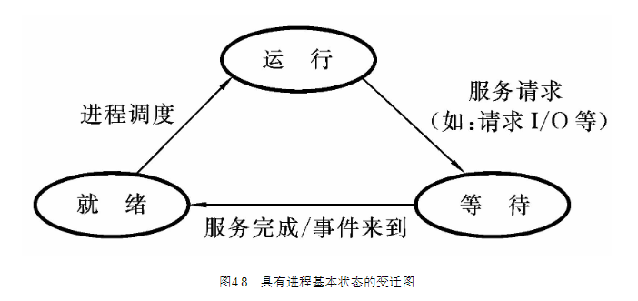
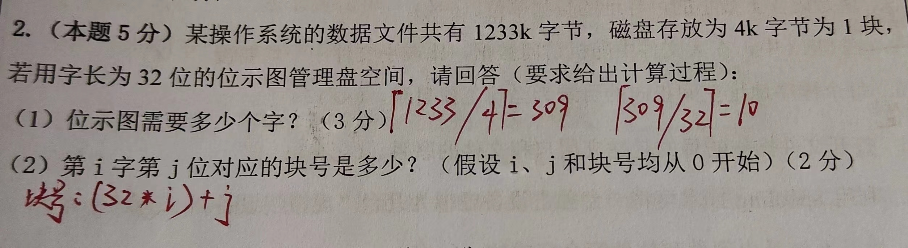

# 操作系统

<!-- 一、考试目标
1、掌握操作系统的基本概念、基本原理和基本功能，理解操作系统的整体运行过程。
2、掌握操作系统进程、内存、文件和 I/O 管理的策略、算法、机制以及相互关系。
3、能够运用所学的操作系统原理、方法与技术分析问题和解决问题。
二、考试范围及考试内容
1、绪论
（1）操作系统的定义
（2）操作系统的功能
（3）操作系统的接口（用户接口：命令行和图形界面、程序接口：系统调用）
（4）操作系统的发展简史和分类
（5）操作系统的结构（内核态与用户态，中断与异常，系统调用）。
2、进程与线程
（1）进程的基本概念
（2）进程状态与转换
（3）进程控制
（4）进程同步（临界区、互斥和信号量及硬件与软件实现方法）
（5）经典进程的同步问题（生产者与消费者、读者与写者和哲学家进餐）
（6）进程通信（共享存储、消息传递和管道）
（7）线程（概念和多线程模型）。
3、处理机调度与死锁
（1）处理机调度的基本概念
（2）调度时机、切换与过程
（3）调度的基本原则
（4）调度方式
（5）典型的调度算法（先来线服务，短任务、短进程、短线程优先调度算法，时间片轮转法，优先级调度，多级反馈队列调度）
（6）产生死锁的原因和必要条件以及预防死锁的方法。
4、内存管理
（1）内存管理概念（程序的装入和链接、逻辑地址与物理地址、内存保护）
（2）交换与覆盖
（3）连续分配方式（单一连续和分区）
（4）非连续分配方式（分页、分段和段页式）
（5）虚拟内存管理（虚拟内存的基本概念、请求分页、分段、段页式存储器管理方式、页面置换算法）
（6）常用的页面置换算法（最佳置换 OPT算法、先进先出置换 FIFO 算法、最近最少使用置换 LRU 算法、时钟置换 CLOCK 算法）。
5、设备管理
（1）I/O 管理（I/O 设备、I/O 管理目标、I/O 管理功能、I/O 应用接 、I/O 控制方式和 I/O 软件层次结构）
（2）I/O 内核子系统（I/O 调度概念、高速缓存与缓冲区、设备分配与回收、假脱机技术(SPOOLing)
6、文件系统
（1）文件系统基础（文件概念，文件结构--顺序文件、索引文件和索引顺序文件，目录结构-文件控制块和索引节点、单级目录结构和两级目录结构、树形目录结构和图形目录结构，文件共享--共享动机、共享方式和共享语义，文件保护--访问类型和访问控制）
（2）文件系统实现（文件系统层次结构，目录实现，文件实现）
（3）磁盘组织与管理（磁盘的结构、磁盘调度算法和磁盘的管理）
（4）常用的磁盘调度算法（FIFO，SSTF，SCAN，C-SCAN）。 -->

[TOC]

## 第1章 绪论

### 操作系统的基本概念

- 计算机的操作系统是一种**系统软件**

- 操作系统的主要功能
  > 操作系统负责计算机系统的软硬件资源的分配和管理; 控制和协调并发活动; 提供用户接口,使用户获得良好的工作环境
  - 处理机分配
  - 存储管理
  - 设备管理
  - 软件资源(文件)管理

### 操作系统的基本类型

- 批处理操作系统
  - 优点：
  - 缺点：资源利用率不高

## 第2章 操作系统的组织架构

### 操作系统虚拟机

在裸机上配置了操作系统程序后就构成了操作系统虚拟机, 操作系统的核心在裸机上运行,而用户程序则在扩充后的机器上运行.
扩充后的虚拟机不仅可以使用原来裸机提供的各种基本硬件指令,而且还可以使用操作系统中所增加的许多其他"指令"

### 处理机的状态

- 核态
  > 有的系统将管理程序执行时的机器状态进一步分为核态和管态，这时，管态的权限有所变化，管态只允许使用一些在用户态下所不能使用的资源，但不能使用修改机器的状态指令。而核态（kernel mode）就具有上述管态所具有的所有权
  > 核态>管态>目态
- 管态
  > 操作系统的管理程序执行时机器所处的状态,此状态下允许处理机使用全部资源和指令
- 目态
  > 用户程序执行时机器所处的状态,此状态禁止使用特权指令
- 如何区分管态和目态
  > 设置一个系统状态位(模式位),就可以区分当前执行的是系统程序还是用户程序
- 管态目态相互转换
  > 用户程序执行时,若要请求操作系统服务,则要通过一种受控方式进入操作系统,将用户态转为管态,由操作系统得到控制块,在核态下执行其相应的服务例程,服务完毕后,返回到用户态

### 中断机制

- 中断的概念
  > 中断是指某个事件(电源掉电,定点加法溢出或I/O传输结束等)发生时, 系统中止现行程序的运行, 引出处理该事件程序进行处理, 处理完毕后返回断点, 继续执行

## 第4章 并发处理

### 进程概念

- 进程是指一个具有一定独立功能的程序关于某个数据集合的一次运行活动
- 进程与程序的联系与区别
  > (1) 程序是指令的有序集合,其本身没有任何运动的含义,它是一个静态概念; 而进程是程序在处理机上的一次执行过程,它是一动态概念
  > (2) 进程是一个能独立运行的单位,能与其它进程并行地活动
  > (3) 进程是竞争计算机系统有限资源的基本单位,也是进行处理机调度的基本单位

- 进程类型
  - 系统进程: 管态下工作/分配资源
  - 用户进程: 目态下工作/分配资源

- 就绪状态(ready)
  > 当进程获得了除CPU之外所有的资源,它已经准备就绪,一旦得到了CPU控制权,就可以立即运行,该进程所处的状态为就绪状态
- 运行状态(run)
  > 当进程调度/分派模块分派后,得到中央处理机控制权,它的程序正在运行,该进程所处的状态为运行状态
- 等待状态(wait)
  > 若一进程正在等待某一事件发生(如等待输入/输出操作的完成)而暂停执行,这时即便给它CPU控制权它也无法执行,则称该进程处于等待状态,又称为阻塞状态

tip: 时间片到: 运行->就绪

- 线程的概念
  > (1) 线程是进程中的一条执行路径
  > (2) 它有自己私用的堆栈和处理机执行环境(尤其是处理器寄存器)
  > (3) 它共享分配给父进程的主存
  > (4) 它是单个进程所创建的许多个同时存在的线程中的一个
- 进程与线程的联系和区别
  > (不支持多线程时)进程是任务调度的单位,**进程是系统资源的分配单位**;
  > 当系统支持多线程处理时,**线程是任务调度的单位**,但不是系统资源的分配单位;

### 进程的相互制约关系

- 进程互斥
  > 在操作系统中,当某一进程正在访问某一存储区域时,就不允许其它进程来读出或者修改该存储区的内容; 否则就会出现无法估计的错误,通常将进程之间的这种相互制约关系称为互斥
- 进程同步
  > 两个进程并发执行,一个进程等待另一个进程发来的消息,或者建立某个条件后才向前推进,这种制约被称为进程的同步

### 同步机构

- 在大多数同步机构中,必须用一个标志来代表某种资源的状态,比如标志为0表示未被使用,否则表示已被使用,这一标志经常被称为锁或信号灯

- 信号灯
  > 信号灯是一个确定的二元组(s, q), s是一个具有非负初值的整型变量, q是一个初始状态为空的队列. 其可能的取值范围是负整数值/零/正整数值(信号灯数值仅能由PV操作改变)

- P操作(进程对资源的申请)
  - S值减1
  - 若相减结果大于或等于0,则进程继续执行
  - 若相减结果小于0,则进程被封锁,并将它插入到该信号灯的等待队列中,然后转入进程调度程序
- V操作(进程对资源的释放)
  - S值加1
  - 若相加结果大于零,则进程继续执行
  - 若相加结果小于或等于零,则从该信号灯的等待队列中移出一个进程,解除它的等待状态,然后返回本进程继续执行

- S > 0 : 有S个资源, 请求资源的进程可以继续执行
- S = 0 : 无资源, 请求进程必须等待
- S < 0 : 有|S|个进程正在等待

### 进程通信(IPC)

- 进程通信的概念
  > 进程通信(inter process communication, IPC)是一个进程与另一个进程间共享消息的一种方式
  > 消息(message)是发送进程形成的一个信息块, 通过信息的语法表示传送内容到接收进程
  > IPC是利用消息, 明确地从一个进程的地址空间拷贝到另一个进程的地址空间, 而不使用共享存储器的一种通信机制

## 第5章 资源分配与调度

### 资源分配策略

- 目的: 吞吐率尽可能地高, 响应时间尽可能地短
- 先请求先服务(FIFO)
  - 优点: 次序不变,系统开销小
  - 缺点: 对短作业不利(响应时间长)

- 优先调度
  - 优点: 比较灵活,可以优先照顾需要尽快处理的作业或进程,以及它们的各种请求
  - 缺点: 复杂,系统开销大

### 死锁

- 死锁的概念
  > 在两个或多个并发进程中,如果每个进程持有某种资源而又等待着别的进程释放它或它们现在保持着的资源,在未改变这种状态之前都不能向前推进,称这一组进程发生了死锁

- 死锁产生的根本原因是: 系统能够提供的资源个数比要求该资源的进程数要少

- 产生死锁的必要条件
  - 互斥条件
    > 涉及的资源是非共享的,即一次只有一个进程使用
  - 不剥夺条件(非抢占)
    > 资源在未使用完毕之前,不能被其它进程强行夺走
  - 占有并等待(部分分配)
    > 在等待一新资源的同时,进程继续占有已分配到的资源
  - 环路条件(循环等待)
    > 存在一种循环链,链中每一个进程已获得的资源同时被链中下一个进程所请求

## 第6章 处理机调度

### 作业调度

#### 作业调度算法

- 先来先服务调度算法
  - 优点: 实现容易
  - 缺点: 效率较低,对短作业不利

- 短作业优先调度算法
  - 优点: 实现容易且效率较高
  - 缺点: 只照顾短作业的利益,没有考虑长作业的利益

- 响应比高者优先调度算法
  > 响应比 = 响应时间 + 执行时间
  > 响应时间 = 等待时间 + 执行时间
  - 优点: 既照顾了短作业,又不使长作业等待时间过长
  - 缺点: 调度性能一般

- 优先调度算法
  > 优先数 = 等待时间2 - 要求执行时间 - 16 x 输出量(I/O事件)

- 可剥夺调度方式
  > "重要而紧迫"的进程一到,便暂停正在执行的进程,立即把处理机分配给它,这种方式称为可剥夺调度方式

## 第7章 主存管理

### 7.2 主存管理的功能

- 虚拟存储器
  - 最大容量: 2CPU寻址范围
  - 实际容量: min(内存+外存, 2CPU寻址范围)

- 地址映射
  > 物理地址是计算机主存单元的真实地址,又称为绝对地址或实地址
  > 逻辑地址是用户的程序地址(指令地址或操作数地址),对于逻辑地址来说,在主存中并没有一个固定的,真实的物理单元与之对应,它是一个虚地址或称为相对地址
  > 逻辑地址与被共享的物理地址之间有一定的映射关系
  - 程序运行时,必须将逻辑地址正确地转换为物理地址,此即为地址映射(地址重定位)
    > **做题:**
    > **先将逻辑地址分解成页号P和页内地址W两部分(虚地址mod页面大小,商为页号P,余数为页内地址W)**
    > **根据页号P查页面变换表, 可得页号P对应的物理块号B**
    > **物理地址 = 物理块号B x 页面大小 + 页内地址W**
    - 编程或编译时确定地址映射关系
    - 静态地址映射
      > 在装载程序时确定映射关系(装入主存),也称静态重定位
    - 动态地址映射
      > 在程序执行过程中实现的
      > 动态地址映射是指在程序执行期间,随着每条指令和数据的访问自动地,连续地进行地址映射.
      > 这种重定位的实现需要硬件提供手段,且一般是靠硬件地址变换机构实现的,比如重定位寄存器.

- 在存储器管理中, 页面是信息的**物理**单位, 分段是信息的**逻辑**单位
  > 页面大小由**系统/硬件**确定, 分段大小由**用户程序**确定

- 存储管理的功能
  - 映射逻辑地址到物理主存地址
  - 在多用户之间分配物理主存
  - 对各用户区的信息提供保护措施
  - 扩充逻辑主存区

### 7.4 淘汰策略

- 置换算法
  > 当要索取一页面并送入主存时,必须将该作业已在主存中的某一页面淘汰掉. 用来选择淘汰哪一页的规则就叫做置换算法

- 颠簸(抖动)
  > 刚被淘汰出去的页,不久之后又要访问它,因而又要把它调入,而调入后不久又再次淘汰,如此反复,使得整个系统的页面置换非常频繁,以致大部分的机器时间花费在来回进行页面的调度上,只有一小部分时间用于程序的实际执行,从而影响整个系统的效率.
  > 导致系统效率急剧下降的主存和辅存之间的频繁页面置换现象称为颠簸(抖动)

- 在任何时刻,若访问的页已在主存,则称此次访问成功; 若访问的页不在主存,则称此次访问失败,并产生缺页中断

- 缺页中断
  > 当CPU访问的页面不在物理内存时, 便会产生一个缺页中断, 请求操作系统将所缺页调入到物理内存

- 最佳算法(OPT)
  > 最佳算法(最佳淘汰策略)是当要调入一新页而必须淘汰一旧页时,所淘汰的那一页应是以后不再使用的,或是在最长时间段之后才会用到的页

- 先进先出算法(FIFO)
  > 总是选择在主存中居留时间最长(即进入最早)的一页淘汰

- 最久未使用淘汰算法(LRU)
  > 选择最长时间未被使用的那一页淘汰

### 段页式存储管理

段页式存储管理的思想：
> 段页式存储管理的用户地址空间是二维的,按段划分的.在段中再划分成若干大小相等的页,这样地址结构就由段号,段内页号和页内位移三部分组成
> 用户使用的仍是段号和段内相对地址,由地址变换机构自动地将段内相对地址的高几位解释为段内页号,将剩余的低位解释为业内位移
> 用户地址空间的最小单位不是段而是页,而主存按页的大小划分,按页装入, 这样,一个段可以装入到若干个不连续的主存块内,段的大小不再受主存可用区的限制了

## 第8章 输入/输出管理

### 输入输出管理概念

- 设备独立性
  > 设备独立性是指用户在编制程序时所使用的设备与实际使用的设备无关, 也就是在用户程序中仅使用逻辑设备名. 逻辑设备名是用户自己指定的设备名(或设备号), 它是暂时的,可更改的.物理设备名是系统提供设备的标准名称(永久的,不可更改的)

- Spool(假脱机系统)
  > 为了克服独占设备的缺点,操作系统提供外部设备联机同时操作的功能, 又称假脱机系统
  > Spool系统利用通道和中断技术, 在主机控制之下, 由通道完成输入/输出工作, 该系统包括预输入程序、缓输出程序、井管理程序和预输入表、缓输出表等数据结构。它在联机方式下实现了输入收存和输出发送的功能，使外部设备和主机能并行操作，所以称为假脱机系统。

## 第9章 文件系统

### 文件的物理结构

- 连续文件
  > 连续文件结构是由一组分配在磁盘连续区域的物理块组成的
  - 优点: 连续存取时速度较快
  - 缺点: 长度一经固定便不易改变,因此不利于文件的增生和扩充

- 串联文件
  > 串联文件采用的是一种非连续的存储结构,文件的逻辑记录可以存放到不连续的物理块中,能较好地利用辅存空间
  - 优点: 串联文件结构比较易于修改
  - 缺点: 只适用于顺序存取方式,不适用于直接存取方式

- 索引文件
  > 将逻辑文件顺序地划分为长度与物理存储块长度相同的逻辑块,然后为每个文件分别建立逻辑块号与物理块号的对照表
  - 优点: 可以直接读写任意记录,而且便于文件的增删
  - 缺点: 每次存取都涉及索引表的查找,所以采用的查找策略对文件系统的效率有很大影响

- 索引表的组织
  - 一级间接索引
    > 若磁盘块的大小为512B,用于登记磁盘块号的表项占用2B,这样一个磁盘块可以登记256个表项
  - 二级间接索引
    > 文件目录项中有一组表项,其内容登记的是第二级索引表块的块号. 第二级索引表块中的索引表项登记的是第一级索引表的块号, 第一级索引表项中登记的是文件逻辑记录所在的磁盘块号
    - 二级索引结构文件大小的计算:
      > n x 2562 x 512B 
      > n为文件目录项中用于索引的表项数目
      > 逻辑记录大小为512B
      > 用于登记磁盘块号的表项占用2B

### 位示图

