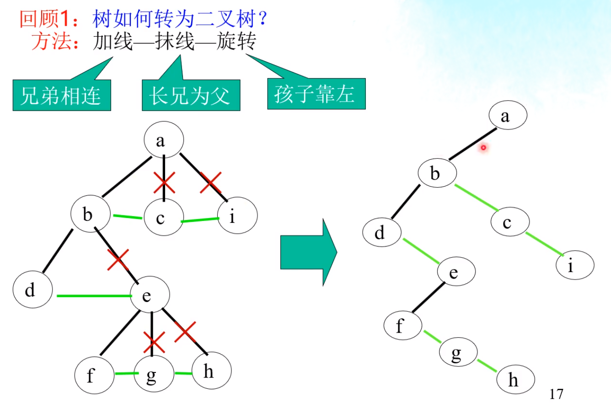
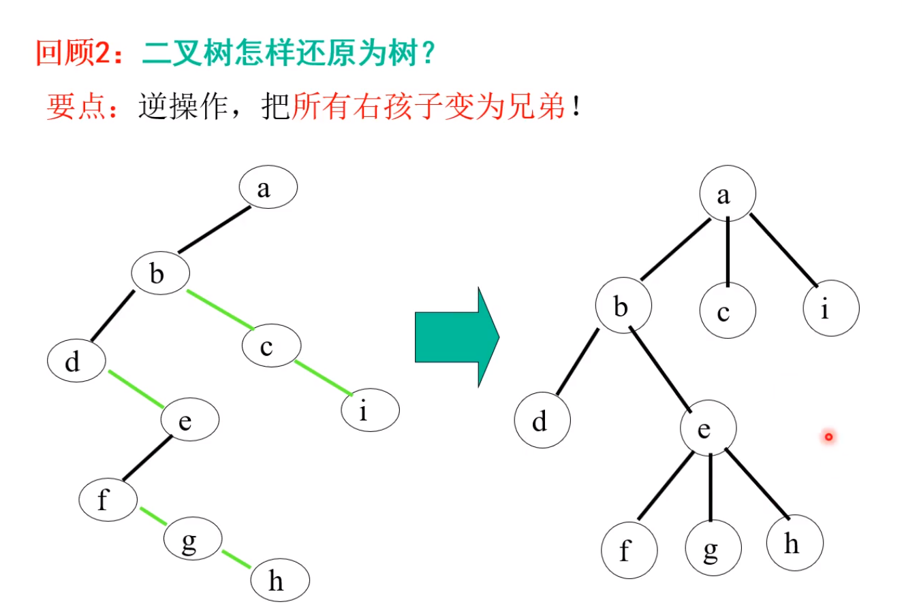
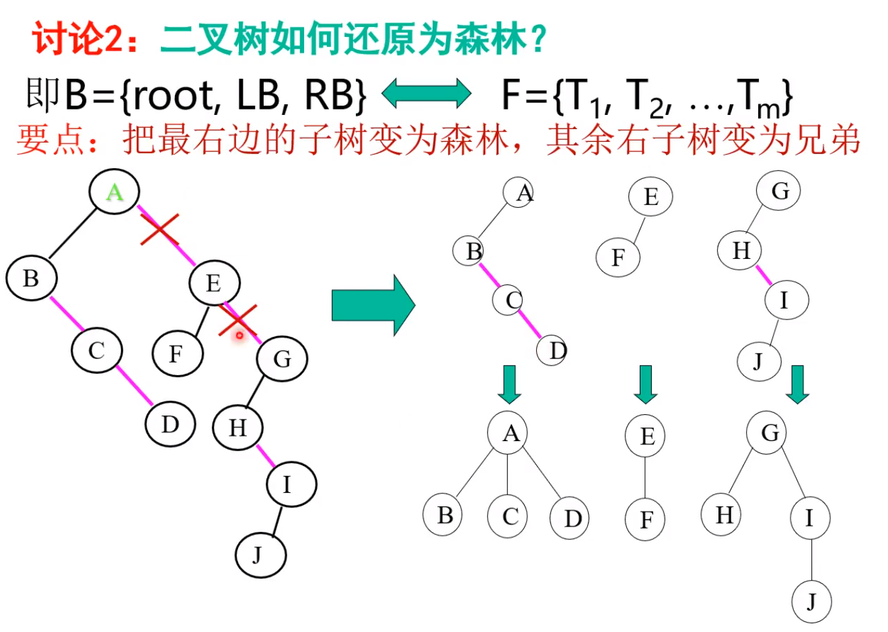

# 数据结构

一、考试目标
1、掌握数据结构的基本概念、基本原理和基本方法。
2、掌握数据结构的逻辑结构、存储结构以及各种基本操作的实现，能够对算法进行基本的时间复杂度与空间
复杂度的分析。
3、能够运用数据结构基本原理和方法进行问题的分析与求解，能够对算法进行设计与分析。
二、考试范围及考试内容
1、绪论
（1）什么是数据结构（2）基本概念和术语（3）抽象数据类型的表示与实现（4）算法和算法分析
2、线性表
（1）线性表的定义和基本操作（2）线性表的顺序表示和实现（3）线性表的链式表示和实现（4）线性表的
应用
3、栈和队列
（1）栈和队列的基本概念（2）栈和队列的顺序存储结构（3）栈和队列的链式存储结构（4）栈的应用：数
制转换、括号匹配的检验、行编辑程序、表达式求值（5）队列的应用：杨辉三角
4、树和二叉树
（1）树的定义和基本术语（2）二叉树：定义、顺序存储结构和链式存储结构、遍历（3）线索二叉树的基本
概念和构造（4）树和森林：存储结构、森林和二叉树的转换、树和森林的遍历（5）树和二叉树的应用：赫
夫曼树及赫夫曼编码
5、图
（1）图的定义和术语（2）图的存储结构：邻接矩阵、邻接表（3）图的遍历：深度优先搜索、广度优先搜索
（4）图的基本应用：最小生成树、最短路径、拓扑排序和关键路径
6、查找
（1）静态查找表：顺序查找、折半查找、分块查找（2）动态查找表：二叉排序树、平衡二叉树（3）哈希表
7、内部排序
（1）基本概念（2）插入排序：直接插入排序、折半插入排序、希尔排序（3）交换排序：起泡排序、快速排
序（4）选择排序（5）归并排序（6）基数排序（7）各种内部排序方法的比较讨论

[TOC]

## 第3章 栈与队列

### 栈

结构体:

```c
typedef struct{
  SElemType *base;
  SElemType *top;
  int stacksize;
}SqStack;
```

入栈push: *S.top++ = e
判断栈满: S.top - S.base >= S.stacksize
出栈pop: e = *S.top--
判断栈空: S.top == S.base

### 循环队列

初始化建栈: Q.front = Q.rear = 0
插入新元素: Q.rear = (Q.rear + 1) % MAXSIZE
删除头元素: Q.front = (Q.front + 1) % MAXSIZE
判断队满: if((Q.rear + 1) % MAXSIZE == Q.front)

## 第4章 串

### 串的块链存储表示

存储密度 = 结点数据本身所占的存储量 / 结点结构所占的存储总量

## 二叉链表&线索二叉树

- 在有N个结点的二叉链表中必定存在N+1个空链域

|lchild|LTag|data|RTag|rchild|
|:--:|:--:|:--:|:--:|:--:|

LTag = 0 lchild指示结点的左孩子
LTag = 1 lchild指示结点的前驱
RTag = 0 rchild指示结点的右孩子
RTag = 1 rchild指示结点的后继

以这种结点结构构成的二叉链表作为二叉树的存储结构,叫做**线索链表**,其中指向结点前驱和后继的指针,叫做**线索**. 加上线索的二叉树称之为**线索二叉树**(Theaded Binary Tree).

## 第6章 树和二叉树

### 二叉树和森林间的转换

- 树转换成二叉树
  > (1) 兄弟结点间加线
  > (2) 除长子(左孩子)外的孩子去线
  > (3) 层次调整(孩子靠左)
  
  

- 二叉树转换成树
  > (1) 所有右孩子变成兄弟(不包括右孩子的左孩子)
  > (2) 将兄弟与左孩子的双亲连线
  > (3) 层次调整
  
  

- 森林转换成二叉树
  如果F={T<sub>1</sub>, T<sub>2</sub>, T<sub>3</sub>, ..., T<sub>m</sub>}是森林, 按以下规则转换成一棵二叉树B=(root, LB, RB)
  > (1) 若F为空, 即m = 0, 则B为空树;
  > (2) 若F非空, 即m != 0, 则B的根root即为森林中第一棵树的根ROOT(T<sub>1</sub>); B的左子树LB是从T<sub>1</sub>中根结点的子树森林F<sub>1</sub>={T<sub>11</sub>, T<sub>12</sub>, T<sub>13</sub>, ..., T<sub>1m</sub>}转换而成的二叉树; 其右子树RB是从森林F'={T<sub>1</sub>, T<sub>2</sub>, T<sub>3</sub>, ..., T<sub>m</sub>}转换而成的二叉树

  - 做题方法1:
    > (1) 森林中的每棵树各自转换成二叉树
    > (2) 将所有的二叉树转换成一棵二叉树 (如下)
    > (2.1) 第一棵树不变
    > (2.2) 将第二棵树作为第一棵树的根的右孩子
    > (2.3) 将第三棵树作为第二棵树的根的右孩子, 以此类推
  - 做题方法2:
    

- 二叉树转换成森林
  如果B=(root, LB, RB)是一课二叉树,按以下规则转换成森林F={T<sub>1</sub>, T<sub>2</sub>, T<sub>3</sub>, ..., T<sub>m</sub>}
  > (1) 若B为空, 则F为空;
  > (2) 若B非空, 则F中第一棵树T<sub>1</sub>的根ROOT(T<sub>1</sub>)即为二叉树B的根root; T<sub>1</sub>中根结点是子树森林F<sub>1</sub>是由B的左子树LB转换而成的森林; F中除T<sub>1</sub>之外其余树组成的森林F'={T<sub>2</sub>, T<sub>3</sub>, ..., T<sub>3</sub>}是由B的右子树RB转换而成的森林

  - 做题方法:
    二叉树能否转化成森林看是否有右孩子?有:heavy_check_mark:则可以转化成森林, 没有:x:则只能转化成树
    > (1) 根与右孩子去线
    > (2) 右孩子的右孩子间去线, 以此类推
    > (2.1) 得到n棵二叉树, 将二叉树转换成树

    

- 先序遍历森林(森林非空)
  > (1)访问森林中第一课树的根结点;
  > (2)先序遍历第一棵树根结点的子树森林;
  > (3)先序遍历除第一棵树之后剩余的树构成的森林;

- 中序遍历森林(森林非空)
  > (1)中序遍历森林第一棵树的根结点的子树森林;
  > (2)访问第一颗树的根结点;
  > (3)中序遍历除第一棵树之后剩余的树构成的森林;


## 第7章 图

### 最小生成树

- 普里姆算法（Prim）
  > 以某顶点为起点,选取其权值最小的邻边

- 克鲁斯卡尔算法（Kruskal）
  > 选取图中权值最小的边, 不构成连通分量

### 拓扑排序

(1) 在有向图中选一个没有前驱的顶点且输出之
(2) 从图中删除该顶点和所有以它为尾的弧
(3) 重复以上两步, 直至全部顶点均已输出, 或者当前图中不存在无前驱的顶点为止(存在环)

### 最短路径

单源点最短路径指给定带权有向图G和源点V<sub>0</sub>, 求从V<sub>0</sub>到G中其余各顶点的最短路径

- 迪杰斯特拉(Dijkstra)
  > (1) S集合,的初态只包含V<sub>0</sub>, T集合的初态为网中除了V<sub>0</sub>之外的,所有顶点
  > (2)按各顶点与V<sub>0</sub>间**最短路径长度递增的次序**(1,2,3,...),逐个把T集合中的顶点加入到S集合中去
  > 使得从V<sub>0</sub>到S集合中各顶点的路径长度始终不大于从V<sub>0</sub>到T集合中各顶点的路径长度

|终点|1|2|3|
|:--:|:--:|:--:|:--:|
|V1|∞|∞|∞|
|V2|<V0,V2,100>|<V0,V3,V2,40>|
|V3|<V0,V3,30>|
|集合S|{V0,V3}|{V0,V3,V2}|

## 第9章 查找

### 分块查找法(索引顺序表的查找)

1. 对每个子表(或称块)建立一个索引项, 其中包括两项内容:
   > 关键字项: 其值为该子表内的最大关键字
   > 指针项: 指示该子表的第一个记录在表中位置
2. ASL = 1/2 (n/s + s) + 1
   > n: 表长
   > s: 每块含有s个记录

### B-树

m阶的B-树满足如下特性(m阶指最多有m棵子树):

1. 树中每个结点最多有m棵子树
2. 若根不是叶子结点, 则至少有2棵子树
3. 除根以外的所有非终端结点至少有m/2(向上取整)棵子树
4. 所有非终端节点都包含以下信息数据:
   > (n, A0, K1, A1, K2, A2, ..., KN, AN)
   > 其中: 
   > A<sub>i-1</sub>所指子树中所有结点的关键字均小于K<sub>i</sub>
   > A<sub>n</sub>所指子树中所有结点的关键字均大于K<sub>n</sub>
   > n为关键字个数: (向上取整)m/2 <= **n** <= m-1
5. 所有叶子结点都出现在同一层次并且不带信息,实际上这些结点不存在, 指向这些结点的指针为空

### 哈希表

#### 开放定址法&线性探测再散列

- H<sub>i</sub> = (H(key) + d<sub>i</sub>) MOD m, 其中i = 1, 2, 3, ..., k(k <= m-1)
  > H(key)为哈希函数; m为哈希表表长; d<sub>i</sub>为增量序列;
  > 增量序列的取法:
  > (1)线性探测再散列: d<sub>i</sub>= 1, 2, 3, ..., m-1;
  > (2)二次探测再散列: d<sub>i</sub>= 1<sup>2</sup>, -1<sup>2</sup>, 2<sup>2</sup>, -2<sup>2</sup>, ..., ±k<sup>2</sup>(k <= m/2)
  > (3)伪随机探测再散列: d<sub>i</sub>=伪随机数序列

## 邻接表

|adjvex|nextarc|info|
|:--:|:--:|:--:|

- 邻接点域(adjvex): 指示与顶点V<sub>i</sub>邻接的点在图中的位置
- 链域(nextarc): 指示下一条边或弧的结点
- 数据域(data): 存储和边或弧相关的信息,如权值等

若无向图中有n个顶点, e条边, 则它的邻接表需要n个头结点和2e个表结点

## 第10章 内部排序


### 快速排序


### 堆排序

- 需要一个记录大小的辅助空间, 每个待排序记录仅占一个存储空间
- 最坏情况下的时间复杂度: O(nlog<sub>2</sub>n)

## 其它

### 静态链表

- 静态链表是用数组来实现链式存储结构，目的是方便在不设指针类型的高级程序设计语言中使用链式结构。
  > 优点是和动态链表一样，删除和插入元素时间复杂度低；
  > 不足是和数组一样，需要提前分配一块较大的空间。

### 后缀表达式

例: a\*(b+c)-d
转化为后缀表达式（逆波兰式）：
> 从左至右依次遍历中缀表达式各个字符（需要准备一个字符栈存储操作符和括号）

1、字符为 运算数 ：
> 直接送入后缀表达式（注：需要先分析出完整的运算数）。

2、字符为 左括号 ：
> 直接入栈（注：左括号入栈后优先级降至最低）。

3、字符为 右括号 ：
> 直接出栈，并将出栈字符依次送入后缀表达式，直到栈顶字符为左括号（左括号也要出栈，但不送入后缀表达式）。

4、字符为 操作符 ：
> 若栈空，直接入栈。
若栈非空，判断栈顶操作符，若栈顶操作符优先级低于该操作符，该操作符入栈；否则一直出栈，并将出栈字符依次送入后缀表达式，直到栈空或栈顶操作符优先级低于该操作符，该操作符再入栈。

总结：只要满足 栈空 或者 优先级高于栈顶操作符 即可停止出栈，并将该操作符入栈
