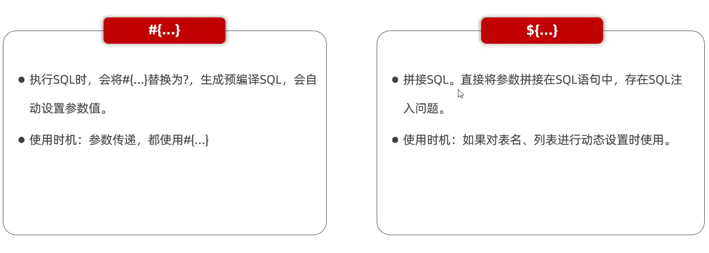
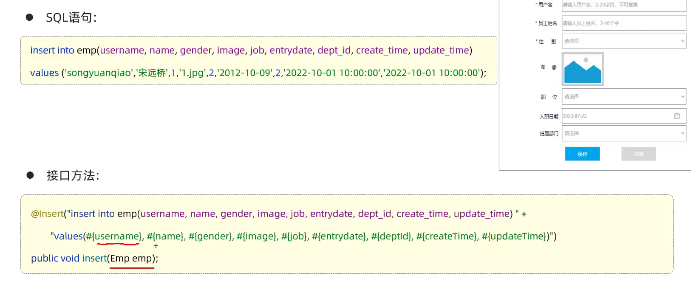
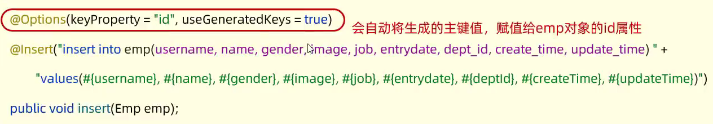
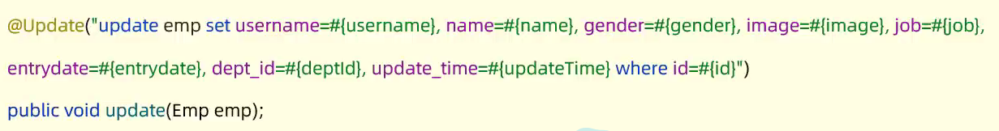
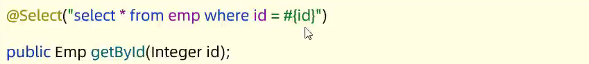
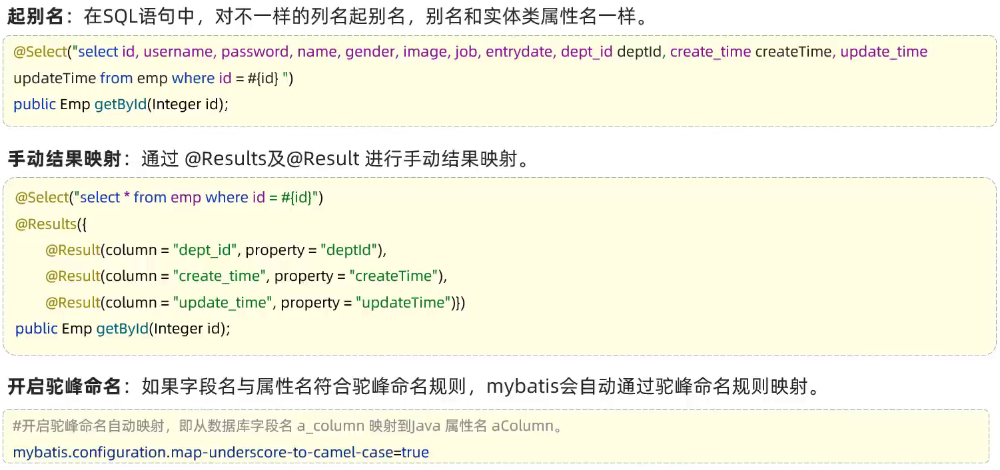
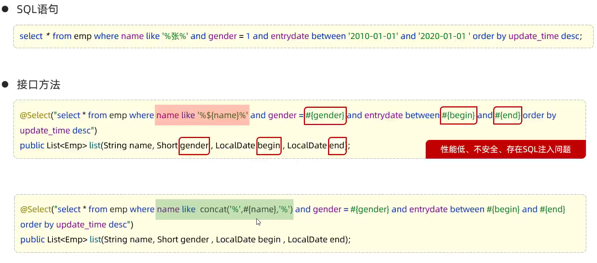
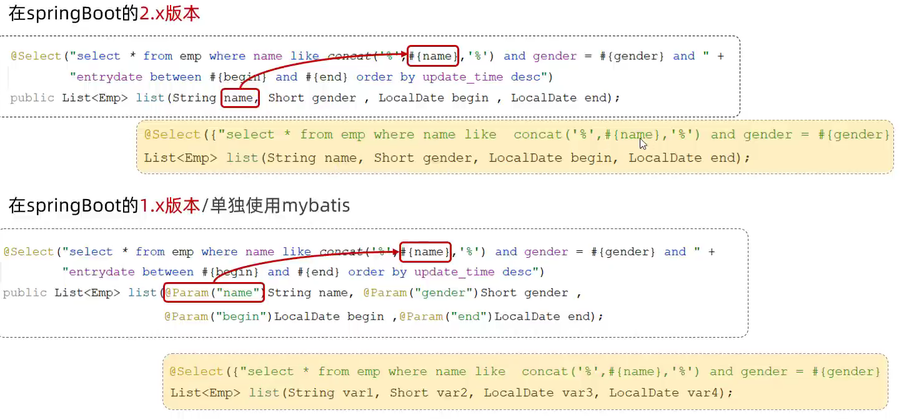

# Mybatis基础操作

## 日志输出

- application.properties中配置
  > mybatis.configuration.log-impl = org.apache.ibatis.logging.stdout.StdOutImpl

- SQL语法解析检查 \-> 优化SQL \-> 编译SQL \-> 执行SQL
  - 预编译SQL
    > 性能更高
    > 更安全


注意: ${}不是预编译SQL, 因为是把参数直接拼接到sql语句中, 性能更低, 且存在SQL注入问题

## 删除操作

- @Delete注解
  - 获取动态值

  ```java
  @Mapper
  public interface empMapper{
    // 根据id删除数据
    @Delete(delete from emp where id = #{id}) // #{}获取参数值
    //public void delete(Integer id); // 如果接口方法中的形参只有一个, 那么#{}中的值不强制要求相同, 例如id = #{value}
    public int delete(Integer id); // 返回值为此次操作影响的记录数, insert和update也是如此
  }
  ```

## 新增操作


注意: 不要写成表中的字段名, 要写类中的属性名

- 主键返回
  > 描述: 在数据添加成功后, 需要获取插入数据库数据的主键
  >  添加套餐数据时, 还需要维护套餐菜品关系表数据



## 更新操作



## 查询操作

- 简单查询

  

- 数据封装
  - 实体类属性名和数据库表查询返回的字段名一致, mybatis会自动封装
  - 如果实体类属性名和数据库表查询返回的字段名不一致, 不能自动封装
  - 解决:
    - 方案一: 给字段起别名, 让别名与属性名保持一致
    - 方案二: 通过@Results, @Result注解手动映射封装
    - 方案三: 开启mybatis的驼峰命名自动映射开关 a_column \-> aColumn

    

- 条件查询

  
  注意: 使用#{}参数占位符会生成?, ?不能出现在''内, 而使用${}参数占位符会引起安全问题, 可以使用MySQL的concat()函数拼接字符串

- 参数名问题
  
  
