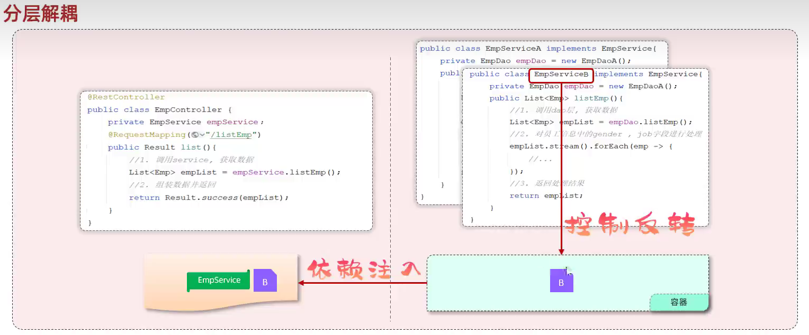
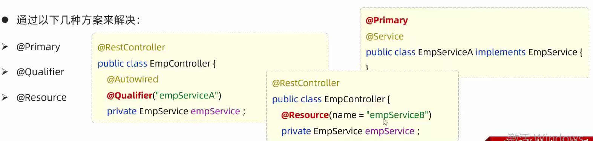

# 三层架构

- controller: 控制层, 接收前端发送的请求, 对请求进行处理, 并响应数据
- service: 业务逻辑层, 处理具体的业务逻辑
- dao: 数据访问层(Data Access Object)(持久层), 负责数据访问操作, 包括数据的增删改查

## 分层解耦

- 内聚: 软件中各个功能模块内部的功能联系
- 耦合: 衡量软件中各个层/模块之间的依赖、关联的程度
  > 软件设计原则: 高内聚低耦合

- 控制反转: Inversion Of Control, 简称IOC, 对象的创建控制权由程序自身转移到外部(容器, 也称IOC容器/Spring容器),这种思想称为控制反转
- 依赖注入: Dependency Injection, 简称DI, 容器为应用程序提供运行时, 所依赖的资源, 称之为依赖注入
- Bean对象: IOC容器中创建、管理的对象, 称之为bean

- @Component注解: (不属于以下3种类时)将当前类交给IOC容器管理, 成为IOC容器中的Bean
  - @Controller (控制层controller的注解)
  - @Service (业务逻辑层service的注解)
  - @Repository (数据持久层dao的注解)
  - 注意事项
    > 声明Bean的时候, 可以通过value属性指定Bean的名字, 如果没有指定, 默认为类名首字母小写
    > 使用以上4个注解都可以声明Bean, 但是在Spring Boot集成Web开发中, 声明控制器Bean只能用@Controller
  - Bean组件扫描
    > 前面声明Bean的4大注解, 要想生效, 还需要被组件扫描注解@ComponentScan扫描
    > @ComponentScan注解虽然没有显示配置, 但是实际上已经包含在了启动类声明注解@SpringBootApplication中, 默认扫描范围是启动类所在包及其子包
- @AutoWired注解(自动装配): 运行时, IOC容器会提供该类型的Bean对象, 并赋值给该变量 \- 依赖注入
  - @AutoWired注解, 默认是按照**类型**进行的, 如果存在多个相同类型的bean, 将会报错

    

  - @Service + @Primary (首要的)
  - @AutoWired + @Qualifier("bean名称") (限定词)
  - @Resource(name = "bean名称") (java.annotation.)
