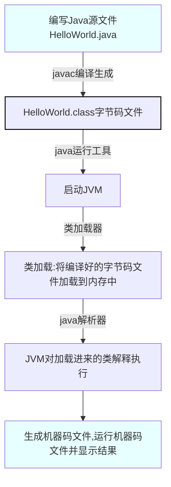

<!-- 也不妄想做别人的·光，只想做自己的太阳，爱自己是终身浪漫的开始！ -->
# 1. Java开发入门

&emsp;[Java概述](#1.1)<br>
&emsp;[JDK的使用](#1.2)<br>
&emsp;[系统环境变量](#1.3)<br>
&emsp;[第一个Java程序](#1.4)<br>
&emsp;[Java的运行机制](#1.5)<br>
&emsp;[Intellij IDEA开发工具](#1.6)

<br>

## <span id=1.1>1.1 Java概述

<br>

> ### 什么是Java
>
> - Java是一种高级计算机语言,由SUN公司于1995年5月推出的一种可以编写跨平台应用软件、&ensp;完全面向对象的程序设计语言。
>
> - 针对不同开发市场，SUN公司将Java划分为三个技术平台，即Java SE、Java EE、Java ME
>
> > - *`Java SE`(Java Platform Standard Edition, Java平台标准版): 为开发普通桌面和商务应用程序提供的解决方案, 包括Java核心类库,如集合、IO、数据库连接、网络编程等*
> > - *`Java EE`(Java Platform Enterprise Edition, Java平台企业版): 为开发企业级应用程序提供的解决方案, 包括Servlet,JSP,JavaBean,EJB,Web,Service等*
> > - *`Java ME`(Java Platform Micro Edition, Java平台微型版): 为开发电子消费产品和嵌入式设备提供的解决方案, 主要用于微型数字电子设备上的软件程序开发, 支持HTTP等协议*

<br>

> ### java语言的特点
>
> - `简单易用`, 丢弃了C++中的运算符重载,多重继承等概念, Java使用引用代替了指针, Java提供自动的*垃圾回收机制*
> - `安全可靠`, Java提供了一套可靠的安全机制: Java程序在运行前会利用*字节确认器*进行代码的安全检查,以确保程序不会存在非法访问,网络安全的问题
> - `跨平台`, 引入了虚拟机的概念, 通过JVM(Java Virtual Machine, Java虚拟机)可以在不同操作系统上运行Java程序
> - `面向对象`, Java将一切事物都看成对象, 将现实世界的*事物抽象成对象*, 将现实世界中的*关系抽象成继承*, 这种方式更利于开发人员对于复杂程序的理解,分析,设计和编写
> - `支持多线程`, Java内置了*多线程控制*, 可以让用户程序并发执行, 利用Java的*多线程编程接口*, 开发人员可以方便地编写出多线程的应用程序, 提供程序的执行效率

<br>

## <span id=1.2>1.2 JDK的使用

> ### 什么是JDK
>
> - Sun公司提供的一套Java开发环境(Java Development Kit, 简称JDK)&emsp;`Tips: JDK是由C和C++实现的哦!`
> - JDK是Java的核心,其中包括了Java编译器(javac.exe), Java运行工具(java.exe), Java文档生成工具(javadoc.exe) ,Java打包工具(jar.exe)等
> - Sun公司提供给普通用户使用的JRE(Java Runtime Environment, Java运行环境), 其中只有Java运行工具, 没有Java编译工具
> - *`JDK包含了JRE, JRE包含JVM`*

<br>

> ### 安装JDK
>
> - [下载链接](http://www.oracle.com/technetwork/java/javase/downloads/index.html)
> - 下载完成后打开文件, 点击下一步, 选择安装模块
>
> > - **开发工具**: 指Java核心类库,包含Java程序执行所必须的程序, 包括JRE
> > - **源代码**: Java所有核心类库的源代码
> > - **公共JRE**: 指Java运行环境, 公共JRE是一个独立的JRE系统,会单独安装在系统的其他路径下,公告JRE会向IE浏览器和系统中注册JRE,使任何程序都可以使用公共JRE

<br>

> ### JDK目录介绍
>
> - `bin目录`
>
> > - 用于存放一些可执行程序,&emsp;如javac.exe,&emsp;javadoc.exe,&emsp;java.exe,&emsp;jar.exe
>
> - `db目录`
>
> > - 一个小型的数据库Java DB, 纯Java实现、开源的数据库管理系统
>
> - `include目录`
>
> > - 由于JDK由C和C++实现，因此在启动时需要引入一些C语言的头文件，此目录用于存放这些文件
>
> - `jre目录`
>
> > - Java运行时环境的根目录,包含JVM,包含运行时的类包,Java应用启动器以及一个bin目录(这个bin不包含开发工具)
>
> - `lib目录`
>
> > - 顾名思义:library,意为Java类库或库文件,是开发工具使用的归档包文件
>
> - `javafx-src.zip`
>
> > - 存放的是Java FX(Java图形用户界面工具)所有核心类库的源代码
>
> - `src.zip`
>
> > - src文件夹的压缩文件,src中存放的是JDK核心类的源代码,通过该文件可以查看Java基础类的源代码
>
> - `README`
>
> > - 说明性文档

<br>

## <span id=1.3>1.3 系统环境变量

> ### path环境变量
>
> - 要编译和执行Java程序,除了在java.exe和javac.exe所在目录(`JDK安装目录下的bin目录`)中操作外,&ensp;可以将java.exe和javc.exe两个可执行文件所在路径添加到PATH环境变量中,&ensp;以方便开发
>
> ### classpath环境变量
>
> - Java虚拟机需要运行一个类时,会在classpath环境变量所定义的路径下寻找所需的class文件和类包(`%JAVA_HOME%\lib`)
>

<br>

## <span id=1.4>1.4 第一个Java程序

```Java
public class Main{ // 类

    public static void main(String[] args){ // 方法
        
        System.out.pritln("Hello World!"); // 功能语句
    }
}
```

<br>

## <span id=1.5>1.5 Java的运行机制



<!-- ```flow
st=>start: Start
e=>end: End
cond=>condition: Option
op1=>operation: solution_1
op2=>operation: solution_2

st->cond
cond(yes)->op1->e
cond(no)->op2->e
``` -->


## <span id=1.6>1.6 Intellij IDEA开发工具

`这玩意儿吧,写的bug多了,自然也就会了!`
