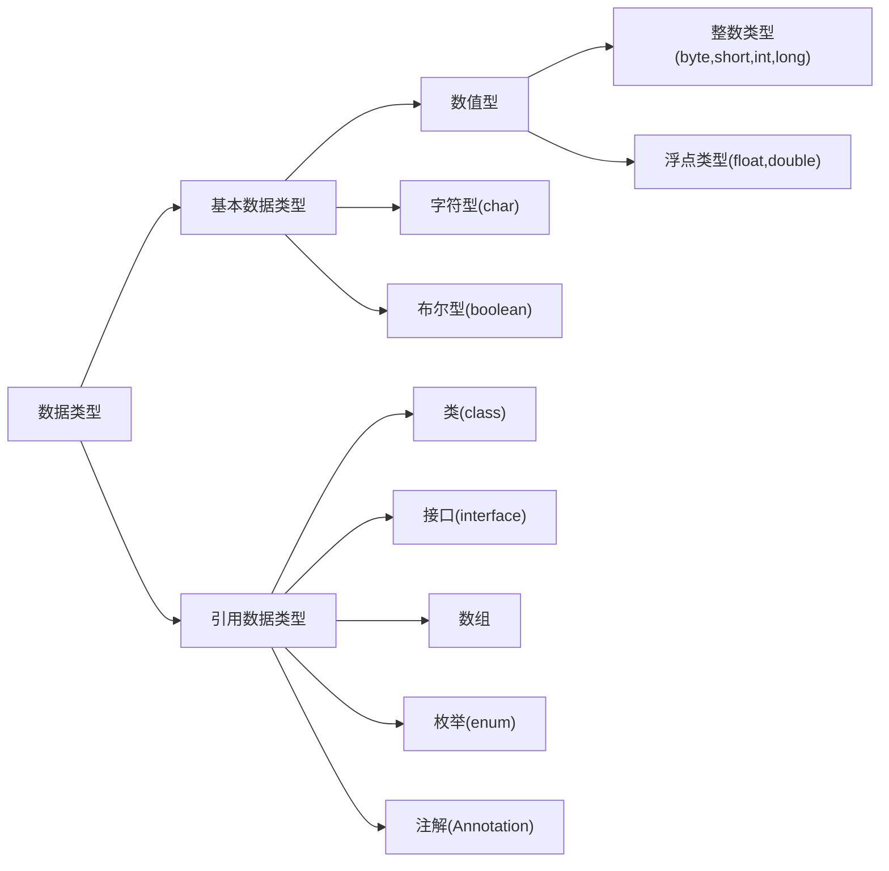
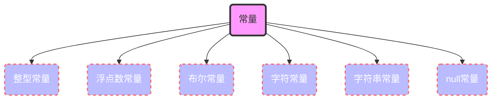

<!-- 我祝福你，愿你日后所得都值得你放弃了我:busts_in_silhouette: -->

# 2. Java编程基础(上)

[TOC]
<!-- &emsp;[2.1&emsp;Java的基本语法](#2.1)<br>
&emsp;&emsp;&emsp;[2.1.1 Java的基本语法格式](#2.1.1)<br>
&emsp;&emsp;&emsp;[2.1.2 Java中的注释](#2.1.2)<br>
&emsp;&emsp;&emsp;[2.1.3 Java中的关键字](#2.1.3)<br>
&emsp;&emsp;&emsp;[2.1.4 Java中的标识符](#2.1.4)<br>
&emsp;[2.2&emsp;Java中的变量与常量](#2.2)<br>
&emsp;&emsp;&emsp;[2.2.1 变量的定义](#2.2.1)<br>
&emsp;&emsp;&emsp;[2.2.2 变量的数据类型](#2.2.2)<br>
&emsp;&emsp;&emsp;[2.2.3 变量的类型转换](#2.2.3)<br>
&emsp;&emsp;&emsp;[2.2.4 变量的作用域](#2.2.4)<br>
&emsp;&emsp;&emsp;[2.2.5 Java中的常量](#2.2.5)<br> -->

<br>

## <span id=2.1>2.1 Java的基础语法

### <span id=2.1.1>Java的基本语法格式

Java程序代码必须先声明一个类,&nbsp;然后在类中编写实现需求的业务代码,&nbsp;类使用class关键字定义,&nbsp;在class前可以有修饰符,&nbsp;具体语法格式如下:
> [修饰符] class 类名 {
> &emsp;&emsp;程序代码
> }<br>
>
*修饰符: public, private, protected, default&ensp;(具体后面再说)*
Java程序可分为结构定义语句和功能执行语句,&nbsp;其中结构定义语句用于声明一个类或方法,&nbsp;功能执行语句用于实现具体的功能.&nbsp;每条功能执行语句的结尾必须使用英文";"结束,&nbsp;如下面语句:

```java
System.out.println("这是第一个Java程序!");
```

Java语言严格区分大小写,&ensp;具体Java编程规范可参考[《阿里巴巴Java开发手册》]("https://github.com/BryceLoski21/MarkDown/blob/main/Java/%E9%98%BF%E9%87%8C%E5%B7%B4%E5%B7%B4Java%E5%BC%80%E5%8F%91%E6%89%8B%E5%86%8C(%E7%BB%88%E6%9E%81%E7%89%88).pdf")

### <span id=2.1.2>Java中的注释

为什么要写注释?&emsp;--为了使代码易于阅读<br>
Java中的注释有三种类型:

- 1.单行注释

> 对程序中某一行进行注释,&nbsp;用符号"//"表示

```java
int x = 10; // 定义一个整型变量x 
```

- 2.多行注释

> 同时为多行内容进行统一注释,&nbsp;以符号"/\*"开头,&nbsp;以符号"\*/"结尾

```java
/* 定义一个整型变量x
将5赋值给变量x */
int x;
x = 5;
```

- 3.文档注释

> 通常是对程序中某个类或类中方法进行的系统性的解释说明,&nbsp;开发人员可以使用javadoc工具将文档注释提取出来生成一份API帮助文档
> 文档注释以符号"/\*\*"开头,&ensp;以符号"\*/"结尾

```java
/**
  * Title: HelloWorld类
  * @author BryceLoski21
  * @version 1.0
  */
public class HelloWorld{
    /**
      * 这是一个main()方法入口
      * @param args 参数名
      */
    public static void main(String[] args)[

        System.out.println("这是一个Java程序!");
    ]
}
```

`Tips: 多行注释中可以嵌套使用单行注释,多行注释中不可以嵌套使用多行注释(原因在于第一个"/*"会和第一个"*/"配对,第二个"*/"找不到匹配导致编译失败)`

### <span id=2.1.3>Java中的关键字

关键字(keyword)是编程语言里事先定义好并赋予了特殊含义的单词,&ensp;也称保留字,&emsp;具体如下表

| | | 表2\-1 Java关键字| | |
|:--|:--:|:--:|:--:|--:|
|abstract|assert|boolean|break|byte
|case|catch|char|class|const
|continue|default|do|double|else
|enum|extends|final|finally|float
|for|goto|if|implements|import
|instanceof|int|interface|long|native
|new|package|private|protected|public
|return|strictfp|short|static|super
|switch|synchronized|this|throw|throws
|transient|try|void|volatile|while

### <span id=2.1.4>Java中的标识符

在程序中定义一些符号来标记一些名称,&ensp;如*包名*,&ensp;*类名*,&ensp;*方法名*,&ensp;*参数名*,&ensp;*变量名*,&ensp;这些符号好被称为**标识符**,&ensp;标识符由`大小写字母`,`数字`,`下划线"\_"`和`美元符号"$"`组成,&ensp;*<u>标识符不能以数字开头,&ensp;也不能是Java中的关键字*</u>

合法的标识符(合法但不符合规范):

```java
String username;
String Username;
String _username;
String $username;
String username_1;
```

标识符定义规范:

1. 包名所有字母一律小写,&ensp;例如com.tacocloud.example
2. 类名和接口名每个单词的首字母都要大写,&ensp;例如ArrayList
3. 常量名所有字母都要大写,&ensp;单词之间使用下划线连接,&ensp;例如DAY_OF_MONTH
4. 变量名和方法名的第一个单词首字母小写,&ensp;第二个单词开始每个单词首字母大写,&ensp;例如getLineNumber
5. 应该尽量使用有意义的英文单词来定义标识符,&ensp;使得代码更易于阅读,&ensp;例如userName

<br>

## <span id=2.2>2.2 Java中的变量与常量

程序运行期间,&ensp;可能会产生一些临时数据,&ensp;应用程序会将这些保存在一些内存单元中,&ensp;每个内存单元都用一个标识符来标识,&ensp;<u>这些内存单元我们称之为变量,&ensp;定义的标识符就是变量名,&ensp;内存单元中存储的数据就是变量的值</u>

### <span id=2.2.1>变量的定义

定义变量只需要指定变量的类型和变量名即可,&ensp;定义变量的语法格式:
> 数据类型 变量名 \[=初始值];&emsp;//&nbsp;[]&nbsp;中的内容为可选项
>
> ```java
> String userName; // 定义一个String类型的变量userName
> String userId = 010225; // 定义一个String类型的变量userId
> ```

### <span id=2.2.2>变量中的数据类型

`变量三要素: 数据类型,变量名,变量值`

Java中的数据类型分为两种:&emsp;*基本数据类型*&ensp;和&ensp;*引用数据类型*,&ensp;Java中的数据类型如下图所示:



<br>

- 整型类型变量
  整数类型变量用来存储整数数值,&ensp;即没有小数部分的值,&ensp;为了给不同大小范围的整数合理分配空间,&ensp;整数类型分为4种不同的类型:&emsp;字节型(byte),&ensp;短整型(short),&ensp;整型(int),&ensp;长整型(long),&ensp;4种类型占用存储空间大小以及取值范围如下表所示:

  |类型名|占用空间|取值范围|
  |:--|:--:|:--:|
  |`byte`|8位(`1`个字节)|- 2^7^~2^7^ - 1
  |`short`|16位(`2`个字节)|- 2^15^~2^15^ - 1
  |`int`|32位(`4`个字节)|- 2^31^~2^31^ - 1
  |`long`|64位(`8`个字节)|- 2^63^~2^63^ - 1
  
  > ```java
  > long miss = 20211030L; // 声明一个long类型的变量miss, 初始值为20211030
  > long distance = 12742L; // 没有超过int类型取值范围的值可以加L/l,也可以不加
  > long life = 1;
  > ```
  
  *tips: 为&nbsp;Long类型变量赋值时,&nbsp;如果其值超过了&nbsp;int类型取值范围,&nbsp;就需要在其值后加一个&nbsp;L或者&nbsp;l,&nbsp;说明赋值为long类型,&nbsp;如果没有超过&nbsp;int类型取值范围可加可不加*

<br>

- 浮点数类型变量
  Java中浮点数类型分为两种:&emsp;单精度浮点数(float)和双精度浮点数(double),&ensp;double比float更加精确,&ensp;两种浮点数所占存储空间大小以及取值范围如下:

  |类型名|占用空间|取值范围|
  |:--:|:--:|:--:|
  |float|32位(`4`个字节)|1.4E - 45 ~ 3.4E + 38, - 1.4E - 45 ~ - 3.4E - 45 + 38|
  |double|64位(`8`个字节)|4.9E - 324 ~ 1.7E + 308, - 4.9E - 324 ~ -1.7E + 308|

  > ```java
  > float pi = 3.14f; // 声明一个float类型变量,初始值为3.14
  > double goldenRatio = 0.618d; // 声明一个double类型变量,初始值为0.618
  > ```

  *tips:&nbsp;为&nbsp;float类型的变量赋值时需要在其值后加上&nbsp;F或者&nbsp;f,&nbsp;为&nbsp;double类型的变量赋值时需要在其值后加上&nbsp;D或者&nbsp;d,&nbsp;也可以不加*

<br>

- 字符类型变量
  用于存储一个单一字母,&nbsp;在Java中用char表示,&nbsp;Java中每个char类型变量占用`2`个字节,&nbsp;在给char类型变量赋值时需要使用一对英文半角格式的单引号''把字符括起来

  > ```java
  > char upCase = 'A'; // 声明一个char类型的变量,初始值为A
  > char surName = '印';
  > ```

  *tips:&nbsp;一个汉字占用的也是&nbsp;2个字节*

<br>

- 布尔类型变量
  用来存储布尔值,&nbsp;在Java中用boolean表示,&nbsp;此类型只有两个值,&nbsp;true或者false
  
  > ```java
  > boolean flag = true; // 声明一个初始值为true的布尔类型变量flag
  > flag = false; // 将false赋值给flag
  > ```

  *tips:&nbsp;布尔类型转换成整型时,0会转换成&nbsp;false,&nbsp;1会转换成&nbsp;true*

### <span id=2.2.3>变量的类型转换

- 自动类型转换&emsp;(隐式类型转换)
  指的是两种数据在转换过程中不需要显示地声明,&ensp;当一个类型取值范围小的数值直接赋值给另一个取值范围大的数据类型变量时,&nbsp;系统会自动进行类型转换<br>
  自动类型转换图(由低到高):

  ```mermaid
  graph LR
  A>byte]-->B>short]-->D>int]
  C>char]-->D
  D-->E>"long(64位)"]-->F>"float(32位)"]-->G>double]
  ```
  
<br>

- 强制类型转换&emsp;(显示类型转换)
  指的是两种数据类型之间的转换需要显式地声明，&ensp;当两种类型彼此不兼容，&ensp;或者目标类型取值范围小于源类型时，&ensp;自动类型转换无法进行，&ensp;这时就需要进行强制类型转换<br>
  *需要注意的是强制类型转换不一定会造成数据丢失(溢出),&ensp;而是高转低,&ensp;将取值范围大的数据类型转换成取值范围小的数据类型时,&ensp;可能会造成数据的丢失*<br>
  强制类型转换语法格式:
  > 目标类型 变量名 = (目标类型)值;
  >
  > ```java
  > int num = 4; //声明一个初始值为4的int类型变量（32位）
  > byte sum = (byte)num; //将int类型变量num强制类型转换成byte类型后，赋值给byte类型变量sum
  > ```

  <br>

  \*表达式类型自动提升
  表达式是指由变量和运算符组成的一个算式,&ensp;变量在表达式中选择运算时,&ensp;也有可能发生自动类型转换,&ensp;也就是表达式数据类型的自动提升<br>

  ```java
  public class Example01{

    public static void main(String[] args){

      byte num_1 = 1; // 注意变量的类型
      short num_2 = 2;
      char num_3 = 3;
      // 下面这条语句在运算时,自动将byte,short,char转换成了int类型
      int sum = num_1 + num_2 + num_3; // 如果sum变量不是int类型,则需要把int类型的运算结果转换成对应类型 
      System.out.println("Sum:" + sum); //打印输出结果为6
    }
  }
  ```

  *tips: Java里有很多&ensp;*"自动"&ensp;的东西,&ensp;诸如垃圾回收机制,&ensp;自动装箱自动拆箱之类数不胜数,&ensp;用的好就是化繁为简,&ensp;用不好就是挖坑入坟,&ensp;实际开发中的业务逻辑和代码实现就让人很是头疼了(可能是因为我菜吧:joy:),&ensp;当你遇到bug的时候,&ensp;你就知道那真是一个看山不是山(只顾着往前走,&ensp;却忘了回头看,&ensp;也可能是因为我老是写一阵子停一阵子?:eyes:导致我现在在这里整理Java基础知识:punch:)*

### <span id=2.2.4>变量的作用域

变量需要*先定义再使用*,&ensp;但是这并不意味着变量定义后的语句中一定可以使用该变量,&ensp;*变量需要在它的作用范围内才可以被使用*
`变量一定会被定义在一对大括号中,&ensp;该大括号所包含的代码区域便是这个变量的作用域&emsp;(绝大部分变量的作用域是如此的,&ensp;但是变量不一定只能在"{}"中使用)`

```java
public class Example02{
  
  public static void main(String[] args){ // ::Start variable作用域

    int variable = 0; // variable作用域包括下面{}其中
    { // ::Start quantity作用域
      int quantity = 1;
    } // ::End quantity作用域
  } // ::End variable作用域
}
```

### <span id=2.2.5>Java中的常量

常量就是程序中固定不变的值,&ensp;是不能改变的数据,&ensp;有且只能有一次赋值


<!-- 背景色蓝紫色fill:#bbf, 边框颜色stroke:#f66, 边框厚度stroke-width:2px, 字体颜色color:#fff, 边框短横线数组stroke-dasharray: 5 5 -->
<br>

定义常量的语法非常简单，&ensp;只需要在定义变量的语法基础上加上final关键字修饰即可
> final 数据类型 常量名 \[=初始值]

```java
final int num = 0; // 定义一个int类型的常量num,初始值为0
final int sum; // 定义一个int类型的常量sum
sum = 1; // 给常量sum赋值,且只可赋值一次 
```

`Tips: 其实变量与常量区别并不大,甚至可以说常量是一种特殊的变量,常量在声明是需要final关键字修饰,常量只可进行一次赋值`

1. 整型常量
   - 整数类型的常量,有二进制,八进制,十进制和十六进制4种表现形式
   - *二进制*:&ensp;由0和1组成的数字序列,&ensp;JDK7以后允许使用二进制字面值来表示整数,&ensp;二进制数值前要以&ensp;*0b或0B开头*,&ensp;如0b1101110
   - *八进制*:&ensp;*以0开头*并且其后由0~7(包括0和7)的整数所组成的数字序列,&ensp;如0225
   - 十进制:&ensp;由数字0~9(包括0和9)的整数组成的数字序列,&ensp;如1019
   - *十六进制*:&ensp;*以0x或者0X开头,&ensp;并且其后由0\~9,A\~F(包括0和&nbsp;9,A和&nbsp;F)组成的字符序列*,&ensp;如0x25AF
<br>

2. 浮点数常量
   - 浮点数就是数学中的小数,&nbsp;分为单精度浮点数(float,值后面加F或者f)和双精度浮点数(double,值后面加D或者d),&nbsp;如果不加任何后缀,&nbsp;JVM会默认该浮点数为double双精度浮点数
   - 浮点数可以用指数形式表示
      > 2e3f&emsp;3.6d&emsp;0f&emsp;3.84d&emsp;5.022e+23f
<br>

3. 字符常量
   - 字符常量用来表示一个字符,&nbsp;字符常量的值需要用一对英文半角''括起来,&ensp;其值可以是英文字母,数字,标点符号以及转义序列来表示的特殊字符
      > 'a'&emsp;'1'&emsp;'&'&emsp;'\r'
<br>

4. 字符串常量
   - 用于表示一穿连续的字符,&nbsp;字符串常量的值需要用一对英文半角""括起来
   - 一个字符串常量可以包含一个或多个字符,&nbsp;也可以不包含任何字符,&nbsp;即长度为0
      > "HelloWorld"&emsp;"123"&emsp;"Welcome \n XXX"&emsp;""
<br>

5. 布尔常量
   - 即布尔类型的两个值true和false,&nbsp;该常量用于区分一个条件的真假
<br>

6. null常量
   - null常量只有一个值null,&nbsp;表示对象的引用为空

\*转义符--反斜杠(\\)

|符号|\n|\r|\t|\b|\\'|\\"|\\\|
|--|--|--|--|--|--|--|--|
|**含义**|换行|回车符|制表符|退格符|单引号|双引号|反斜杠|
