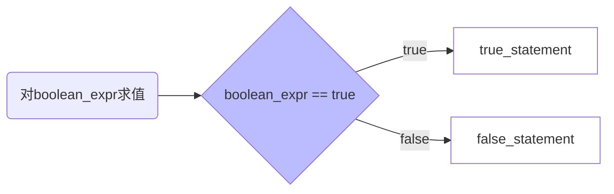

<!-- :moon:&emsp;:runner::dash:&emsp;:couple_with_heart: -->
<!-- 生日快乐! -->

# Java编程基础(下)

[TOC]

## <span id=2.3>Java中的运算符

### 算术运算符

Java中的算术运算符用于处理四则运算的符号
<p align=left>表2-6 算术运算符</p>

|运算符|运算|范例|结果|
|:--|:--:|:--:|--:|
+|正号|a=3; +a|3
-|负号|b=4; -b|-4
+|加|5+5|10
-|减|6-4|2
*|乘|3*4|12
/|除(算术中整除的结果)|7/5|1
%|取模(算术运算中的求余)|7%5|2
++|自增(前)|a=2; b=++a;|a=3; b=3;
++|自增(后)|a=2; b=a++;|a=3; b=2;
--|自减(前)|a=2; b=--a;|a=1; b=1;
--|自减(后)|a=2; b=a--;|a=1; b=2;

:blue_heart:多加注意:blue_heart:

- 使用自增(++)或自减(--)时,如果运算符(++/--)放在变量之前,则会先运算再使用变量;如果运算符放在变量之后,则会先使用变量再运算
- 当除数和被除数都为整数时,得到的结果是一个整数,如果除法运算有小数参与,得到的结果也是一个小数
- 进行取模(%)运算时,运算结果的正负取决于被模数(%左边的数)的符号,与模数(%右边的数)的符号无关

### 赋值运算符

赋值运算符用于将常量、变量或表达式的值赋给某一个变量
<p align=left>表2-7 赋值运算符</p>

|运算符|运算|范例|结果|
|:--:|:--:|:--:|:--:|
|=|赋值|a=3; b=2;|a=3; b=2|
|+=|加等于|a=3; b=2; a+=b;|a=5; b=2;|
|-=|减等于|a=3; b=2; a-=b;|a=1; b=2;|
|*=|乘等于|a=3; b=2; a*=b;|a=6; b=2;|
|/=|除等于|a=3; b=2; a/=b;|a=1; b=2;|
|%=|模等于|a=3; b=2; a%=b;|a=1; b=2;|

:purple_heart:多加注意:purple_heart:

- 在Java中可以通过一条语句对多个变量进行赋值:smiley::+1:

```java
int x, y, z;
x = y = z = 5; // 为三个变量赋值
```

- 在Java中不可以通过一条声明语句同时给多个变量赋值:worried::-1:

```java
int x = y = z = 5;
```

- 赋值运算符中强制类型转换的自动实现:warning:

> 使用+=, -=, *=, /=, %=运算符进行赋值时,强制类型转换会自动完成

```java
public class Example05{

    public static void main(String[] arg){

        short s = 3; // short类型(16位)
        int i = 5; // int类型(32位)
        s += i; // 运算时,JVM自动将short低转高,运算结果为int类型
        // 赋值时,使用+=将结果赋值给short,JVM自动将int类型的结果转换成short类型

        System.out.println("s=" + s); // s=8
    }
}
```

### 比较运算符

比较运算符用于对两个变量或常量的大小进行比较,其结果是一个布尔值
<p align=left>表2-8 比较运算符</p>

|运算符|运算|范例|结果|
|:--:|:--:|:--:|:--:|
|==|相等于|4 == 3|false|
|!=|不等于|4 != 3|false|
|<|小于|4 < 3|false|
|>|大于|4 > 3|true|
|<=|小于等于|4 <= 3|false|
|>=|大于等于|4 >= 3|true|

应该不会有人在做比较的时候把"=="写成"="吧:exclamation:
不会吧:grey_question:不会吧:grey_question:不会真的有人吧:grey_question:那个人不会:hankey:你吧:wave:

### 逻辑运算符

逻辑运算符用于对布尔类型的值或表达式进行操作,其结果仍是一个布尔值
<p align=left>表2-9 逻辑运算符</p>

|运算符|运算|范例|结果|
|:--:|:--:|:--:|:--:|
|&|与|true & true|true|
|&|与|true & false|false|
|&|与|false & false|false|
|&|与|false & true|false|
|\||或|true \| true|true|
|\||或|true \| false|true|
|\||或|false \| false|false|
|\||或|false \| true|true|
|^|异或|true ^ true|false|
|^|异或|true ^ false|true|
|^|异或|false ^ false|false|
|^|异或|false ^ true|true|
|!|非|!true|false|
|!|非|!false|true|
|&&|逻辑与|true && true|true|
|&&|逻辑与|true && false|false|
|&&|逻辑与|false && false|false|
|&&|逻辑与|false && true|false|
| \|\| |逻辑或|true \|\| true|true|
| \|\| |逻辑或|true \|\| false|true|
| \|\| |逻辑或|false \|\| false|false|
| \|\| |逻辑或|false \|\| true|true|

:green_heart:多加注意:green_heart:

- & 与 && 的区别

    > - &的两边都为true,其结果为true,右边表达式都会进行运算
    > - 使用&&,左边为false,右边的表达式不会进行运算,&&也被称为短路与

- | 与 || 的区别

    > - |的任意一边为true,其结果为true,两边都会运算
    > - ||的左边为true,右边的表达式不会进行运算

- 异或

    > ^两边的布尔值相同时,其结果为false,两边布尔值不相同时,其结果为true

### 位运算符

位运算符是针对二进制的每一位进行运算的符号,专门针对数字0和1进行操作的

- 按位与运算符&

    > - 相同位上的两个二进制数都为1,则该位的运算结果为1,否则为0
    > 00000110
    > &
    > 00001011
    > \-------------
    > 00000010

- 按位或运算符|
  
    > 两个二进制数位有一个为1,则该位的运算结果为1,否则为0
    > 00000110
    > |
    > 00001011
    > \-------------
    > 00001111

- 取反运算符~
  
    > 针对一个二进制数的每一位进行取反操作,如果二进制位是0,取反得到1,如果二进制位是1,取反得到0
    > \~ 00000110
    > \----------------
    > &emsp;11111001

- 左移运算符<<
  
    > 将操作数所有二进制位向左移动指定位数,左边移走的部分舍去,右边的空位补0
    > 00001011 << 1
    > \--------------------
    > 00010110

- 右移运算符>>

    > 将操作数所有进制位向右移动指定位数,右边移走的部分舍去,左边的空位根据原数的符号位补0或者1(原来是复数就全部补1,是正数就全部补0)
    > 00001011 >> 1
    > \--------------------
    > 00000101

- 无符号右移运算符>>>

    > 将操作数的所有二进制位不考虑正负数的向右移动指定位数,左边的空位全部补0,右边移走的部分舍去
    > 00001011>>>1
    > \--------------------
    > 00000101

### 条件运算符

条件运算符,也称三元运算符(或三目运算符),由符号`?`和`:`组合构成<br>

语法格式如下:
> (boolean_expr) ? true_statement : false_statement



```java
int store = 5;
System.out.println(store >= 0 ? "没有库存" : "库存为:"+store);
// 输出结果为"库存为:5"
```

### 运算符的优先级

|优先级|运算符|
|:--:|:--:|
|1|.&emsp;[]&emsp;()|
|2|++&emsp;--&emsp;~&emsp;!|
|3|*&emsp;/&emsp;%|
|4|+&emsp;-|
|5|<<&emsp;>>&emsp;>>>|
|6|<&emsp;>&emsp;<=&emsp;>=&emsp;|
|7|==&emsp;!=|
|8|&|
|9|^|
|10|\||
|11|&&|
|12|\|\||
|13|?&emsp;:|
|14|=&emsp;*=&emsp;/=&emsp;%=&emsp;+=&emsp;-=&emsp;<<=&emsp;>>=&emsp;>>>=&emsp;&=&emsp;^=&emsp;\|=|

<br>

## <span id=2.4>选择结构语句

选择结构语句需要对一些语句作出判断,从而决定执行哪一段代码,选择结构语句分为if条件语句和switch条件语句

### if条件语句

if条件语句指如果满足某种条件,就进行某种处理,&ensp;if条件语句分为3种语法格式

- if语句
指满足某种条件就进行处理,不满足则跳过执行语句

```java
if(判断条件){
    执行语句
}
```

```java
public class Example07{

    public static void main(String[] args){
        
        int age = 17; // int类型变量age,初始值为17

        if(age < 18){ // 判断age是否小于18

            System.out.println("此人未成年!"); // 小于18,输出"此人未成年!"
        }
    }
}
```

<br>

- if...else语句
指如果满足某种条件,就进行某种处理,否则就进行另一种处理

```java
if(判断条件){
    执行语句1 // 判断条件为true执行语句1
}else{
    执行语句2 // 判断条件为false执行语句2
}
```

```java
public class Example08{

    public static void main(String[] args){

        int num = 19;

        if(num % 2 == 0){
            // 判断条件成立(true),num能被2整除
            System.out.println(num +"是一个整数");
        }else{
            // 判断条件不成立(false),num不能被2整除
            System.out.println(num +"是一个奇数");
        }
    }
}
```

tips: 这里的语句可以用三元运算符代替,替换语句如下:

```java
System.out.println(num %2 ==0? num +"是一个整数" : num +"是一个奇数");
```

<br>

- if...else if...else语句

if...else if...else语句用于对多个条件进行分支判断,从而进行多种不同的处理

```java
if(判断条件1){
    执行语句1
}else if(判断条件2){
    执行语句2
}
...
else if(判断条件n){
    执行语句n
}else{
    执行语句n+1
} // 所有条件均不满足,执行语句n+1
```

```java
public class Example09{

    public static void main(String[] args){

        int grade = 75;

        if(grade > 80){
            
            System.out.println("该成绩的等级符号为优");

        }else if(grade > 70){
            
            System.out.println("该成绩的等级为良");

        }else if(grade > 60){
            
            System.out.println("该成绩的等级为中");
            
        }else{

            System.out.println("该成绩的等级为差");
        }
    }
}
```

### switch条件语句

switch语句也是一种常见的选择结构语句，由一个switch控制表达式和多个case关键字组成，switch条件语句的控制表达式的结果类型可以是byte、short、char、int、enum枚举以及String类型，*不能是boolean类型*

```java
switch (控制表达式){
    case 目标值1:
        执行语句1
        break;
    case 目标值2:
        执行语句2
        break;
    ...
    case 目标值n:
        执行语句n
        break;
    default:
        执行语句n+1
        break;
}
```

> switch语句将控制表达式的值与每个case中的目标值进行匹配,如果找到了匹配的值,就执行相应case后的执行语句,并通过break关键字跳出switch语句,如果在遍历完所有case中的值后仍没有匹配的值,则执行default后面的语句

```java
public class Example10{

    pulic static void main(String[] args){
        
        int month = 5;

        switch (month){

        case 12:
        case 1:
        case 2:
            System.out.println("冬天");
            break;

        case 3:
        case 4:
        case 5:
            System.out.println("春");
            break;

        case 6:
        case 7:
        case 8:
            System.out.println("夏");
            break;

        case 9:
        case 10:
        case 11:
            System.out.println("秋");
            break;

        default:
            System.out.println("输入月份不正确");
            break;
        }
    }
}
```

> 当有多个case目标值会执行同样的执行语句时,可以将这多个case标签并列书写,并只编写一次执行语句即可

<br>

## <span id=2.5>循环条件语句

Java中的一种特殊语句,可以实现将一段代码重复执行,
循环语句分为while语句和do...while语句以及for循环语句

### while条件语句

根据条件判断决定是否执行{}内的语句,while语句会反复判断循环条件是否成立,只要条件成立,{}内的循环语句就会执行,直到循环条件不成立,while才会结束

```java
while(循环条件){
    执行语句
    ...
}
```

```java
public class Example11{
    
    public static void main(String[] args){
    
        int x = 1;

        while(x <= 4){

            System.out.println("x=" + x);

            x++; // 没有这行代码,循环永远不会结束
        }
    }
}
```

### do...while条件语句

do...while循环语句也叫后测试循环语句,它和while循环语句的功能类似

```java
do{
    执行语句
    ...
}while(循环条件);
// 记得英文半角的;
```

```java
public class Example12{

    public static void main(String[] args){

        int x = 1;

        do{

            System.out.println("x="+x);
            x++;

        }while(x <= 4);
        // 循环体会先执行一次然后再判断循环条件是否成立(是否进入下一次循环)
    }
}
```

### for循环语句

最常用的循环语句,一般用在循环次数已知的情况下,通常可以使用while代替

```java
for(初始化表达式; 循环条件; 操作表达式){
    执行语句
    ...
}
```

> 首先执行一次初始化表达式,然后进行循环条件判断,结果为true,则执行循环体,最后再执行操作表达式来控制循环条件,循环条件结果为false时会跳出整个for循环

```java
public class Example13{

    public static void main(String[] args){

        int sum = 0;

        for(int count = 1; count <= 4; count++){
            sum += count; // sum = sum + count
        }

        System.out.println("sum="+sum); // sum = 10
    }
}
```

### 循环嵌套

嵌套循环是指一个在循环语句的循环体中再定义一个循环语句的语法结构,
while,do...while,for循环语句都可以进行循环嵌套,并且它们之间也可以互相嵌套

```java
for(初始化表达式; 循环条件; 操作表达式){
    ...
    for(初始化表达式; 循环条件; 操作表达式){
        执行语句
        ...
    }
    ...
}
```

> 上面的语法结构展示了双层for循环嵌套的基本格式,其中外层for循环每执行一次,都要执行完内层循环中的所有for循环,然后再根据条件判断是否执行外层循环

```java
public class Example14{

    public static void main(String[] args){

        for(int rows = 1; rows <= 9; rows ++){ // 1~9行(*后的数字)

            for(int column = 1; column <= rows; column ++){ // 1~9列(*前的数字)
                
                System.out.print(column+"*"+rows+"="+column*rows+"\t");
            }

            System.out.println(""); // print与println的区别在于,println会换行
        }
    }
}
```

### 跳转语句

跳转语句用于实现循环语句执行过程中程序流程的跳转,再Java中的跳转语句有break语句和continue语句

- break语句

> - switch条件语句和循环结构语句都可以使用break语句
> - switch语句中,作用是终止某个case并跳出switch结构
> - 循环结构语句中,作用是跳出当前循环结构语句,并执行后面的代码

```java
public class Example15{

    public static void main(String[] args){

        int x = 1;

        while(x <= 4){

            System.out.println("x="+x);

            if(x==3)
                break;
            // x=3时break跳出整个循环,打印结果中不会出现"x=4"
            
            x++;
        }
    }
}
```

> 循环语句中的break语句默认只会跳出当前所在循环,如果想要在内层循环中使用break语句跳出外层循环,则需要预先对外层循环进行标记

```java
public class Example16{

    public static void main(String[] args){

        outer: for(int row = 1; row<=9; row++){

            for(int column = 1; column<=row; column++){

                if(column>=3){
                    break outer;
                }

                System.out.print(column+"*"+row+"="+column*row+"\t");
            }
            System.out.println("");
        }
    }
}
```

- continue语句

> continue语句用在循环语句中,它的作用是终止本次循环,执行下一次循环

```java
public class Example17{

    public static void main(String[] args){

        int sum = 0;

        for(int 1 = 1; i<=100; i++){ // 对100以内的奇数求和

            if(i%2==0)
                continue; // 能被2整除则跳出循环并进行下一次循环

            sum += i; // sum=sum+i 
        }
        System.out.println("Sum="+sum); // sum=2500
    }
}
```

<br>

## <span id=2.6>数组

数组指一组数据的集合,数组中的每个数据被称作元素(数组元素从0开始)

### 数组的定义

> 三种定义数组的方法:
>
> - 数组类型 [] 数组名 = new 数组类型 [数组长度];
> - 数组类型 [] 数组名 = new 数组类型 [] {数组元素0, 数组元素1, 数组元素n};
> - 数组元素 [] 数组名 = {数组元素0, 数组元素1, 数组元素n};

```java
int[] ids = new int[100];
String[] names = new String[]{"张三","李四"};
Object[] obj = {"张三","李四"};
// 也可以先声明变量再赋值(分开写)
int[] num; // 声明一个int[]类型变量num,num占用内存空间,但没有分配初始值
num = new int[100]; // 创建了一个数组,并将数组的内存地址赋值给num
// 使用num实际上是在引用数组 
```

> 数组中的每个元素都有一个索引(也可称为角标),访问数组元素可以通过"数组名[角标]"的形式,即"ids[0]...ids[99]",需要注意的是`数组中最小的索引是0,最大的索引数是"数组长度-1"`,数组的长度可以通过"数组名.length"的方式来获得,即数组元素的个数

```java
public class Example18{

    public static void main(String[] args){

        int[] ids = new int[100];// 第一种方式
        System.out.println("ids[0]="+ids[0]);
        System.out.println("ids[99]="+ids[99]);
        System.out.println("==================");

        String[] names = new String[]{"张三", "李四"}; // 第二种方式
        System.out.println("names[0]="+names[0]);
        System.out.println("names[1]="+names[1]);
        System.out.println("==================");

        Object[] object = {"jack", "tom"}; // 第三种方式
        System.out.println("数组的长度为:"+object.length);
        System.out.println("object[0]="+object[0]);
        System.out.println("object[1]="+object[1]);
    }
}
```

Java中不同数据类型元素的初始值
|数据类型|默认初始化值|
|:--:|:--:|
|byte,short,int,long|0|
|float,double|0.0|
|char|空字符'\u0000'|
|boolean|false|
|引用数据类型|null,不引用任何对象|

多加注意:

> - 每个数组的索引范围都是0~length-1,如果访问数组元素时超过这个范围,程序会报数组越界异常--"ArrayIndexOutOfBoundsException"
> - 使用变量引用数组时,变量必须指向一个有效的数组对象,如果该对象为null,则意味着没有指向任何数组,此时通过该变量访问数组就会出现空指针异常"NullPointerException"

```java
public class Example21{

    public static void main(String[] args){

        int[] arr = new int[3]; // 定义一个长度为3的数组
        
        arr[0] = 5;
        System.out.println("arr[0]="+arr[0]);

        arr[1] = null;
        System.out.println("arr[1]="+arr[1]); // 报空指针异常

        System.out.println("arr[3]="+arr[3]); // 报数组越界异常
    }
}
```

### 数组的常见操作

- 数组遍历
    > 依次访问数组中的每个元素,这种操作被称为数组的遍历

    ```java
    public class Example22{

        public static void main(String[] args){

            int[] arr = {1, 2, 3, 4}; //定义数组

            for(int count = 0; count < arr.length; count++){ //遍历数组并打印

                System.out.println(arr[count]);

            }
        }
    } 
    ```

- 数组最值
  > 即获取数组中的最值

  ```java
  public class Example23{

      public static void main(String[] args){

          int arr = {4, 1, 6, 3, 9, 8};
          int max = arr[0]; // max变量用于存储最大值,假定arr[0]为最大值

          for(int i = 1; i<arr.length; i++){

              if(arr[i] > max)
                max = arr[i]; // 遍历数组,如果发现了更大的值,则将其赋值给max
          }
      }
      System.out.println("数组arr中的最大值:"+max);
  }
  ```

- 数组排序
  > 操作数组时,经常需要对数组元素进行排序,排序方法有很多种(`参考《数据结构与算法(Java语言描述)》第三版`),这里选取的方法为冒泡排序
  
  ```java
  public class Example24{

      public static void main(String[] args){

          int arr[] = {9, 5, 34, 23, 67, 87, 99}; // 定义数组
          
          for(int count = 0; count < arr.length; count++){
              // 打印排序前的数组
              System.out.print(arr[count] + " ");
          }

          System.out.println("====================="); // 分割线

          for(int fir = 1; fir < arr.length; fir++){ // 外层循环定义比较的轮数(n-1轮)
              
              for(int sec = 0; sec < arr.length-1; sec++){ // 第一轮需要比较的两个数

                if(arr[sec] > arr[fir]){ // 比较相邻元素
                    // 交换元素  
                    int temp = arr[sec];
                    arr[sec] = arr[fir];
                    arr[fir] = temp;
                }
              }
          }
          for(int count = 0; count < arr.length; count++){ // 打印排序后的数组
              
              System.out.print(arr[count] + " ");
          }
      }
  }
  ```

### 多维数组

多维数组可以简单理解为在数组中嵌套数组,二维数组可以看作是特殊的一维数组,其定义方式有很多种

- 1.指定二维数组的长度和每个数组的元素个数

```java
int[][] arr = new int[3][4];
```

- 2.只指定二维数组的长度,不确定每个数组的元素个数

```java
int[][] arr = new int[3][];
```

- 3.直接使用嵌套的{}对二维数组进行初始化赋值

```java
int[][] arr = {1, 2}, {3, 4, 5}, {6, 7, 8};
```

- 对二维数组中的元素的操作

```java
arr[0][1]; // 获取二维数组中的第一个元素组的第二个元素
arr[0][1] = 1; // 对二维数组中第一个元素组的第二个元素赋值,值为1
```

```java
public class Example25{

    public static void main(String[] args){

        int[][] arr = new int[3][]; // 定义一个长度为3的二维数组

        arr[0] = new int[] {10, 21}; // 为数组元素赋值
        arr[1] = new int[] {10, 22, 21};
        arr[2] = new int[] {20, 10, 21, 22};

        int sum = 0; // 定义变量sum用于存储总销售额
        
        for(int outter = 0; outter < arr.length; outter++){ // 遍历数组元素
            
            int groupSum = 0; // 定义变量用于存放小组销售额

            for(int inner = 0; inner < arr[outter].length; inner++){
                
                groupSum += arr[outter][inner]; // 计算小组销售额,即元素组中元素值的累加
            }

            sum += groupSum; // 计算总销售额,即累加每个元素组的和

            System.out.println("第" +(outter+1) +"个小组销售额为:" +groupSum +"万元");
        }

        System.out.println("总销售额为:" +sum +"万元");
    }
}
```
