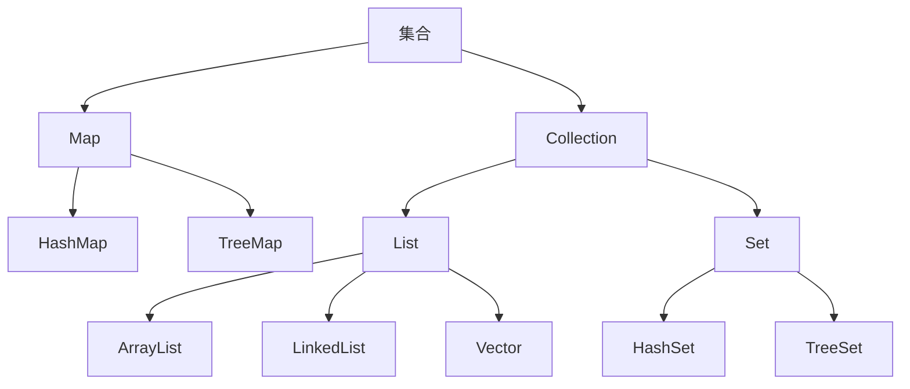
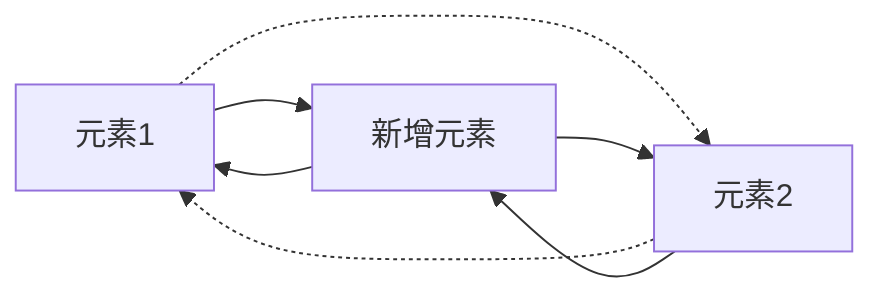
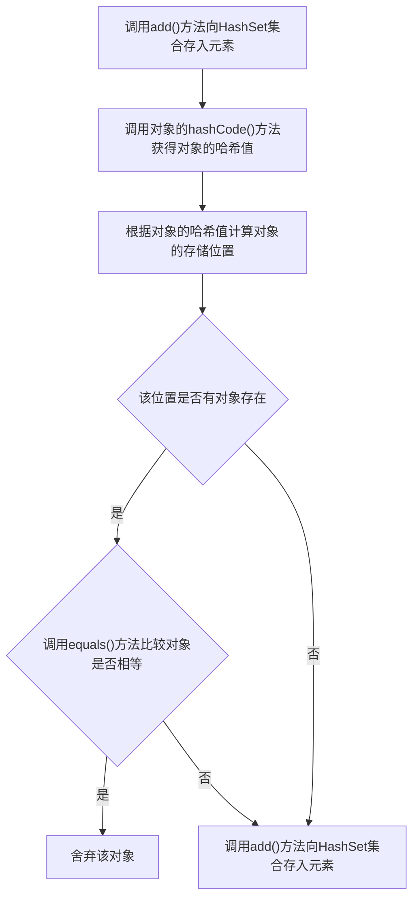
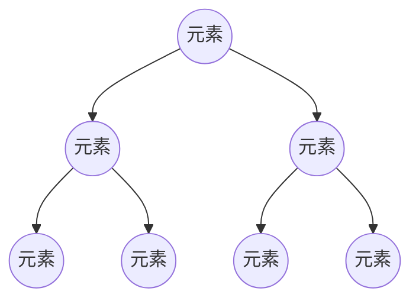

# 第六章_集合

[TOC]

<font face="黑体">

## 集合概述

Java中的集合就像一个容器,专门存储Java对象(实际上是对象的引用),这些对象可以是任意类型,且长度可变,这些集合类位于java.util包中.

集合按照存储类型可以分为两大类:单列集合Collection和双列集合Map.

1. Collection
   - 单列集合的根接口,用于存储一系列符合某种规则的元素.重要的子接口有List和Set.
   - List集合的特点是元素有序,可重复.List的主要实现类有ArrayList和LinkedList以及Vector.
   - Set集合的特点是元素无序且不可重复.Set的主要实现类有HashSet和TreeSet.
2. Map
   - 双列集合的根接口,用于存储具有键(Key),值(Value)映射关系的元素.
   - Map集合中每个元素都包含一对键值,并且Key是唯一的,在使用Map集合时可以通过指定的Key找到对应的Value.Map接口的主要实现类有HashMap和TreeMap.



## Collection接口

单列集合Collection中的一些主要方法,其中stream()方法是JDK8增加的.

|方法声明|功能概述|
|:--:|:--:|
|boolean add(Object o)|向集合中添加一个元素|
|boolean addAll(Collection c)|将指定集合c中的所有元素添加到该集合中|
|void clear()|删除该集合中的所有元素|
|boolean remove(Object o)|删除该集合中的指定元素|
|boolran removeAll(Collection c)|删除集合中包含指定集合c中的所有元素|
|boolean isEmpty()|判断该集合是否为空|
|boolean contains(Object o)|判断该集合中是否包含某个元素|
|boolean containsAll(Collection c)|判断该集合中是否包含指定集合c中的所有元素|
|Iterator iterator()|返回在该集合的元素上进行迭代的迭代器(Iterator),用于遍历该集合所有元素|
|int size()|获取该集合元素个数|
|Stream\<E> stream()|将集合源转换为有序元素的流对象|

### List <i><font size=4 color=red>IS-A</font></i> Collection <font size=2 color=red>注: IS-A 即 subsumption父子继承关系</font>

List集合特点: 允许出现重复的元素,所有元素以线性方式进行存储.元素有序,元素存入顺序和取出顺序一致.

List作为Collection集合的子接口,不但继承了Collection接口中的全部方法,而且还增加了一些操作集合的特有方法,其中sort(Comparator<? super E> c)方法是JDK8增加的.

|方法声明|功能描述|
|:--:|:--:|
|void add(int index, Object element)|将元素element插入在List集合的指定索引位置|
|boolean addAll(int index, Collection c)|将集合c包含的所有元素插入到List集合的指定索引位置|
|Object get(int index)|返回集合index索引处的元素|
|Object set(int index, Object element)|将集合index索引处的元素替换成element元素,并将替换的元素返回|
|Object remove(int index)|删除index索引处的元素|
|int indexOf(Object o)|返回对象o在集合中首次出现的位置索引|
|int lastIndexOf(Object o)|返回对象o在集合中最后一次出现的位置索引|
|List subList(int fromIndex, int toIndex)|返回从索引fromIndex(包括)到索引toIndex(不包括)之间的所有元素集合组成的子集合|
|Object[] toArray()|将集合元素转换成数组|
|default void sort(Comparator<? super E> c)|根据指定的比较器规则对集合元素进行排序|

#### ArrayList <font size=4 color=red><i>implements</i></font> List

ArrayList内部封装了一个长度可变的数组对象,当存入的元素超过数组长度时,ArrayList会在内存中分配一个更大的数组来存储这些元素,因此可以将ArrayList看作是一个长度可变的数组.
ArrayList在增加或删除指定位置的元素时,会创建新的数组,效率比较低,不适合做大量的增删操作,但是其采用数组结构通过索引方式访问元素的方式在遍历和查找元素时极为高效.

```java
import java.util.ArrayList;


public class Example01 {

   public static void main(String[] args) {
      // 创建ArrayList对象,并显示地指定集合中存储String类型的元素,避免产生安全隐患
      ArrayList<String> list = new ArrayList();

      // 向集合中添加元素
      list.add("stu1");
      list.add("stu2");
      list.add("stu3");
      list.add("stu4");

      System.out.println("集合的长度: " + list.size());
      System.out.println("第2个元素是: " + list.get(1)); //索引取值从0开始
   }
}
```

#### LinkedList <font size=4 color=red><i>implements</i></font> List

LinkedList内部包含有两个Node类型的first和last属性维护一个双向循环链表,链表中的每一个元素都使用引用的方式来记住它的前一个元素和后一个元素,从而将所有元素彼此连接起来.
LinkedList在指定位置插入一个新元素时,只需要修改元素之间的这种引用关系,删除一个节点也是如此,所以LinkedList集合对于元素的增删操作表现出很高的效率,但是在遍历和查找元素时效率较低.



LinkedList集合除了从接口Collection和List中继承并实现了集合操作方法外,还专门针对元素的增删操作定义了一些特有的方法.

|方法声明|功能概述|
|:--:|:--:|
|void add(int index, E element)|在此链表中指定位置插入指定的元素|
|void addFirst(Object o)|将指定元素插入集合开头|
|void addLast(Object o)|将指定元素添加到集合的结尾|
|Object getFirst()|返回集合的第一个元素|
|Object getLast()|返回集合的最后一个元素|
|Object removeFirst()|移除并返回集合的第一个元素|
|Object removeLast()|移除并返回集合的最后一个元素|
|boolean offer(Object o)|将指定元素添加到集合的结尾|
|boolean offerFirst(Object o)|将指定元素添加到集合的开头|
|boolean offerLast(Object o)|将指定元素添加到集合的结尾|
|Object peek()|获取集合的第一个元素|
|Object peekFirst()|获取集合的第一个元素|
|Object peekLast()|获取集合的最后一个元素|
|Object poll()|移除并返回集合的第一个元素|
|Object pollFirst()|移除并返回集合的第一个元素|
|Object pollLast()|移除并返回集合的最后一个元素|
|void push(Object o)|将指定元素添加到集合的开头|
|void pop()|移除并返回集合的第一个元素|

```java
import java.util.LinkedList;


public class Example02{

   public static void main(String[] args){

      //创建LinkedList集合
      LinkedList link = new LinkedList();

      //1.添加元素
      link.add("stu1");
      link.add("stu2");

      System.out.println(link); //输出集合中的元素
      
      link.offer("offer"); //向集合尾部追加元素

      link.push("push"); //向集合头部添加元素

      System.out.println(link); //输出集合中的元素

      //2.获取元素
      Object object = link.peek(); //获取集合第一个元素

      System.out.println(object); //输出集合中的元素

      //3.删除元素
      link.removeFirst(); //删除集合第一个元素
      
      link.pollLast(); //删除集合最后一个元素

      System.out.println(link); //输出集合中的元素
   }
}
```

### Set <i><font size=4 color=red>IS-A</font></i> Collection

Set接口继承自Collection接口,它与Collection中方法基本一致,并没有对Collection接口进行功能上的扩充,只是比Collection接口更加严格.

Set接口中的元素无序,并且不允许重复.

Set接口主要有两个实现类:HashSet和TreeSet

#### HashSet <font size=4 color=red><i>implements</i></font> Set

HashSet是根据对象的哈希值来确定元素在集合中存储的位置,具有良好的存取和查找性能.

当向HashSet集合中添加一个元素时,首先会调用该元素的hashCode()方法来确定元素的存储位置,然后再调用元素对象的equals()方法来确保该位置没有重复的元素.

```java
import java.util.HashSet;


public class Example03 {

   public static void main(String[] args) {

      HashSet set = new HashSet();

      set.add("Jack");

      set.add("Eve");

      set.add("Rose");

      set.add("Rose"); //向HashSet set中添加重复元素

      //遍历输出set中的元素
      set.forEach(o -> System.out.println(o));
   }
}
```

调用HashSet的add()方法时:首先调用当前存入元素的hashCode()方法获得对象的哈希值,然后根据对象的哈希值计算出一个存储位置;如果该位置上没有元素,则直接将元素存入;如果该位置上有元素存在(哈希冲突,HashSet底层是hash表+链表+红黑树,链表/红黑树用于解决哈希冲突),则会调用equals()方法让当前存入的元素依次和该位置上的元素进行比较.如果返回的结果为false就将该元素存入集合;返回的结果为true则说明有重复元素,就将该元素舍弃.



当向集合中存入元素时,为了保证HashSet正常工作,要求存入对象时,需要重写Object类中的hashCode()和equals()方法.
Object是所有类的父类,equals()方法是Object提供的一个方法,Object中的equals()方法的默认实现是返回两个对象的"=="比较结果,也就是比较内存地址是否一致,但是equals()是可以被重写的,具体使用时需要关注其是否被重写.
如果需要将开发者自定义的类型对象存入HashSet,需要重写hashCode()方法和equals()方法.

```java
import java.util.*;


class Student{

   private String id;

   private String name;

   public Student(String id, String name){

      this.id = id;

      this.name = name;
   }

   public String toString(){ //重写toString()方法

      return id+":"+name;
   }

   public int hashCode(){ //重写hashCode()方法

      return id.hashCode(); //返回属性id的哈希值
   }

   public boolean equals(Object obj){ //重写equals()方法

      if(this == obj){ //判断是否是同一个对象(比较内存地址)

         return true; //如果是,直接返回true
      }

      if(!(obj instanceof Student)) { //判断对象是否为Student类型

         return false; //如果对象不是Student类型,返回false
      }

      Student stu = (Student) obj; //将对象强转为Student类型

      boolean b = this.id.equals(stu.id); //判断id值是否相同(String类默认重写了equals()方法)

      return b; //返回判断结果
   }
}

public class Example04{

   public static void main(String[] args){

      HashSet hs = new HashSet();
      
      Student stu1 = new Student("1", "Jack");

      Student stu2 = new Student("2", "Rose");

      Student stu3 = new Student("3", "Rose");

      hs.add(stu1);

      hs.add(stu2);

      hs.add(stu3);

      System.out.println(hs);
   }
}
```

#### TreeSet <font size=4 color=red><i>implements</i></font> Set

TreeSet是Set接口的另一个实现类,内部采用平衡二叉树来存储元素,这样的结构保证了TreeSet集合中没有重复的元素,并且可以对元素进行排序.
**二叉树就是每个节点最多有两个子节点的有序树**,每个节点及其子节点组成的树被称为子树,通常左侧的子节点被称为左子树,右侧的子节点被称为右子树,其中**左子树上的元素小于它的根节点,而右子树上的元素大于它的根节点.**



当二叉树存入新元素时,新元素首先会和第一个元素(最顶层元素)进行比较,如果小于第一个元素就执行左边的分支,继续和该分支的子元素进行比较;如果大于第一个元素就执行右边的分支,继续和该分支的子元素进行比较,如此反复,直到与最后一个元素比较时,如果新元素小于最后一个元素就将其放在最后一个元素的左子树上,如果大于最后一个元素就将其放在最后一个元素的右子树上.

针对TreeSet集合存储元素的特殊性,TreeSet在继承Set接口的基础上实现了一些特有的方法

|方法声明|功能描述|
|:--:|:--:|
|Object first()|返回TreeSet集合中的首个元素|
|Object last()|返回TreeSet集合中的最后一个元素|
|Object lower(Object o)|返回TreeSet集合中小于给定元素的最大元素,如果没有返回null|
|Object floor(Object o)|返回TreeSet集合中小于或等于给定元素的最大元素,如果没有返回null|
|Object higher(Object o)|返回TreeSet集合中大于给定元素的最小元素,如果没有返回null|
|Object ceiling(Object o)|返回TreeSet集合中大于或等于给定元素的最小元素,如果没有返回null|
|Object pollFirst()|移除并返回集合的第一个元素|
|Object pollLast()|移除并返回集合的最后一个元素|

```java
import java.util.TreeSet;


public class Example11{

   public static void main(String[] args){

      //创建TreeSet集合
      TreeSet ts = new TreeSet();

      //1.向TreeSet集合中添加元素
      ts.add(3);

      ts.add(9);

      ts.add(1);

      ts.add(1);

      ts.add(21);

      System.out.println("创建的TreeSet集合为:" + ts);

      //2.获取首尾元素
      System.out.println("TreeSet集合首元素为:" + ts.first());

      System.out.println("TreeSet集合尾元素为:" + ts.last());

      //3.比较并获取元素
      System.out.println("集合中小于或等于9的最大一个元素为:" + ts.floor(9));

      System.out.println("集合中大于10的最小一个元素为:" + ts.higher(10));

      System.out.println("集合中大于或等于100的最小一个元素为:" + ts.ceiling(100));

      //4.删除元素
      Object first = ts.pollFirst(); //移除并返回集合中的首元素

      System.out.println("删除的第一个元素是:" + first);

      System.out.println("删除首元素后的TreeSet集合为:" + ts);
   }
}
```

集合中的元素在进行比较时,都会调用compareTo()方法,该方法是Comparable接口中定义的,因此要想对集合中的元素进行排序,就必须实现Comparable接口.
Java中的大部分类都实现了Comparable接口,并默认实现了接口中的CompareTo()方法,如Integer,Double和String等.

实际开发中,除了会向TreeSet中添加java中默认的类型数据外,还会存入一些用户自定义的类型数据,由于自定义的数据类型没有默认实现Comparable接口,因此也就无法直接在TreeSet集合中进行排序操作.

为了解决这个问题,Java提供了两种TreeSet的排序规则:自然排序和定制排序.

- 自然排序
  自然排序要求向TreeSet集合中存储的元素所在类必须实现Comparable接口,并重写compareTo()方法,然后TreeSet集合就会对该类型元素使用compareTo()方法进行比较,并默认使用升序排序.

```java
import java.util.TreeSet;

//定义Teacher类实现Comparable接口
class Teacher implements Comparable{

   String name;

   int age;

   public Teacher(String name, int age) {

      this.name = name;

      this.age = age;
   }

   public String toString(){

      return name +":"+ age;
   }

   //重写Comparable接口的comparaTo()方法
   public int comparaTo(Object obj){

      Teacher s = (Teacher)obj;

      //定义比较方式,先比较年龄age,再比较名称name
      if(this.age - s.age > 0){

         return 1;
      }

      if(this.age - s.age == 0){

         return this.name.compareTo(s.name);
      }

      return -1;
   }
   /** Teacher类实现了Comparable接口,并重写了compareTo()方法.
    * 在compareTo()方法,首先针对age值进行比较,根据比较结果返回-1和1,
    * 当age相同时,再对name进行比较.
    **/
}

public class Example12{

   public static void main(String[] args){
 
      TreeSet ts = new TreeSet();

      ts.add(new Teacher("Jack", 19));

      ts.add(new Teacher("Tom", 19));

      ts.add(new Teacher("Rose", 18));

      ts.add(new Teacher("Rose", 18));

      System.out.println(ts);
   }
}
```

> [Rose:18, Jack:19, Tom:19]

- 定制排序
  定制排序就是在创建TreeSet集合时就自定义一个比较器来对元素进行定制排序.
  例如实现了Comparable接口的类而不想按照compareTo()方法进行排序;比如存储在TreeSet中的字符串可以按照长度而不是英文字母的顺序来进行排序.

```java
import java.util.Comparator;
import java.util.TreeSet;

//定义比较器实现Comparator接口
class MyComparator implements Comparator {

   public int compare(Object obj1, Object obj2){ //定制排序方式

      String s1 = (String) obj1;

      String s2 = (String) obj2;

      int temp = s1.length() - s2.length();

      return temp;
   }
}

public class Example13{

   public static void main(String[] args) {

      //1.创建集合时,传入Comparator接口实现定制排序规则
      TreeSet ts = new TreeSet(new MyComparator());
      //使用了TreeSet的有参构造方法public TreeSet(Comparator<? super E> comparator)

      ts.add("Jack");

      ts.add("Helena");

      ts.add("Eve");

      System.out.println(ts);

      //2.创建集合时,使用Lambda表达式定制排序规则
      TreeSet ts2 = new TreeSet((obj1, obj2) ->{

         String s1 = (String) obj1;

         String s2 = (String) obj2;

         return s1.length() - s2.length();
      });

      ts2.add("Jack");

      ts2.add("Helena");

      ts2.add("Eve");

      System.out.println(ts2);
   }
}
```

因为TreeSet集合会对存入元素进行比较排序,所以为了保证程序的正常运行,一定要保证存入TreeSet集合中的元素是同一种数据类型.

### Colection集合遍历

#### Iterator遍历集合

Iterator接口是Java集合框架里的一员，主要用于迭代访问（即遍历）Collection中的元素，因此Iterator对象也被称为迭代器。

```java
import java.util.ArrayList;
import java.util.Iterator;

public class Example03{

   public static void main(String[] args){

      //创建ArrayList对象
      ArrayList list = new ArrayList();

      //向集合中添加字符串
      list.add("data_1");
      
      list.add("data_2");

      list.add("data_3");

      //获取Iterator对象
      Iterator iterator = list.iterator();

      //判断集合中是否存在下一个元素
      while(iterator.hasNext()){

         Object obj = iterator.next(); //取出ArrayList集合中的元素

         System.out.println(obj);

         // if("Annie".equals(obj)){
         //    list.remove(obj);
         // }

         /* 在使用Iterator迭代器对集合中的元素 进行迭代时,
            如果调用了集合对象的remove()方法去删除元素,会出现异常. */
         
         /** 并发修改异常ConcurrentModificationException:
           * 由迭代器对象抛出,原因是集合中删除了元素会导致迭代器预期的迭代次数发生改变,导致迭代器的结果不准确.
           * 解决方法1: 找到该元素后跳出循环不再迭代
           * if("Annie".equals(obj)){
           *   list.remove(obj);
           *   break;
           * }
           * 解决方法2: 使用迭代器本身的删除方法
           * if("Annie".equals(obj)){
           *   iterator.remove();  
           * }
           */
      }
   }
}
```

遍历元素时,首先通过调用ArrayList集合的iterator()方法获取迭代器对象,然后使用迭代器的hasNext()方法判断集合中是否存在下一个元素.如果存在,则调用next()方法将元素取出,否则说明已到达了集合末尾,停止遍历元素.
在通过next()方法获取元素时,必须保证要获取的元素存在,否则会抛出NoSuchElementException异常.
Itrator迭代器对象在遍历集合时,内部采用指针的方式来跟踪集合中的元素,在调用Iterator的next()方法之前,迭代器的索引位于第一个元素之前,不指向任何元素,当第一次调用迭代器的next()方法后,迭代器的索引会向后移动一位,指向第一个元素并将该元素返回.当再次调用next()方法时,迭代器的索引会指向第二个元素并将该元素返回,依此类推,直到hasNext()方法返回false表示到达了集合末尾,终止遍历.

#### foreach遍历

foreach循环是一种更加简洁的for循环,也称增强for循环.

```java
for(容器中元素类型 临时变量 : 容器变量) {
   //执行语句
}
```

与for循环相比,foreach循环不需要获得容器的长度也不需要根据索引访问容器中的元素,它会自动遍历容器中的每个元素.

```java
import java.util.ArrayList;

public class Example04{

   public static void main(String[] args){

      ArrayList list = new ArrayList();

      list.add("data_1");

      list.add("data_2");

      list.add("data_3");

      //使用foreach循环遍历集合
      for(Object obj : list){

         System.out.println(obj);//取出并打印集合中的元素
      }
      /** foreach循环书写起来虽然简洁,但在使用时仍由局限,
       * foreach在循环遍历集合和数组时,只能访问集合中的元素,
       * 不能其中的元素进行修改
       */
   }
}
```

#### JDK8的forEach遍历集合

JDK8根据Lambda表达式特性还增加了一个forEach(Consumer action)方法来遍历集合,该方法所需参数是一个函数式接口(FunctionalInterface,有且仅有一个抽象方法的接口).

```java
import java.util.ArrayList;

public class Example07 {

   public static void main(String[] args){
      
      ArrayList list = new ArrayList();

      list.add("data_1");

      list.add("data_2");

      list.add("data_3");
      
      System.out.println(list);
      
      //使用forEach(Consumer action)方法遍历集合
      list.forEach(obj -> System.out.println("迭代集合元素:" + obj));
   }
}
```

除了针对所有集合类型对象增加了一个forEach(Consumer action)方法来遍历集合外,还针对Iterator迭代器对象提供了一个forEachRemaining(Consumer action)方法来进行遍历,该方法同样需要一个函数式接口.

```java
import java.util.ArrayList;
import java.util.Iterator;

public class Example08{

   public static void main(String[] args){

      ArrayList list = new ArrayList();

      list.add("data_1");

      list.add("data_2");

      list.add("data_3");

      System.out.println(list);

      //将集合转换为Iterator迭代器对象
      Iterato it = list.iterator();

      //使用forEachRemaining(Consumer action)来遍历迭代器对象
      it.forEachRemaining(obj -> System.out.println("迭代集合元素:" + obj));
   }
}
```

## Map接口

Map接口是一种双列集合,每个元素都包含一个键对象Key和值对象Value,键和值之间存在一种对应关系,称为映射.
Map中的映射关系是一对一的,一个键对象Key对应唯一一个值对象Value,其中键对象Key和值对象Value可以是任意数据类型,并且键对象Key不允许重复.

Map集合常用方法:

|方法声明|功能描述|
|:--:|:--:|
|void put(Object key, Object value)|向Map集合中添加指定键值映射的元素|
|int size()|返回Map集合键值对映射的个数|
|Object get(Object key)|返回指定键所映射的值,如果此映射不包含该键的映射关系,则返回null|
|boolean containsKey(Object key)|查看Map集合中是否存在指定的键对象Key|
|boolean containsValue(Object value)|查看Map集合中是否存在指定的值对象Value|
|Object remove(Object key)|删除并返回Map集合中指定键对象Key的键值映射元素|
|void clear()|清空整个Map集合中的键值映射元素|
|Set keySet()|以Set集合的形式返回Map集合中的所有键对象Key|
|Collection values()|以Collection集合的形式返回集合中的所有值对象Value|
|Set<Map.Entry<Key, Value>> entrySet()|将Map集合转换成存储元素类型为Map的Set集合|
|Object getOrDefult(Object key, Object defaultValue)|返回Map集合指定键Key所映射的值,如果不存在则返回默认值defaultValue(JDK 8较之前版本增加的方法)|
|void forEach(BiConsumer action)|通过传入一个函数式接口对Map集合元素进行遍历(JDK 8较之前版本增加的方法)|
|Object putIfAbsent(Object key, Object value)|向Map集合中添加指定键值映射的元素,如果集合中已存在该键值映射元素,则不再添加而是返回已存在的值对象Value(JDK 8较之前版本增加的方法)|
|boolean remove(Object key, Object value)|删除集合中键值映射同时匹配的元素(JDK 8较之前版本新增的方法)|
|boolean replace(Object key, Object value)|将Map集合中指定键对象Key所映射的值修改为value(JDK 8较之前版本新增的方法)|

### HashMap <font size=4 color=red><i>implements</i></font> Map

HashMap集合是Map集合是Map接口的一个实现类,它用于存储键值映射关系,该集合的键和值允许为空,但是键不能重复,且集合中的元素是无序的.

HashMap底层是由哈希表结构组成的,其实就是"数组+链表"的组合体,数组是HashMap的主体结构,链表则主要是为了解决哈希值冲突而存在的分支结构.正因为这样特殊的存储结构,HashMap集合对于元素的增删改查操作表现出的效率都比较高.

水平方向以数组结构为主体并在竖直方向以链表结构进行结合的就是HashMap中的哈希表结构.哈希表结构中,水平方向数组的长度称为HashMap集合的容量(capacity),竖直方向每个元素位置对应的链表结构称为一个桶(bucket),每个桶的位置在集合中都有对应的桶值,用于快速定位集合元素添加、查找时的位置.

向HashMap集合添加元素时,首先会调用键对象k的hash(k)方法,快速定位并寻址到该元素在集合中要存储的位置.
在定位到存储元素键对象k的哈希值所对应桶位置后,如果该位置为空,则可以直接向该桶位置插入元素对象;如果该桶位置不为空,则还需要继续通过键对象k的equals(k)方法比较新插入的元素键对象和已存在的元素键对象是否相同,如果相同,就会对原有元素的值对象v进行替换并返回原来的旧值,否则会在该桶的链表结构头部新增一个节点来插入元素对象.

```java
import java.util.HashMap;
import java.util.Map;

public class Example14{

   public static void main(String[] args){

      //创建HashMap对象
      Map map = new HashMap();

      //1.向Map存储键值对元素
      map.put("1", "Jack");

      map.put("2", "Rose");

      map.put("3", "Lucy");

      map.put("4", "Lucy");

      map.put("1", "Tom");

      System.out.println(map);

      //2.查看键对象是否存在
      System.out.println(map.containsKey("1"));

      //3.获取指定键对象映射的值
      System.out.println(map.get("1"));

      //4.获取集合中的键对象和值对象集合
      System.out.println(map.keySet());

      System.out.println(map.values());

      //5.替换指定键对象映射的值
      map.replace("1", "Tom2");

      System.out.println(map);

      //6.删除指定键对象映射的键值对元素
      map.remove("1");

      System.out.println(map);
   }
}
```

数组是内存中连续的存储单元,它占用的空间代价是很大的,但是它的随机存取速度是Java集合中最快的.通过增大桶的数量,而减少Entry<K,V>链表的长度,来提高从HashMap中读取数据的速度.
HashMap内部采用了根据实际情况,动态地分配桶数量的策略:
通过new HashMap()方法创建HashMap时,默认集合容量(capacity)大小为16,加载因子loadFactor为0.75(HashMap桶多少权衡策略的经验值),此时该集合桶的阈值就为12(容量capacity与加载因子loadFactor的乘积).如果向HashMap集合中不断添加完全不同的键值对<K, V>,当超过12个存储元素时,HashMap集合就会默认新增一倍桶的数量(也就是集合的容量).
如果对存取效率要求不高,需要节省空间,可以使用new HashMap(int initialCapacity, float loadFactor)构造方法,在创建HashMap集合时指定集合容量与加载因子,并将这个加载因子设置得大一些.

### TreeMap <font size=4 color=red><i>implements</i></font> Map

