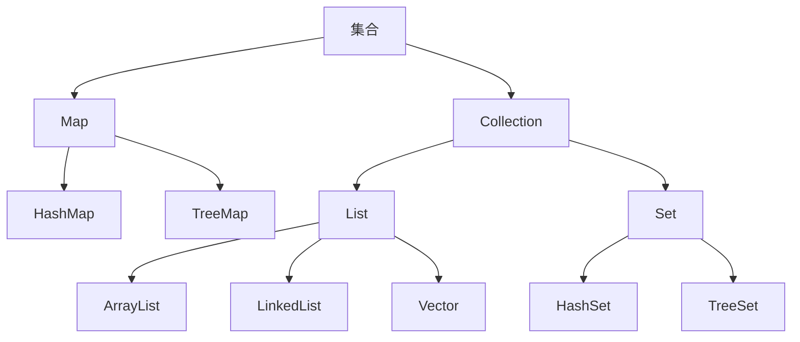

# 第六章_集合

[TOC]

## 集合概述

Java中的集合就像一个容器,专门存储Java对象(实际上是对象的引用),这些对象可以是任意类型,且长度可变,这些集合类位于java.util包中.

集合按照存储类型可以分为两大类:单列集合Collection和双列集合Map.

1. Collection
   - 单列集合的根接口,用于存储一系列符合某种规则的元素.重要的子接口有List和Set.
   - List集合的特点是元素有序,可重复.List的主要实现类有ArrayList和LinkedList以及Vector.
   - Set集合的特点是元素无序且不可重复.Set的主要实现类有HashSet和TreeSet.
2. Map
