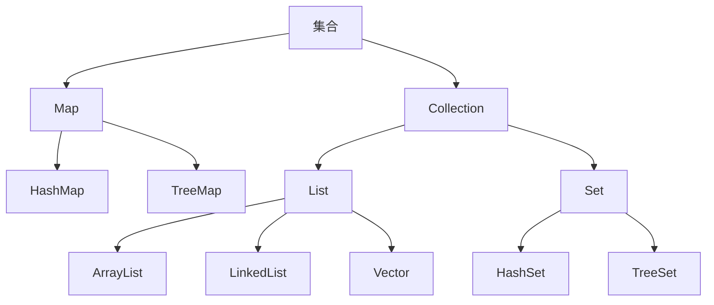
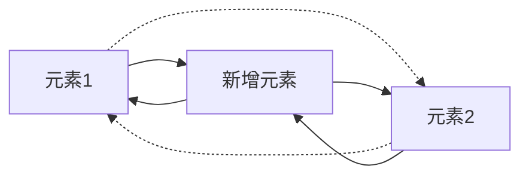
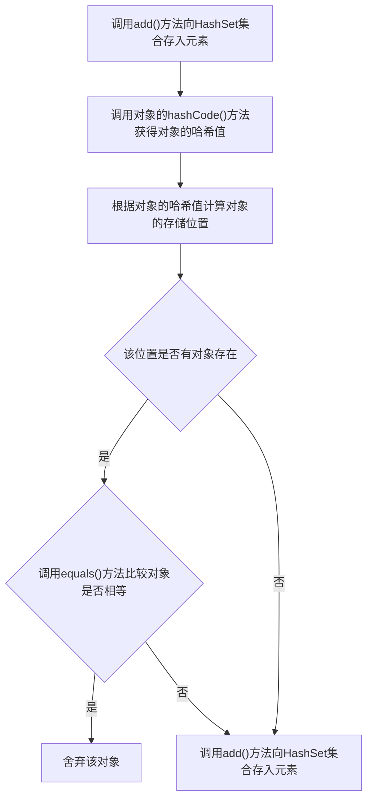
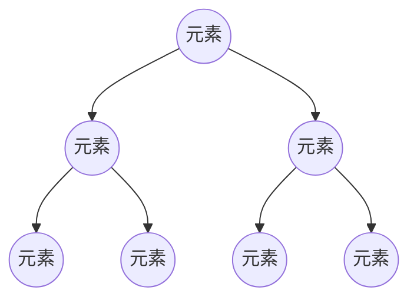

# 第六章_集合

[TOC]

## 集合概述



Java中的集合就像一个容器,专门存储Java对象(实际上是对象的引用),这些对象可以是任意类型,且长度可变,这些集合类位于java.util包中.

集合按照存储类型可以分为两大类:单列集合Collection和双列集合Map.

1. Collection
   - 单列集合的根接口,用于存储一系列符合某种规则的元素.重要的子接口有List和Set.
   - List集合的特点是元素有序,可重复.List的主要实现类有ArrayList和LinkedList以及Vector.
   - Set集合的特点是元素无序且不可重复.Set的主要实现类有HashSet和TreeSet.
2. Map
   - 双列集合的根接口,用于存储具有键(Key),值(Value)映射关系的元素.
   - Map集合中每个元素都包含一对键值,并且Key是唯一的,在使用Map集合时可以通过指定的Key找到对应的Value.Map接口的主要实现类有HashMap和TreeMap.

## Collection接口

单列集合Collection中的一些主要方法,其中stream()方法是JDK8增加的.

|方法声明|功能概述|
|:--:|:--:|
|boolean add(Object o)|向集合中添加一个元素|
|boolean addAll(Collection c)|将指定集合c中的所有元素添加到该集合中|
|void clear()|删除该集合中的所有元素|
|boolean remove(Object o)|删除该集合中的指定元素|
|boolran removeAll(Collection c)|删除集合中包含指定集合c中的所有元素|
|boolean isEmpty()|判断该集合是否为空|
|boolean contains(Object o)|判断该集合中是否包含某个元素|
|boolean containsAll(Collection c)|判断该集合中是否包含指定集合c中的所有元素|
|Iterator iterator()|返回在该集合的元素上进行迭代的迭代器(Iterator),用于遍历该集合所有元素|
|int size()|获取该集合元素个数|
|Stream\<E> stream()|将集合源转换为有序元素的流对象|

### List <i><font size=4 color=red>IS-A</font></i> Collection <font size=2 color=red>注: IS-A 即 subsumption父子继承关系</font>

List集合特点: 允许出现重复的元素,所有元素以线性方式进行存储.元素有序,元素存入顺序和取出顺序一致.

List作为Collection集合的子接口,不但继承了Collection接口中的全部方法,而且还增加了一些操作集合的特有方法,其中sort(Comparator<? super E> c)方法是JDK8增加的.

|方法声明|功能描述|
|:--:|:--:|
|void add(int index, Object element)|将元素element插入在List集合的指定索引位置|
|boolean addAll(int index, Collection c)|将集合c包含的所有元素插入到List集合的指定索引位置|
|Object get(int index)|返回集合index索引处的元素|
|Object set(int index, Object element)|将集合index索引处的元素替换成element元素,并将替换的元素返回|
|Object remove(int index)|删除index索引处的元素|
|int indexOf(Object o)|返回对象o在集合中首次出现的位置索引|
|int lastIndexOf(Object o)|返回对象o在集合中最后一次出现的位置索引|
|List subList(int fromIndex, int toIndex)|返回从索引fromIndex(包括)到索引toIndex(不包括)之间的所有元素集合组成的子集合|
|Object[] toArray()|将集合元素转换成数组|
|default void sort(Comparator<? super E> c)|根据指定的比较器规则对集合元素进行排序|

#### ArrayList <font size=4 color=red><i>implement</i></font> List

ArrayList内部封装了一个长度可变的数组对象,当存入的元素超过数组长度时,ArrayList会在内存中分配一个更大的数组来存储这些元素,因此可以将ArrayList看作是一个长度可变的数组.
ArrayList在增加或删除指定位置的元素时,会创建新的数组,效率比较低,不适合做大量的增删操作,但是其采用数组结构通过索引方式访问元素的方式在遍历和查找元素时极为高效.

```java
import java.util.ArrayList;


public class Example01 {

   public static void main(String[] args) {
      // 创建ArrayList对象,并显示地指定集合中存储String类型的元素,避免产生安全隐患
      ArrayList<String> list = new ArrayList();

      // 向集合中添加元素
      list.add("stu1");
      list.add("stu2");
      list.add("stu3");
      list.add("stu4");

      System.out.println("集合的长度: " + list.size());
      System.out.println("第2个元素是: " + list.get(1)); //索引取值从0开始
   }
}
```

#### LinkedList <font size=4 color=red><i>implement</i></font> List

LinkedList内部包含有两个Node类型的first和last属性维护一个双向循环链表,链表中的每一个元素都使用引用的方式来记住它的前一个元素和后一个元素,从而将所有元素彼此连接起来.
LinkedList在指定位置插入一个新元素时,只需要修改元素之间的这种引用关系,删除一个节点也是如此,所以LinkedList集合对于元素的增删操作表现出很高的效率,但是在遍历和查找元素时效率较低.



LinkedList集合除了从接口Collection和List中继承并实现了集合操作方法外,还专门针对元素的增删操作定义了一些特有的方法.

|方法声明|功能概述|
|:--:|:--:|
|void add(int index, E element)|在此链表中指定位置插入指定的元素|
|void addFirst(Object o)|将指定元素插入集合开头|
|void addLast(Object o)|将指定元素添加到集合的结尾|
|Object getFirst()|返回集合的第一个元素|
|Object getLast()|返回集合的最后一个元素|
|Object removeFirst()|移除并返回集合的第一个元素|
|Object removeLast()|移除并返回集合的最后一个元素|
|boolean offer(Object o)|将指定元素添加到集合的结尾|
|boolean offerFirst(Object o)|将指定元素添加到集合的开头|
|boolean offerLast(Object o)|将指定元素添加到集合的结尾|
|Object peek()|获取集合的第一个元素|
|Object peekFirst()|获取集合的第一个元素|
|Object peekLast()|获取集合的最后一个元素|
|Object poll()|移除并返回集合的第一个元素|
|Object pollFirst()|移除并返回集合的第一个元素|
|Object pollLast()|移除并返回集合的最后一个元素|
|void push(Object o)|将指定元素添加到集合的开头|
|void pop()|移除并返回集合的第一个元素|

```java
import java.util.LinkedList;


public class Example02{

   public static void main(String[] args){

      //创建LinkedList集合
      LinkedList link = new LinkedList();

      //1.添加元素
      link.add("stu1");
      link.add("stu2");

      System.out.println(link); //输出集合中的元素
      
      link.offer("offer"); //向集合尾部追加元素

      link.push("push"); //向集合头部添加元素

      System.out.println(link); //输出集合中的元素

      //2.获取元素
      Object object = link.peek(); //获取集合第一个元素

      System.out.println(object); //输出集合中的元素

      //3.删除元素
      link.removeFirst(); //删除集合第一个元素
      
      link.pollLast(); //删除集合最后一个元素

      System.out.println(link); //输出集合中的元素
   }
}
```

### Set <i><font size=4 color=red>IS-A</font></i> Collection

Set接口继承自Collection接口,它与Collection中方法基本一致,并没有对Collection接口进行功能上的扩充,只是比Collection接口更加严格.

Set接口中的元素无序,并且不允许重复.

Set接口主要有两个实现类:HashSet和TreeSet

#### HashSet <font size=4 color=red><i>implement</i></font> Set

HashSet是根据对象的哈希值来确定元素在集合中存储的位置,具有良好的存取和查找性能.

当向HashSet集合中添加一个元素时,首先会调用该元素的hashCode()方法来确定元素的存储位置,然后再调用元素对象的equals()方法来确保该位置没有重复的元素.

```java
import java.util.HashSet;


public class Example03 {

   public static void main(String[] args) {

      HashSet set = new HashSet();

      set.add("Jack");

      set.add("Eve");

      set.add("Rose");

      set.add("Rose"); //向HashSet set中添加重复元素

      //遍历输出set中的元素
      set.forEach(o -> System.out.println(o));
   }
}
```

调用HashSet的add()方法时:首先调用当前存入元素的hashCode()方法获得对象的哈希值,然后根据对象的哈希值计算出一个存储位置;如果该位置上没有元素,则直接将元素存入;如果该位置上有元素存在(哈希冲突,HashSet底层是hash表+链表+红黑树,链表/红黑树用于解决哈希冲突),则会调用equals()方法让当前存入的元素依次和该位置上的元素进行比较.如果返回的结果为false就将该元素存入集合;返回的结果为true则说明有重复元素,就将该元素舍弃.



当向集合中存入元素时,为了保证HashSet正常工作,要求存入对象时,需要重写Object类中的hashCode()和equals()方法.
Object是所有类的父类,equals()方法是Object提供的一个方法,Object中的equals()方法的默认实现是返回两个对象的"=="比较结果,也就是比较内存地址是否一致,但是equals()是可以被重写的,具体使用时需要关注其是否被重写.
如果需要将开发者自定义的类型对象存入HashSet,需要重写hashCode()方法和equals()方法.

```java
import java.util.*;


class Student{

   private String id;

   private String name;

   public Student(String id, String name){

      this.id = id;

      this.name = name;
   }

   public String toString(){ //重写toString()方法

      return id+":"+name;
   }

   public int hashCode(){ //重写hashCode()方法

      return id.hashCode(); //返回属性id的哈希值
   }

   public boolean equals(Object obj){ //重写equals()方法

      if(this == obj){ //判断是否是同一个对象(比较内存地址)

         return true; //如果是,直接返回true
      }

      if(!(obj instanceof Student)) { //判断对象是否为Student类型

         return false; //如果对象不是Student类型,返回false
      }

      Student stu = (Student) obj; //将对象强转为Student类型

      boolean b = this.id.equals(stu.id); //判断id值是否相同(String类默认重写了equals()方法)

      return b; //返回判断结果
   }
}

public class Example04{

   public static void main(String[] args){

      HashSet hs = new HashSet();
      
      Student stu1 = new Student("1", "Jack");

      Student stu2 = new Student("2", "Rose");

      Student stu3 = new Student("3", "Rose");

      hs.add(stu1);

      hs.add(stu2);

      hs.add(stu3);

      System.out.println(hs);
   }
}
```

#### TreeSet <font size=4 color=red><i>implement</i></font> Set

TreeSet是Set接口的另一个实现类,内部采用平衡二叉树来存储元素,这样的结构保证了TreeSet集合中没有重复的元素,并且可以对元素进行排序.
**二叉树就是每个节点最多有两个子节点的有序树**,每个节点及其子节点组成的树被称为子树,通常左侧的子节点被称为左子树,右侧的子节点被称为右子树,其中**左子树上的元素小于它的根节点,而右子树上的元素大于它的根节点.**


