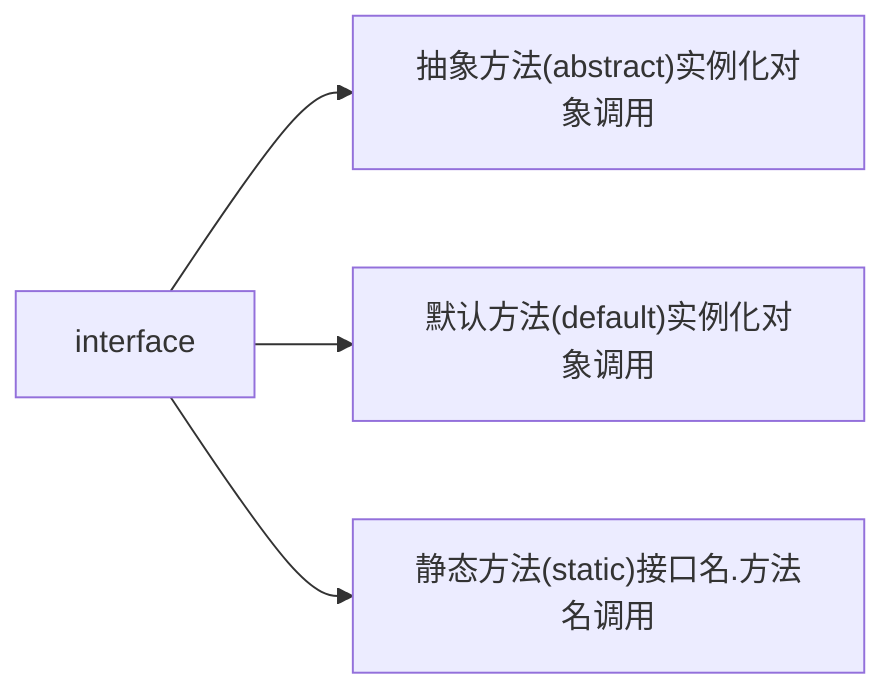
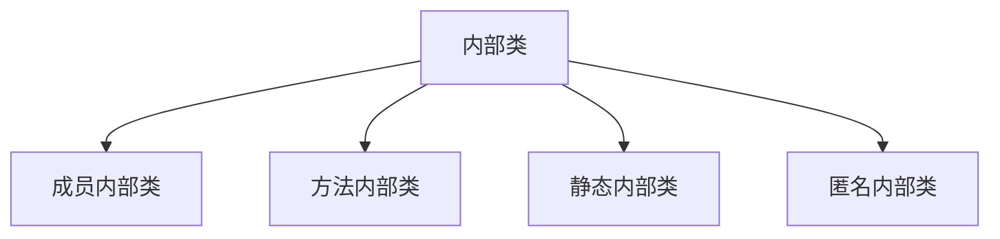

# 面向对象(下)

[TOC]

## 类的继承

### 继承的概念

在程序中，继承指的是事物之间的所属关系，通过继承可以使多种事物之间形成一种关联体系；
在Java中，类的继承指在一个现有类的基础上构建一个新的类，构建出来的新类被称作子类，现有类被称作父类或基类，`子类会自动拥有父类所有可继承的属性和方法`

`在程序中,如果想要声明一个类继承另一个类需要使用extends关键字`

> [修饰符] class 类名 extends 父类名 {
> // 程序核心代码
> }

```java
class Animal{ // Dog类的父类

    String name;

    void shout () {

        System.out.println("吼叫声!!!");
    }
}

class Dog extends Animal { //继承自Animal类的Dog类

    public void printName() {

        System.out.println("name=" +name);
    }
}

public class Example01 {

    public static void main(String[] args) {

        Dog dog = new Dog(); //创建一个Dog类的实例对象

        dog.name = "沙皮狗"; //为dog对象的name属性赋值

        dog.printName(); //调用dog对象的printName方法

        dog.shout(); //调用Dog类继承来的shout方法
    }
}
```

1. Java中,**类**只支持单继承,不允许多重继承,一个类只能有一个父类
2. 多个类可以继承一个父类
3. Java中,多层继承是可以的,即一个类的父类可以再去继承另外的父类
4. 父类与子类是一种相对的概念

### 重写父类方法

子类会继承父类中公共的方法,但有时需要在子类中对父类方法进行修改,即对父类方法进行重写

子类中重写方法父类被重写的方法具有**相同**的`方法名`,`参数列表`以及`返回值类型`

<u>子类重写父类方法时,不能使用比父类中被重写的方法更严格的访问权限</u>,如果父类方法的访问权限是public,子类重写这个方法不能使用private

```java
class Animal {

    void shout() {

        System.out.println("动物发出叫声!");
    }
}

class Dog extends Animal {

    void shout() { //重写父类的shout方法

        System.out.println("汪汪汪!");
    }
}

public class Example02 {

    public static void main(String[] args){

        Dog dog = new Dog(); //创建Dog类的实例对象

        dog.shout(); //调用重写的shout方法
    }
}
```

### super关键字

在Java中专门提供了一个super关键字来访问父类的成员,例如访问父类的成员变量,成员方法和构造方法

1.使用super关键字调用父类的成员变量和成员方法
> super.成员变量
> super.成员方法([参数1, 参数2, ...])

```java
class Animal {

    String name = "动物";

    void shout() {

        System.out.println("动物发出叫声!");
    }
}

class Dog extends Animal { //Animal的子类--Dog类

    String name = "犬类";

    void shout() { //重写继承自父类的shout方法

        super.shout(); //访问父类的shout方法
    }

    void printName() {

        System.out.println("name=" +super.name); //访问父类的成员变量
    }
}

public class Example03 {

    public static void main(String[] args){

        Dog dog = new Dog(); //创建一个dog对象

        dog.shout(); //调用dog对象重写的shout方法

        dog.printName(); //调用dog对象的printName方法
    }
}
```

2.使用super关键字调用父类的构造方法
> super([参数1, 参数2, ...])

```java
class Animal {

    public Animal(String name){ //Animal类的有参构造方法

        System.out.println("我是" +name);
    }

    public Animal() { //一旦定义了构造方法,系统不再提供默认的无参构造方法

        System.out.println("Animal的无参构造方法");
    }
}

class Dog extends Animal { //Dog类继承自Animal类

    public Dog(){ //Dog类的无参构造方法

        super("傻狗"); //访问父类的构造方法,并传入String参数"傻狗"
    }
}

public class Example04 {

    public static void main(String[] args){

        Dog dog = new Dog(); //创建Dog类的实例对象
        //输出为"我是傻狗"
    }
}
```

`通过super调用父类构造方法的代码必须位于子类构造方法的第一行,并且只能出现一次`
另外,如果注释掉上述代码的第11行,即super("傻狗")这一句:程序编译出现错误,显示"Implicit super constructor Animal() is undefined. Must explicitly invoke another constructor(未定义隐式无参构造方法,必须显示地调用另一个构造方法)"
原因在于,`在子类的构造方法中一定会调用父类的某个构造方法`,可以在子类中`通过super关键字指定调用父类的哪个构造方法`,如果没有指定,`在实例化子类对象时,默认调用父类的无参构造方法`

```java
class Animal {

    public Animal(){ //Animal的无参构造方法

        System.out.println("我是一只动物!");
    }

    public Animal(String name){ //Animal的有参构造方法

        System.out.println("我是一只" +name);
    }
}

class Dog extends Animal { //Animal的子类

    public Dog(){ //Dog无参构造方法

    }

    public Dog(String name){ //Dog的有参构造方法

        System.out.println("我是一只" +name);
    }
}

public class Example05 {

    public static void main(String[] args){

        Dog dog = new Dog(); //通过Dog的无参构造方法(父类的无参构造方法)实例化对象
    }
}
```

:warning:如果没有特殊需求,当定义了有参构造方法后,尽量在类中再显示定义一个无参构造方法

### Object类

`Object类是所有类的父类，即每个类都直接或间接继承自该类`，因此Object类通常被称为超类，基类或根类

当定义一个类时,如果没有使用extends关键字为这个类显示地指定父类,那该`类默认继承自Object类`

Object类中常用的方法:

|方法声明|功能描述|
|:--:|:--:|
|boolean equals(Object obj)|判断某个对象与此对象是否相等|
|final Class<?> getClass()|返回此Object的运行时类|
|int hashCode()|返回该对象的哈希码值|
|String toString()|返回该对象的字符串表示|
|void finalize()|垃圾回收器调用此方法来清理没有被任何引用变量所引用对象的资源|

toString()方法使用:

```java
//Animal类默认继承自Object类,在Object类中定义了toString()方法
class Animal {

    void shout() {

        System.out.println("动物叫!");
    }
}

class Example06 {

    public static void main(String[] args){

        Animal animal = new Animal(); //创建Animal类的实例对象
        
        System.out.println(animal.toString()); //调用toString()方法并打印
    }
}
```

Objetc类中toString()方法输出信息的格式:

```java
getClass().getName() +"@ " +Integer.toHexString(hashCode());
```

getClass().getName()代表返回对象所属类的类名,即包名+类名的全限定名称
hashCode()代表返回该对象的哈希值
Integer.getHexString(hashCode())代表将该对象的哈希值用16进制表示,其中hashCode()是Object类中定义的一个方法,将对象的内存地址进行哈希运算,返回一个int类型的哈希值

重写toString()方法:

```java
class Animal { //默认继承自Object类

    public String toString() { //重写toString方法

        return "这是一只动物!";
    }
}

public class Example07 {

    public static void main(String[] args){

        Animal animal = new Animal(); //创建Animal的实例对象

        System.out.println(animal.toString()); //打印Animal的toString()方法
    }
}
```

## final关键字

final关键字用于修饰<u>类</u>,<u>变量</u>和<u>方法</u>,它有`不可更改`或者`最终`的含义

1. `final关键字修饰的类不能被继承`
2. `final修饰的方法不能被子类重写`
3. `final修饰的变量(成员变量和局部变量)是常量,并且只能赋值一次`

\* final修饰成员变量时,必须在声明变量的同时进行初始化赋值,final修饰局部变量时,声明语句和赋值语句可以分开进行
\* static只能用于修饰成员变量,不能用于修饰局部变量

### final关键字修饰类

java中的类被final修饰后,该类将不可继承,也就是不可以派生子类

```java
final class Animal {

}

class Dog extends Animal {
    /** error:
     * The type Dog cannot subclass the final class Animal
     * 无法从最终类Animal进行继承
     **/
}

public class Example08 {

    public static void main(String[] args){

        Dog dog = new Dog(); //创建Dog类的实例对象
    }
}
```

### final关键字修饰方法

当一个类的方法被final关键字修饰后,这个类的子类将不能重写该方法

```java
class Animal {

    public final void shout() { //使用final修饰shout方法

    }
}

class Dog extends Animal {

    public void shout() { //重写Animal的shout方法
        /** error:
         * Cannot override the final method from Animal
         * 无法重写父类final方法
         **/
    }
}

class Example09 {

    public static void main(String[] args){

        Dog dog = new Dog(); //创建Dog的实例对象
    }
}
```

### final关键字修饰变量

final修饰的变量被称为常量,它只能被赋值一次,也就是说final修饰的变量一旦被赋值,其值不能被改变

```java
public class Example11 {

    final int m; //final修饰的成员变量必须在声明时赋值,否则会报错
    /** error:
     * The blank final field m may not have been initialized
     * final修饰的变量m没有初始化
     * 使用final关键字修饰成员变量时,JVM不会对其进行初始化
     **/

    public static void main(String[] args){

        final int n; //final修饰的局部变量,可以先声明,再进行一次赋值

        n = 4;
    }
}
```

## 抽象类和接口

### 抽象类

在面向对象的概念中，所有的对象都是通过类来描绘的，但是反过来，并不是所有的类都是用来描绘对象的，定义一个类时,通常需要定义一些方法来描述该类的行为特征,但有时这些方法的实现方式是无法确定的,如果一个类中没有包含足够的信息来描绘一个具体的对象，这样的类就是抽象类。

1. `抽象类使用abstract关键字来修饰,也可以说这样的类就是抽象类`
2. `抽象方法使用abstract关键字来修饰,并且在定义方法时不需要实现方法体`
3. `抽象类中可以不包含任何抽象方法`
4. `抽象类不可以被实例化`
5. `抽象方法是没有方法体的,不可以被调用`

抽象类及语法格式:

> [修饰符] abstract class 类名 {
> //定义抽象方法
> [修饰符] abstract 方法返回类型 方法名([参数1,参数2, ...])
> //其他方法或属性
> ...
> }

```java
abstract class Animal { //定义抽象类

    String name;

    public abstract void shout(); //定义抽象方法
}

class Dog extends Animal { //继承自抽象类Animal

    public void shout() { //实现抽象方法

        System.out.pritln("汪汪汪");
    }
}

public class Example12 {

    public static void main(String[] args) {

        Dog dog = new Dog(); //创建Dog类的实例对象

        dog.shout(); //调用dog对象的shout方法
    }
}
```

### 接口

如果一个抽象类中所有方法都是抽象的,则可以将这个类定义为Java中的另一种形式--接口

接口是一种特殊的抽象类,它不能包含普通方法,其内部所有方法都是抽象方法



JDK8中,接口中除了抽象方法外,还可以有默认方法和静态方法(也叫类方法),默认方法使用default修饰,静态方法使用static修饰,这两种方法都允许有方法体,静态方法只能通过接口名调用,不能通过实现类和实现类对象调用,默认方法只能通过实现类对象来调用

与定义类时不同,定义接口使用interface关键字来声明,定义接口的语法格式:

```java
 [修饰符] interface 接口名 [extends 父接口1,父接口2, ...] {
    
    [public] [static] [final] 常量类型 常量名 = 常量值;
    
    [public] [abstract] 方法返回值类型 方法名([参数1, 参数2, ...]);
    
    [public] default 方法返回值类型 方法名([参数1, 参数2, ...]) {
        //默认方法的方法体
    }

    [public] static 方法返回值类型 方法名([参数1, 参数2, ...]){
        //静态方法的方法体
    }
}
```

1. 定义一个接口时,可以继承多个父接口
2. 定义常量时,可以省略"public static final"修饰符,接口会为常量默认添加
3. 定义抽象方法时,可以省略"public abstract",系统会默认添加
4. 定义默认方法和静态方法时,可以省略"public",系统会默认添加

定义一个接口的实现类,使用implements,并实现接口中所有抽象方法,一个实现类可以实现多个接口

```java
[修饰符] class 类名 [extends 父类名] [implements 接口1, 接口2, ...] {
    ...
}
```

```java
interface Animal { //定义接口

    int ID = 1; //定义了全局常量,省略了static final

    void breathe(); //定义抽象方法breathe()

    default void getType(String type) { //定义默认方法

        System.out.println("该动物属于:" +type);
    }

    static int getId(){ //定义一个静态方法

        return Animal.ID;
    }
}

class Dog implements Animal { //Dog类实现了Animal接口

    //接口实现类必须实现接口中的所有抽象方法!
    public void breathe() { //实现breathe方法

        System.out.println("狗在呼吸");
    }
}

public class Example13 {

    public static void main(String[] args) {

        System.out.println(Animal.getID()); //通过接口名调用静态方法(类方法)

        Dog dog = new Dog(); //实例化Dog类对象

        System.out.println(dog.ID); //在实现类中通过对象名.常量名访问全局常量

        dog.breathe(); //调用dog对象的breathe方法

        dog.getType("犬科"); //通过接口实现类Dog的实例化对象,调用接口默认方法
    }
}
```

```java
interface Animal {

    int ID = 1; //定义全局变量

    void breathe(); //定义抽象方法breathe()

    default void getType(String type) { //定义默认方法getType()

        System.out.println("该动物属于:" +type);
    }

    static int getID() { //定义静态方法

        return Animal.ID;
    }
}

interface LandAnimal extends Animal { //定义LandAnimal接口,继承自Animal接口

    void run(); //定义抽象方法run()
}

class Dog implements LandAnimal { //Dog类实现了LandAnimal接口

    public void breathe() { //实现breathe方法

        System.out.prinrln("狗在呼吸!");
    }

    public void run() { //实现run方法

        System.out.println("狗在陆地上跑!");
    }
}

public class Example14 {

    public static void main(String[] args) {

        System.out.println(Animal.ID); //通过接口名调用全局常量

        Dog dog = new Dog(); //实例化Dog类对象

        System.out.priintln(dog.ID); //在实现类中获取接口全局变量

        dog.breathe(); //通过dog对象的breathe方法

        dog.getType("犬科"); //通过dog对象调用接口默认方法

        dog.run(); //调用对象的run方法
    }
}
```

总结:

1. JDK8以前,接口中的方法必须是抽象的,并且方法不能包含方法体,在调用抽象方法时,必须通过接口的实现类的对象才能调用实现方法;
2. JDK8以后,接口中处理抽象方法外,还包含默认方法和静态方法,默认方法通过对象调用,静态方法通过接口名调用;
3. 抽象类实现接口时,只需要实现接口中的部分抽象方法即可,如果不是抽象类实现接口则需要实现全部抽象方法;
4. 一个类可以通过implements同时实现多个接口,使用","隔开;
5. 接口之间可以通过extends关键字实现继承,一个接口可以继承多个接口,使用","隔开
6. 一个类在继承一个类的同时还可以实现接口,此时extends关键字必须位于implements关键字之前

```java
class A extends B implements C { //先继承,再实现

}
```

## 多态

多态指不同类在调用同一对象时所呈现的多种不同行为

一个类的属性和方法被其他类继承或重写后，当把子类对象直接赋值给父类引用变量时，相同引用类型的变量调用同一方法会呈现多种不同形态

通过多态消除了类之间的耦合关系，大大提高了程序的可扩展性和可维护性

Java的多态性是由类的继承和重写以及父类引用指向子类对象来体现的

```java
abstract class Aninmal { //抽象类

    abstract void about() { //定义抽象方法

    }
}

class Cat extends Animal { //Cat继承自Animal抽象类

    public void shout() { //实现shout方法

        System.out.println("喵喵喵!");
    }
}

class Dog extends Animal { //Dog继承自抽象类Animal

    abstract void shout() { //实现shout方法

        System.out.println("汪汪汪!");
    }
}

public class Example {

    public static void main(String[] args) {

        Animal an1_cat = new Cat();

        Animal an2_dog = new Dog();

        an1_cat.shout(); //输出"喵喵喵"

        an2_dog.shout(); //输出"汪汪汪"
        //程序在编译时制动识别具体的子类对象,
        //从而选择性的调用对应的方法,这就是Java中多态性的体现
    }
}
```

### 对象的类型转换

在多态的使用中,涉及将子类对象当作父类使用的情况(自动类型转换),这种情况在Java中被称为"向上转型"

```java
Animal an1_cat = new Cat();
Animal an2_dog = new Dog();
```

将子类对象当父类使用时不需要任何显式声明,但此时不能通过父类变量去调用子类特有的方法

```java
interface Animal {

    void shout(); //定义抽象方法shout()
}

class Cat implements Animal {

    public void shout() { //实现shout方法
        
        System.out.println("喵喵喵");
    }

    public void catchMouse() { //Cat类特有方法catchMouse()

        System.out.println("小猫抓老鼠");
    }
}

public class Example16 {

    public static void main(String[] args){

        Animal an1_cat = new Cat();

        an1_cat.shout();

        an1_cat.catchMouse();
        /** error:
         * The method catchMouse() is undefined for the type Animal
         * 在父类Animal中未定义catchMouse()方法
         **/
    }
}
```

由于通过"new Cat();"创建的对象本质是Cat类型,所以通过Cat类型的对象调用catchMouse()是可行的,因此要解决上面的问题,可以将Animal类型的对象an1_cat转换为Cat类型(向下转型):

```java
public class Example16 {

    public static void main(String[] args){

        Animal an1_cat = new Cat();
        
        Cat cat = (Cat) an1_cat; //强制类型转换
        
        cat.shout();

        cat.catchMouse();
    }
}
```

需要注意的是,在进行对象向下类型转换时,必须转换为本质类型

```java
interface Animal { //定义接口Animal

    void shout(); //定义抽象方法shout()
}

class Cat implements Animal {

    public void shout() {

        System.out.println("喵喵喵");
    }

    public void catchMouse() {

        System.out.println("小猫抓老鼠");
    }
}

class Dog implements Animal { //Dog类实现Animal接口

    public void shout() { //实现接口shout()方法

        System.out.println("汪汪汪");
    }
}

public class Example17 {

    public static void main(String[] args){

        Animal an1_dog = new Dog();
        
        Cat cat = (Cat) an1_dog;
        /** java.lang.ClassCastException
         * example17.Dog cannot be cast to example17.Cat
         * Dog类型不能转换成Cat类型
         **/
        cat.shout();

        cat.catchMouse();
    }
}
```

创建的Animal对象的本质是一个Dog对象,在强制类型转换时,Dog类型的对象显然无法转换为Cat类型

为了避免上述这种异常情况的发生,Java提供了一个`关键字instanceof`,它可以`判断一个对象是否为某个类(或接口)的实例或者子类实例`

> 对象(或者对象引用变量) instanceof 类(或接口)

```java
public class Example17 {

    public static void main(String[] args){
        
        Animal an1 = new Dog();

        if(an1 instanceof Cat){ //判断an1是否为Cat的实例或子类实例:是--true,不是--false
        /** instanceof的使用:
         * 1.左边对象类型不能是基础数据类型对象
         * 2.null用intanceof跟任何类型比较都是false
         * 3.左边对象和右边类型不在一颗继承树上
         **/
            Cat cat = (Cat) an1;
            
            cat.shout();
            
            cat.catchMouse();

        }else{
            
            System.out.println("该类型对象不是Cat类型!")
        }

    }
}
```

## 内部类

在Java中,允许在一个类的内部定义类,这样的类被称为内部类,这个内部类所在的类称作外部类



### 成员内部类

在一个类的内部除了可以定义成员变量,成员方法,还可以定义类,这样的类被称作成员内部类

1. 在成员内部类中,可以访问外部类的所有成员,包括成员变量和成员方法;
2. 在外部类中,同样可以访问成员内部类的变量和方法

```java
class Outer { //外部类

    int m = 0; //外部类的成员变量

    void test1() { //外部类的成员方法

        System.out.println("外部类成员方法!");
    }

    class Inner { //成员内部类Inner

        int n = 1; //成员内部类的成员变量

        void show1() { //成员内部类的成员方法show1()

            System.out.println("外部类成员变量 m:" + m); //访问外部类的成员变量

            test1(); //访问外部类方法
        }

        void show2() { //成员内部类的成员方法show2()

            System.out.println("内部类成员方法!");
        }
    }

    void test2() { //定义外部类的成员方法访问成员内部类的属性和方法
        
        Inner inner = new Inner(); //创建一个成员内部类的实例
        //对成员内部类的访问通过对象来访问

        System.out.println("访问外部类成员变量 n=" + inner.n); //访问成员内部类的成员变量

        inner.show2(); //访问成员内部类的成员方法
    }
}

public class Example18 {

    public static void main(String[] args){

        Outer outer = new Outer(); //创建外部类的实例

        Outer.Inner inner = outer.new Inner(); //通过外部类对象创建的成员内部类对象

        inner.show1(); //在成员内部类中访问外部类成员变量和方法
        outer.test2(); //在外部类中访问成员内部类的成员变量和方法
    }
}
```

创建内部类对象的具体语法:

> 外部类名.内部类名 变量名 = new 外部类名().new 内部类名();

### 方法内部类

方法内部类(局部内部类),它和局部变量一样,都是在方法中定义的,其有效范围只限于方法内部

局部内部类可以访问外部类的所有成员变量和方法,而局部内部类中的变量和方法却只能在创建该局部内部类的方法中进行访问

```java
class Outer { //定义外部类Outer

    int m = 0; //外部类成员变量

    void test1() { //外部类方法test1

        System.out.println("外部类成员方法!");
    }

    void test2() { //外部类方法test2

        class Inner { //方法内部类Inner

            int n = 1; //方法内部类的成员变量

            void show() { //方法内部类的成员方法show()

                System.out.println("外部类变量m:" + m); //访问外部类成员变量m

                test1(); //访问外部类的成员方法test1()
            }
        }

        Inner inner = new Inner(); //在外部类方法test2()中创建方法内部类对象inner

        System.out.println("方法内部类变量 n:" + inner.n); //通过方法内部类对象inner访问Inner的成员变量

        inner.show(); //通过方法内部类对象inner访问Inner的成员方法
    }
}

public class Example19 {

    public static void main(String[] args) {

        Outer outer = new Outer(); //创建外部类对象

        outer.test2(); //通过外部类对象访问外部类的成员方法
    }
}
```

方法内部类可以访问外部类所有成员,而只有包含方法内部类的方法中才可以访问内部类的所有成员

### 静态内部类

静态内部类,就是使用static关键字修饰的成员内部类

1. 静态内部类中只能访问外部类的静态成员
2. 可以跳过外部类从而直接通过内部类访问静态内部类成员

创建静态内部类对象的语法:

> 外部类名.静态内部类名.变量名 = new 外部类名.静态内部类名();

```java
class Outer {

    static int m = 0; //外部静态变量m

    static class Inner {

        void show() {

            System.out.println("外部类静态变量 m:" + m); //静态内部类访问外部类的成员变量
        }
    }
}

public class Example20 {

    public static void main(String[] args){

        Outer.Inner.inner = new Outer.Inner(); //创建静态内部类对象inner

        inner.show(); //通过静态内部类对象访问静态内部类的方法
    }
}
```

### 匿名内部类

匿名内部类其实就是没有名称的内部类

Java中调用某个方法时,如果该方法的参数是一个接口类型,除了可以传入一个参数接口实现类,还可以使用匿名内部类实现接口来作为该方法的参数

创建匿名内部类的基本语法:

> new 父接口() {
> // 匿名内部类实现部分
> }

```java
interface Animal {

    void shout();
}

public class Example21 {

    public static void main(String[] args) {

        String name = "小印";

        animalShout(new Animal() { // 定义一个匿名内部类作为接口Animal实现

            public void shout() { //实现shout()方法

                System.out.println(name + "喵喵喵");
                //JDK8开始,方法内部类,匿名内部类,可以访问非final的局部变量
                //JDK8以前,局部变量前必须加final修饰符
            }
        });
    }

    public static void animalShout(Animal an) { //定义静态方法,接收接口Animal类型参数

        an.shout();
    }
}
```

new Animal(){},这相当于创建了一个实例对象,{}表示创建的对象为Animal的子类实例,该子类是匿名的,在{}中编写匿名内部类的实现代码

## JDK 8 的Lambda表达式


## 异常

## 垃圾回收机制
