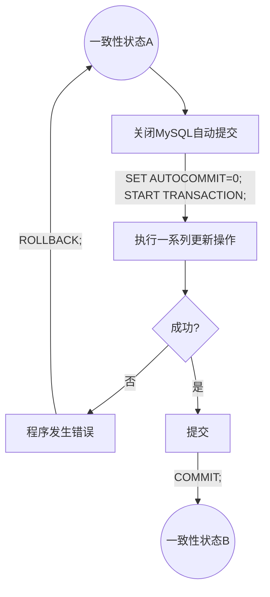

<!-- 那努努力吧 哈哈哈哈哈哈哈哈哈哈哈哈哈哈 -->
# MySQL事务

[TOC]

## 事务的基本概念

事务是由一系列SQL语句组成的一个数据库操作序列,而这些操作是一个不可分割的逻辑工作单元.
如果事务成功执行,那么该事务中的所有更新操作都会执行成功,并将执行结果提交到数据库文件中,成为数据库永久的组成部分.
如果事务中的某条更新操作执行失败,那么事务中的所有操作均被撤销.

为了保证数据能够正确地修改,避免数据的不完整性,事务必须遵循4个原则,即所谓的ACID(原子性,一致性,隔离性和持久性)

- 原子性(Atomicity)
  事务必须是原子工作单元: 事务中的更新操作要么都执行,要么不执行,称为事务的原子性.
  通常,与某个事务关联的操作具有共同的目标,并且是相互依赖的.如果系统只执行执行操作的一个子集,则可以破坏事务的总体目标.
  原子性消除了系统处理操作子集的可能性,用于标识事务是否安全地完成.
- 一致性(Consistency)
  事务的一致性保证了事务完成后,数据库能够处于一致性状态.
  在相关数据库中,所有的规则都必须应用于事务的修改,以保证所有数据的完整性.
  事务结束时,所有的内部数据结构(如B树索引或双向链表)都必须是正确的.
- 隔离性(Isolation)
  同一时刻执行多个事务,称为并发事务.这些事务在执行过程中互不干扰,即一个事务的执行不能被其它事务干扰.
  事务查看数据时数据所处的状态,要么是另一并发事务修改它之前的状态,要么是事务修改它之后的状态,事务不会查看中间状态的数据,这称为可串行性.
  当事务可序列化时将获得最高级别的隔离级别.由于高度隔离会限制可并行执行的事务数,所以一些应用程序降低隔离级别以换取更大的吞吐量.
- 持久性(Durability)
  持久性意味着事务一旦成功执行,在系统中产生的所有变化将是永久的.

## 事务类型

- 系统事务
  系统提供的事务是指在执行某些T-SQL语句时,一条语句就构成了一个事务.
  这些语句是:
  alter table, create, delete, drop, insert, select, update, truncate, rename, replace, begin等.
  这些语句本身就构成了一个事务,要么成功执行,要么对数据库没有任何影响.

- 用户定义的事务
  用户定义的事务是通过事务语句完成的,`MySQL用start transaction语句指定一个事务的开始,用commit语句提交事务,用rollback语句撤销或回滚事务`

## 事务处理

用户定义的事务在执行时必须明确指定事务的结束,否则系统将把从事务开始到用户关闭连接之间所有的操作视为一个事务来处理. 事务提交和事务回滚都标志着事务的结束.

- 事务提交
  默认情况下,MySQL开启了自动提交,也就是在客户端编写的任意一条更新语句,一旦发送到MySQL服务器,MySQL服务器实例会立即对代码进行解析、编译、执行，并将结果提交到数据库文件中.
  **当"set autocommit = 0"时, 自动提交关闭.**
  **当"set autocommit = 1"时, 自动提交开启.**
  MySQL自动提交一旦关闭,数据库开发人员需要提交更新语句,才能将更新结果提交到数据库文件中,成为数据库永久的组成部分.
  自动提交关闭后,MySQL的提交方式分为显式的提交与隐式的提交.
  - 显示的提交:
    自动提交关闭后,使用**commit**命令.commit是提交语句,它使得事务开始以来所执行的所有数据修改成为数据库的永久部分,也标志着一个事务的结束.
  - 隐式的提交:
    1. 更新语句: begin、set autocommit = 1、start transaction、rename table、truncate table等语句。
    2. 数据定义: create、alter、drop语句
    3. 权限管理和账户管理语句: grant、revoke、set password、create user、drop user、rename user等语句。
    4. 锁语句: lock table、unlock table。

    为了有效的提交事务，数据库开发人员应尽量显式地提交事务。

## 事务回滚

事务是由一系列SQL语句组成,在执行过程中,其中一条发生错误,事务不提交到服务器,这时可以使用**rollback**命令将事务撤销.
它使得事务撤销到起点或指定的保存点处,它也标志一个事务的结束.

MySQL客户端的自动提交关闭时,对数据库服务器执行更新操作,服务器内存中会产生若干条NEW记录,这些NEW记录保存了客户端的更新操作.
如果客户端执行了commit命令,MySQL服务器中的NEW记录将被更新到服务器中,事务提交成功;
如过客户端执行了rollback命令,MySQL服务器中的NEW记录将被丢弃,事务被撤销.

注: 需要注意MySQL在设置AUTOCOMMIT=0后,即关闭自动提交后,使用某些语句会隐式地提交(见上文),为了有效提交事务,应尽量显式地提交事务

## 保存点

保存点(也称检查点)可以实现事务的部分提交或部分撤销.
使用MySQL命令`"SAVEPOINT 保存点名;"`可以在事务中设置一个保存点.
使用"RELEASE SAVEPOINT 保存点名;"可以删除一个事务的保存点.
使用MySQL命令"ROLLBACK TO SAVEPOINT 保存点名;"可以将事务回滚到保存点状态.

说明:
    "ROLLBACK TO SAVEPOINT B;"仅仅是让数据库回到事务中的某个"一致性状态B",而"一致性状态B"仅仅是一个"临时状态",该"临时状态"并没有将更新回滚,也没有提交更新.
    事务回滚必须借助于ROLLBACK(而不是"ROLLBACK TO SAVEPOINT 保存点名;").
    事务提交需借助于COMMIT(理论上可以隐式提交,但建议使用COMMIT).
    删除事务中的保存点时,如果当前事务中有两个同名的保存点,旧保存点将被自动丢弃.
