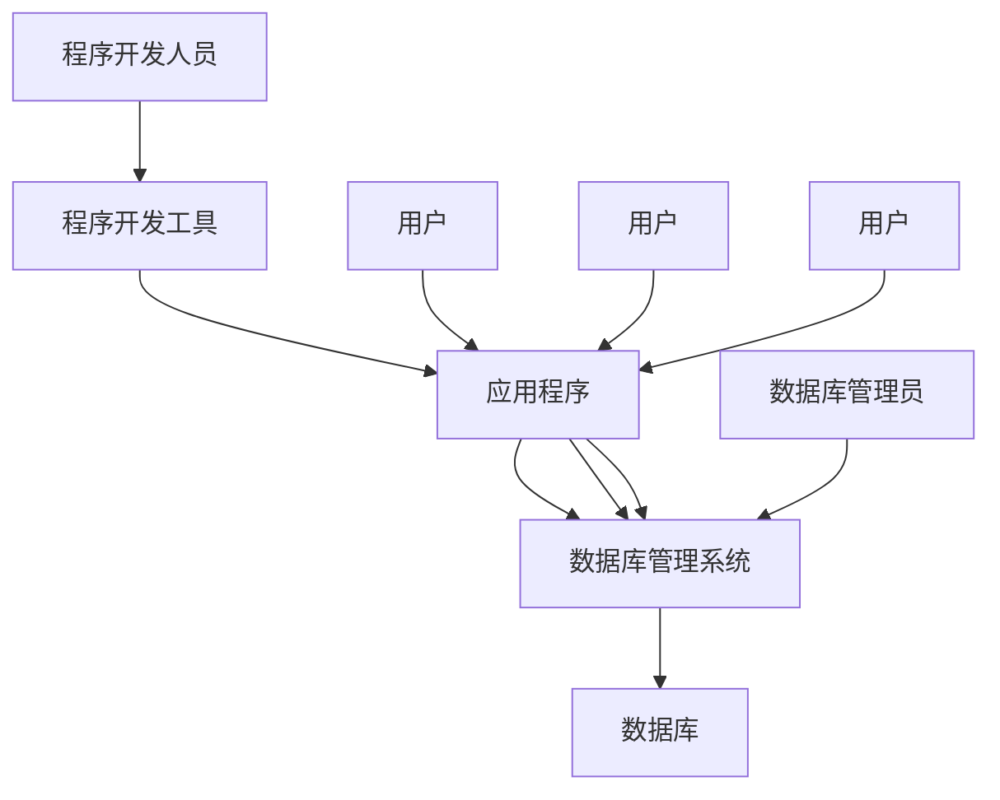

# MySQL概述

[TOC]

## 数据库基础知识

- 数据库(DataBase, 简称DB)
  数据库是**存储和管理数据**的仓库, 是长期存储在计算机内、有组织的、可共享的大量数据的集合.
  数据库中包含诸多数据库对象, 如表、试图、索引、函数、存储过程、触发器、事件等。

 

- 数据库管理系统(DataBase Management System, 简称DBMS)
  数据库管理系统是一种操纵和管理数据库的大型软件, 用于建立、使用和维护数据库.
  - 数据库管理系统的主要功能:
    1. 数据定义(DDL, data definition language)
    2. 数据操纵(DML, data management language)
    3. 数据库运行管理
    4. 数据库的建立和维护
    5. 数据库的传输
    6. 数据库的保护

 

- 数据库系统(DataBase System, 简称DBS)
  是为适应数据处理的需要而发展起来的较为理想的数据处理系统,也是一个为实际可运行的存储、维护和应用系统提供数据的软件系统, 是存储介质、处理对象和管理系统的集合体.
  - 数据库系统的特点:
    1. 数据结构化
    2. 数据共享性好
    3. 数据独立性高
    4. 数据冗余度小
    5. 数据库管理系统为用户提供了友好的接口
    6. 数据库系统的基础是数据模型, 现有数据库系统是基于某种数据模型的.
    7. 数据由DBMS统一管理和控制.

## 关系型数据库介绍

- 关系型数据库(Relational DataBase)
  "关系"实际上是一张二维表,它由行和列组成.表格中的数据能以许多不同的方式被存取或重新召集而不需要重新组织数据库表, 用户和应用程序是通过结构化语言(SQL)访问关系型数据库.
  - 表
    表是数据在一个数据库中的存储容器, 即数据表.它包含一组固定的列,表中的列描述该表所跟踪的实体的属性.
    - 表的术语:
        1. 表名: 一张表的名称, 同一个数据库中不能有同名表存在.
        2. 记录: 表中的一行数据被称为一条记录.
        3. 字段: 表中一列被称为一个字段.
        4. 字段名: 表中的列名, 每个字段名在一张表中是唯一的.
        5. 主键: 能唯一标识一条记录的字段或字段组合, 即表中的关键字段.
        6. 外键: 表中的字段, 它们在其它表中作为主键存在, 一张表的外键是对另一张表中主键的引用.
    - 关系型数据库的特点:
      - 优点:
        1. 容易理解
        2. 使用方便
        3. 易于维护
      - 缺点:
        1. 无法满足高并发读写需求
        2. 无法满足海量数据的高效率读写
        3. 扩展性不强
        4. 事务一致性不佳
        5. 执行复杂SQL语句效率和准确性不高

## MySQL数据库简介

MySQL是瑞典MySQL AB公司开发的一个可用于各种流行操作系统的数据库管理系统,目前属于Oracle旗下产品.MySQL具有功能强、使用简单、管理方便、运行速度快、可靠性高、安全保密性强等优点。

- MySQL的体系结构
  MySQL采用客户机/服务器体系结构,在使用MySQL存取数据时, 必须至少使用两个或者说两类程序:
  - 数据库服务器
    一个位于存放数据的主机上的程序.数据库服务器监听从网络上传过来的客户机请求并根据这些请求访问数据库的内容,以便向客户机提供它们所要求的信息.
  - 客户机
    连接到数据库服务器的程序, 是用户和服务器交互的工具, 告诉服务器需要什么信息的查询.
    常用客户机程序为mysql,这是一个交互式的客户机程序,它能发布查询并看到结果;
    客户机程序mysqldump用于导出表的内容到某个文件;
    客户机程序mysqlimport用于将文件的内容导入到某个表;
    客户机程序mysqladmin用来查看服务器的状态并完成管理任务, 如服务器的关闭、重启, 刷新缓存等.
  - MySQL的C/S体系的优点:
    1. 服务器提供并发控制, 使两个用户不能同时修改相同的记录.
    2. 不必在数据库所在的机器上注册.

 

- MySQL的特性:
  1. 使用C/C++编写, 并使用了多种编译器进行测试, 保证了源代码的可移植性.
  2. 支持Linux、Mac OS、Solaris、Windows等多种操作系统.
  3. 为多种编程语言提供了API, 包括C、C++、Python、Java、Perl、PHP、Ruby、.NET等.
  4. 提供多语言支持, 常见编码如中文的UTF8, GB2312,BIG5, 日文的Shift_JIS等.
  5. 提供TCP/IP、ODBC、JDBC等多种数据库连接途径.
  6. 提供用于管理、检查、优化数据库连接操作的管理工具。
  7. 支持大型的数据库.
  8. MySQL使用标准的SQL数据语言形式.
  9. 服务器可作为单独程序运行在客户端/服务器联网环境下, 也可以作为一个库而嵌入到其它独立的应用程序中使用.

 

- MySQL 8.0的新特性:
  1. 