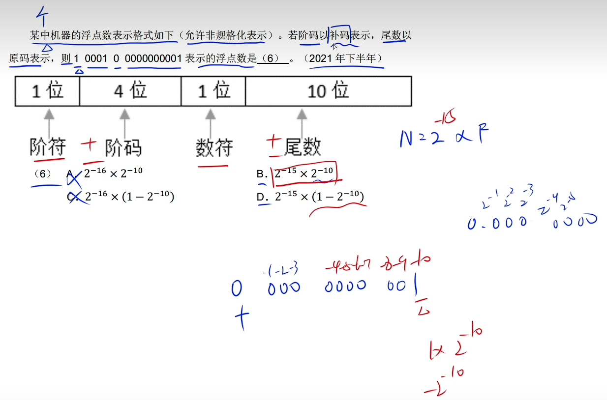
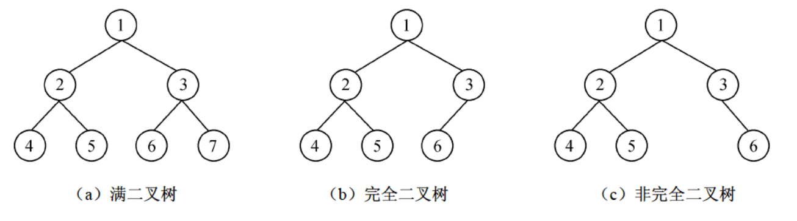
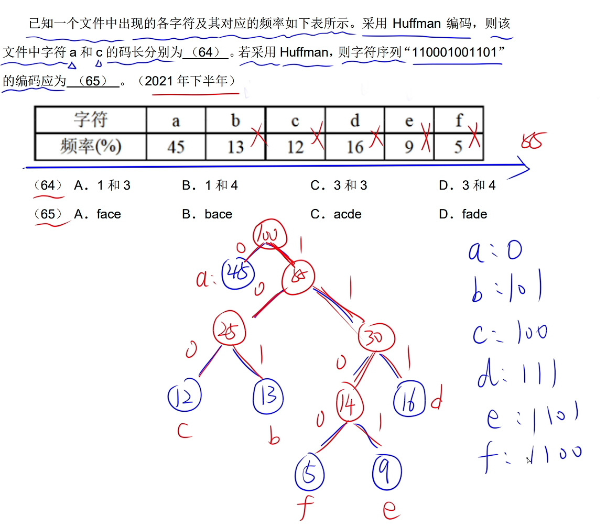
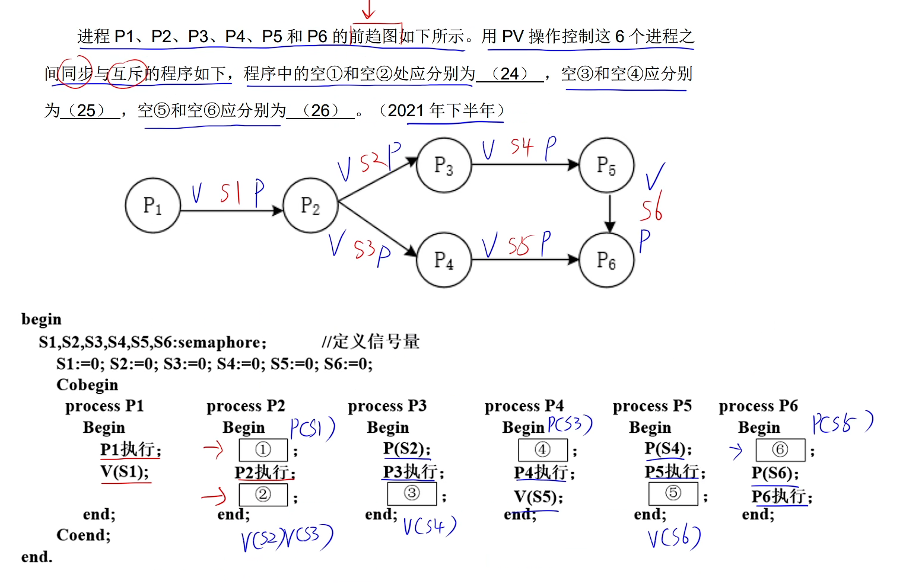
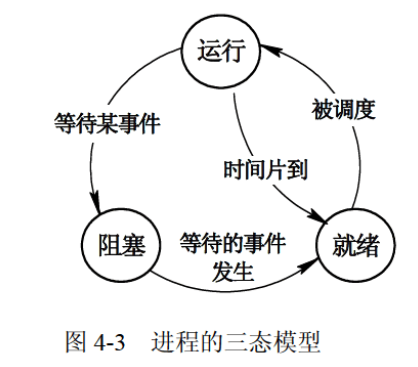
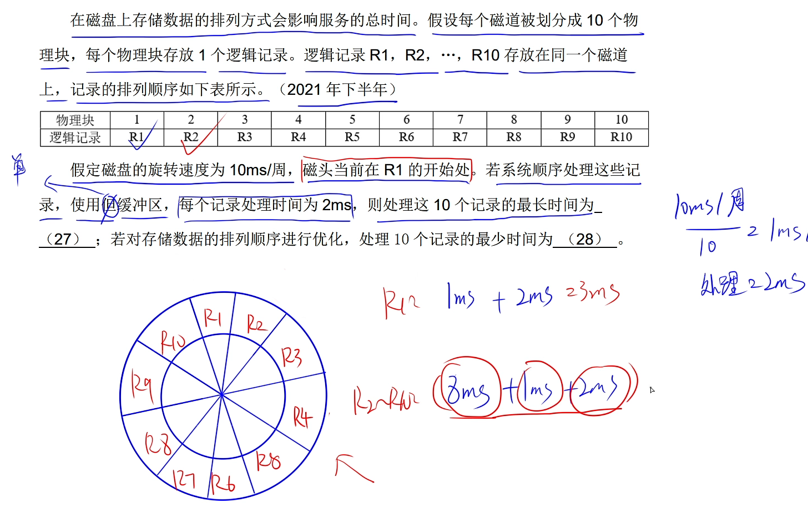
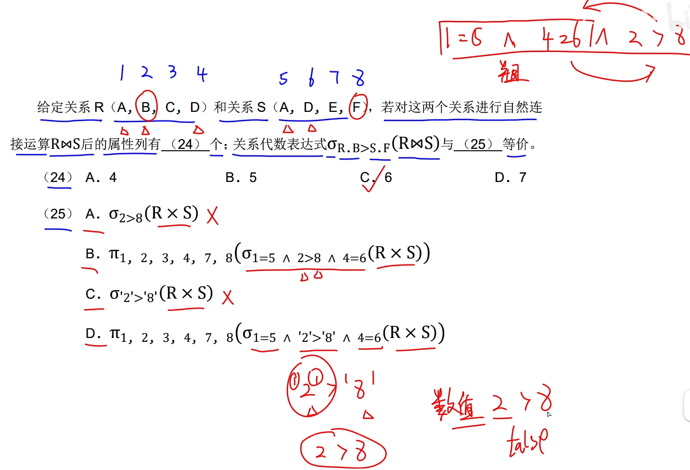
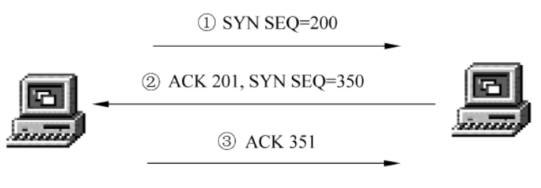

# 软件设计师上午题知识点分类

[TOC]

 

## 1计算机系统知识

- 浮点数数据表示
  
  注: 阶符是1表负数,阶码是补码,先求源码得1111, 换算成十进制是15;尾数是原码,有多少个0就是2的几次方
  > 浮点数的范围由阶码决定
  > 浮点数的精度由尾数决定

- 寻址方式(速度递减)
  - 立即寻址: 操作数直接在指令中
  - 寄存器寻址: 寄存器存放操作数
  - 直接寻址: 指令中存放操作数的地址
  - 寄存器间接寻址: 寄存器内存放的操作数的地址
  - 间接寻址: 指令中存放的是一个地址,地址对应操作数的地址

- 存储系统
  - RAM随机读写存储器
    - SRAM静态随机存储器
    - DRAM动态随机存储器
  - ROM固定只读存储器
  - SAM顺序存储器
  - DAM直接存储器

- 输入输出(I/O)控制方式
  - 程序查询方式
    > CPU和I/O串行工作, CPU一直轮询检查, CPU利用率低
    > 一次只能读/写一个字
    > 由CPU将数据放入内存
  - 中断方式
    > I/O设备通过中断信号主动向CPU报告I/O操作已完成
    > CPU和I/O并行工作, CPU利用率得到提升
    > 一次只能读/写一个字
    > 由CPU将数据放入内存
    > 中断向量: 提供中断服务程序的入口地址
    > 中断响应时间: 发出中断请求开始 到 进入中断服务程序
    > 保存现场: 返回来执行源程序
  - 直接存储器存取方式(DMA)
    > CPU和I/O并行工作
    > 仅在传送数据块的开始和结束需要CPU干预
    > 由I/O直接将数据放入内存
    > 一次读写的单位是数据'块'而不是字

- 常见总线
  > ISA总线: 工业标准总线,支持16位的I/O设备
  > EISA总线: ISA基础上发展来的32位总线
  > PCI总线: 并行内总线
  > PCI Express总线: 点对点串行连接
  > 前端总线: CPU连接北桥芯片的总线
  > RS-232C: 串行外总线
  > SCSI总线: 并行外总线
  > SATA: 串行ATA,用作主板和大量存储设备间数据传输用
  > USB: 通用串行总线
  > IEEE-1394: 高速串行外总线
  > IEEE-488: 并行总线接口标准

- 加密技术和认证技术
  - 对称加密技术
    加密解密使用相同密钥
    > 数据加密标准算法DES
    > 三重DES
    > RC\-5
    > 国际数据加密算法IDEA
    > 高级加密标准算法AES(基于排列和置换运算, 迭代的,分组加密的)
  - 非对称加密技术
    公钥加密私钥解密
    > RSA
    > ECC
    > DSA
  - Hash函数
    > 输入不定长, 输出定长; 常用于产生消息摘要
    - MD-5摘要算法
      > MD5的特点:
      > 压缩性
      > 容易计算
      > 抗修改性
      > 强碰撞性
  - 数字签名
    > 完整性
    > 身份认证
    > 不可否认性

## 2程序设计语言基础知识

- 汇编程序
  - 符号表
    > 记录源程序中各个符号的必要信息,以辅助语义的正确性检查和代码生成,在编译过程中需要对符号表进行快速有效的查找插入修改和删除操作
  - 单元地址计数器
    > 初值一般为0
  - 机器指令表
    > 记录每条机器指令的记忆码和指令长度
  - 伪指令表
    > 每个元素有两个域: 伪指令助记符,相应的子程序入口

- 高级语言编译与解释方式的比较
  - 效率
    > 编译比解释方式有更高的效率
    > 解释方式要反复扫描源程序
  - 灵活性
    > 解释比编译方式更灵活
    > "在运行中"修改程序成为可能
  - 可移植性
    > 解释比编译方式可移植性更好
    > 只要对解释器进行重新编译就可以使解释器运行在不同的环境中
    > Java虚拟机上发展的一种Compiling-just-in-time技术,使得代码在第一次运行时进行编译,其后运行时就不再进行编译了.

## 3数据结构

- 队列
  - 循环队列的优点
    > 入队和出队操作都不需要移动队列中的其它元素

- 哈希表
  哈希冲突是不可避免的,只能尽量避免
  > 线性探查法: 容易产生聚集现象,降低了查找效率
  > 链地址法: 每一个记录中增加一个链域, 链域中存放相同哈希值的记录,平均查找长度和线性表相同为1
  > 装填因子: α = 表中装入的记录数 / 哈希表的长度
  > 装填因子越小发生冲突的可能性就越小, α越大表中已填入的记录就越多

- AOV网
  以顶点表示活动的网, 而弧则表示了活动之间的优先关系
  - <Vi, Vj>是网中的一条弧, 则顶点Vi是Vj的直接前驱, 顶点Vj是Vi的直接后继
  - AOV网不应该存在有向环
  - 若图中所有顶点都在它的拓扑有序序列中,则该AOV网中必不存在环

- 拓扑排序
  - 拓扑排序是将AOV网中所有顶点排成一个线性序列的过程,且该序列满足:
    > 若在AOV网中从顶点Vi到Vj有一条路径,则在该线性序列中,顶点Vi必然在Vj之前
  - 拓扑排序的方法如下:
    > ① 在AOV网中选择一个入度为0(没有前驱)的顶点并输出它
    > ② 从网中删除该顶点及与该顶点有关的所有弧
    > ③ 重复以上两步, 直到网中不存在入度为0的顶点为止
    > 时间复杂度为O(n+e)
  - 在有向无环图G的拓扑序列中,顶点Vi在Vj之前,则:
    > 可能存在弧<Vi, Vj>, 一定不存在<Vj, Vi>
    > 可能存在Vi到Vj的路径, 一定不存在Vj到Vi的路径

- 树
  树的性质:
  1. 一个结点的子树个数记为该结点的度
  2. 树的结点个数 = 树中所有结点的度数之和再加 1
  3. 叶子结点也称终端结点,指肚为0的结点
  - 二叉树
    > 二叉树第i层(i>=1)上最多有2i-1个结点
    > 高度为k的二叉树最多有2k-1个结点(k>=1)
    
    > 满二叉树: 深度为k, 有2k-1个结点
    > 完全二叉树: 除了最后一层其余各层都是满的,且最后一层的结点从左往右放置,不能留空
  - 最小二叉树(图的最短路径): 权值最小的生成树
    连通网N = (V, E)
    - 普里姆Prim算法:
    > 以一个顶点集合U={u0}作为初态,不断寻找与U中顶点相邻且代价最小的边的另一个顶点,直到U集合中U=V为止
    - 克鲁斯卡尔Kruskal算法:
    > 在E中选择最小的边,若该边依附的顶点落在T中不同的连通分量上,则将此边加入到T中,否则舍弃此边而选择下一条代价最小的边,直到T中所有顶点都在同一连通分量上为止
  - 最优二叉树(哈夫曼树)
    
    > 带权路径长度最短的树，权值较大的结点离根较近, 值越大的数放在越靠下的层
  - 平衡二叉树(AVL)
    > ①任意节点的子树的高度差都小于等于1
    > ②左子树和右子树都是平衡二叉树
    > 平衡因子: 右子树深度减去左子树深度(-1,0,1)
  - B树(Balance)
    > 多路的平衡搜索树,B树的每个节点可以存储多个数据
    > 每个结点不止有2个结点,最多有上千个结点
    > 树中每个结点最多有m颗子树
    > 若根结点不是叶子结点,则最少有2颗子树
    > 除根之外的所有非叶子结点最少有m/2颗子树(向上取整)
  - B+树
    > 叶子结点保存了完整的索引和数据;
    > 非叶子结点只保存索引值,不存储数据

- 排序算法

  |排序算法|稳定性|时间复杂度|空间复杂度|
  |:-:|:-:|:-:|:-:|
  |直接插入排序|:heavy_check_mark:|n2|1|
  |冒泡排序|:heavy_check_mark:|n2|1|
  |简单选择排序|:x:|n2|1|
  |希尔排序|:x:|n1.3|1|
  |快速排序|:x:|nlog2n ~ n2|1|
  |堆排序|:x:|nlog2n|1|
  |归并排序|:heavy_check_mark:|nlog2n|n|

- 图
  - 有向图
    > 每条边都是有方向的,有向边称弧
  - 无向图
    > 每条边都是无方向的
  - 完全图
    > 每一个顶点与其他n-1个顶点之间都有边, 称无向完全图
    > n个顶点的无向完全图共有n(n-1)/2条边
  - 度
    > 指关联于该顶点的边的数目
    > 无论有向图还是无向图:
    > 边数e = 1/2 n个顶点的度数之和

## 4操作系统知识

- 信号量与PV操作
  - P操作
    > 申请一个资源
  - V操作
    > 释放一个资源
  
  注: P2 \-\> P3为23, P2->P4为24...根据大小确定S2,S3...的位置(从低到高)
  根据箭头流入流出,流入为P操作,流出为V操作

- 三态模型
  
  - 运行
    > 当一个进程在处理机上运行时,则该进程处于运行状态
    > 对于单处理机系统,处于运行状态的进程只有一个
  - 就绪
    > 一个进程获得了除处理机外的一切所需资源,一旦得到处理机即可运行,则称此进程处于就绪状态
  - 阻塞
    > 也称等待或睡眠状态,一个进程正在等待某一时间的发生而暂时停止运行,即使把处理机分配给进程也无法运行

- 进程调度算法
  - 先来先服务(FCFS)
    > 按作业成为就绪状态的先后次序分配CPU
    > 有利于长作业,而不利于I/O频繁的作业
  - 时间片轮转
    - 固定时间片
    - 可变时间片
  - 优先级调度
    - 静态优先级
    - 动态优先级
  - 多级反馈调度
    > 时间片轮转 \+ 优先级调度

- 磁盘调度
  
  注: 转圈时间小于处理时间,则转圈时间包括了处理时间

## 5软件工程基础知识

- 软件过程模型
  - 瀑布模型
    > 由前至后固定次序: 需求分析\-\> 设计\-\> 编码\-\> 测试\-\> 运行与维护
    > 优点: 容易理解; 管理成本低; 强调开发的阶段性早期计划及需求调查和产品测试
    > 缺点: 客户必须能完整、正确和清晰地表达他们的需求; 对于项目风险的控制能力较弱
  - 增量模型
    > 将需求分段为一系列增量产品,每一增量可以分别开发.增量模型采用随日程时间的进展而交错的线性序列
    > 优点: 具有瀑布模型的所有优点; 第一个可交付版本需要的成本和时间很少; 开发由增量表示的小系统所承担的风险不大
    > 缺点: 如果没有对用户的变更要求进行规划,那么产生的初始增量可能会造成后来增量的不稳定; 管理发生的成本、进度和配置的复杂性可能超出组织的能力
  - 敏捷方法
    - 极限编程(XP)
      > XP是一种轻量级(敏捷)、高效、低风险、柔性、可预测的、科学的软件开发方式
      > 由价值观、原则、实践和行为4个部分组成
    - 水晶法
      > 水晶法认为每一个不同的项目都需要一套不同的策略、约定和方法论
    - 并列争求法
      > 并列争求法使用迭代的方法,每30天一次的迭代称为一个"冲刺",多个自组织和自治的小组并行地递增实现产品
    - 敏捷统一过程(AUP)
      > 采用"在大型上连续", "在小型上迭代"的原理来构建软件系统

- 传统软件的测试策略
  - 单元测试
  - 集成测试
  - 确认测试
  - 系统测试

- 软件测试方法
  - 黑盒测试(功能测试)
  > 不考虑软件的内部结构和特性,测试软件的外部特性
  > 测试技术: 等价类划分、边界值分析、错误推测、因果图
  - 白盒测试(结构测试)
  > 根据程序的内部结构和逻辑来设计测试用例,对程序的路径和过程进行测试
  > 测试技术: 逻辑覆盖、循环覆盖、基本路径测试
  > 从弱到强: 语句\-\>判定\-\>条件\-\>判定/条件\-\>条件组合\-\>路径

- 风险管理
  软件风险包含两个特性：不确定性和损失
  > 项目风险
  > 技术风险
  > 商业风险
  - 风险控制
    > 风险避免
    > 风险监控
    > RMMM计划

- 软件质量特性
  - 功能性
    > 适应性, 准确性, 互用性, 依从性, 安全性
  - 可靠性
    > 成熟性, 容错性, 易恢复性
  - 易使用性
    > 易理解性, 易学性, 易操作性
  - 效率
    > 时间特性, 资源特性
  - 可维护性
    > 易分析性, 易改变性, 稳定性, 易测试性
  - 可移植性
    > 适应性, 易安装性, 一致性, 易替换性

- 5.9软件度量
  - 面向规模的度量
    > 通常用程序的代码行(Line of Code, LOC)或千行代码KLOC来衡量
  - 面向功能的度量
    > 面向功能的度量以功能(由应用程序提供)测量数据作为规范化值, 应用最广泛的面向功能的度量是功能点(Function Point, FP)
  - McCabe度量法
    > 又称环路度量, 环路越多, 程序越复杂
    > 先画出程序图(退化的程序流程图), 计算程序图中闭合环路的个数再加1的结果, 也就是该程序的度量值

## 6结构化开发方法

- 数据流图DFD
  - 构造分层DFD时需要注意的问题
    - 适当命名
    - 画数据流而不是控制流
    - 避免一个加工有过多的数据流
    - 分解尽可能均匀
    - 先考虑确定状态,忽略琐碎的细节
    - 随时准备重画

## 7面向对象技术

- 动态绑定
  > 绑定就是一个把过程调用和响应调用所需要的代码加以结合的过程,在一般的程序设计语言中,绑定是在编译时进行的,叫做静态绑定.动态绑定是在运行时进行的,因此,一个给定的过程调用和代码结合直到调用发生时才进行.

- 面向对象分析
  > ①认定对象
  > ②组织对象
  > ③描述对象间的相互作用
  > ④确定对象的操作
  > ⑥定义对象的内部信息

- 面向对象设计
  > ①识别类及对象
  > ②定义属性
  > ③定义服务
  > ④识别关系
  > ⑥识别包

- 面向对象设计的原则
  > 单一职责原则: 一个类只做一种类型的责任
  > 开闭原则: 对拓展开放, 对修改关闭
  > 里氏替换原则: 子类型必须能够替换掉他们的基类型
  > 依赖倒转原则: 抽象不应该依赖细节,细节应该依赖于抽象
  > 接口分离原则: 不应该强迫客户依赖于它们不用的方法
  > ......
  > 重用发布等价原则: 重用的粒度就是发布的粒度
  > 共同封闭原则: 包中的所有类对于同一类性质的变化应该是共同封闭的, 一个变化若对一个包产生影响,则将对该包中的所有类产生影响
  > 共同重用原则: 一个包中的所有类应该是共同重用的, 如果重用了包中的一个类,那么将要重用包中的所有类
  > 无环依赖原则: 包的依赖关系图中不允许存在环
  > 稳定依赖原则: 朝着稳定的方向进行依赖
  > 稳定抽象原则: 包的抽象程度应该和其稳定程度一致

## Python

  解释型、脚本语言
  > [in] array[1, 2] * 2
  > [out] 1 2 1 2
  > seq(1:10, 2) # 左闭右开,右边不取

  |结构|可变|有序|可重复|
  |:--:|:--:|:--:|:--:|
  |元组|:x:|:heavy_check_mark:|:heavy_check_mark:|
  |字符串|:x:|:heavy_check_mark:|:heavy_check_mark:|
  |字典|:heavy_check_mark:|:x:|:x:|
  |集合|:heavy_check_mark:|:x:|:x:|
  |列表|:heavy_check_mark:|:heavy_check_mark:|:heavy_check_mark:|

## 9数据库技术基础

- 三级模式
  - 外模式(对应视图, 是对视图层的描述)
  - 概念模式(也称模式, 对应基本表, 是对逻辑层的描述)
  - 内模式(对应存储文件, 是对物理层的描述)
- 两级映像
  > 两级映像保证了数据库中数据的逻辑独立性和物理独立性
  - 外模式/概率模式映像
  - 概念模式/内模式映像

- 关系代数\-关系运算
  
  > R X S 表示笛卡尔积(全连接)
  > R自然连接S(去除重复列)
  > σ表示选择
  > ∧表示与(并且/合取)
  > ∨表示或(或者/析取)

## 10网络与信息安全基础知识

- OSI参考模型

  - 应用层
    > 提供OSI用户服务,提供网络与用户应用软件之间的接口服务
  - 表示层
    > 解释所交换信息的含义, 数据的压缩、解压缩、加密、解密
  - 会话层
    > 会话层不参与具体的传输,提供访问验证和会话管理,包括建立、维护和结束会话
  - 传输层
    > 为会话层提供数据传输服务,保证端到端的数据完整性(报文)
  - 网络层
    > 提供端到端的交换网络数据功能, 选择合适的网间路由和交换结点
  - 数据链路层
    > 负责建立、维护和释放数据链路的连接
    > 负责在两个相邻结点间的线路上无差错地传送以帧为单位的数据,并进行流量控制
    > 每一帧包括一定的数据和必要的控制信息
  - 物理层
    > 具体的物理媒体不在OSI的7层内,如果把物理媒体当作第0层
    > 物理层的任务就是为它的上一层提供一个物理连接

- TCP/IP分层模型
  
  > IP地址不是一成不变的,是逻辑地址,IP分配基于网络拓扑
  > MAC地址是不重复的,唯一的,地址分配基于制造商
  - IP(网际层协议)
    > 无连接的(没有确定目标系统已做好接受数据的准备之前就发送数据), 不可靠的
    > IP需要一种避免差错并在发生差错时报告的机制(ICMP)
  - TCP(传输层协议)
    > 面向连接的(发送数据前需要进行3次握手), 可靠的
    > `重发技术:`
    > 发送方启动一个计时器, 然后发送数据,接收方收到数据就给发送方一个确认(Acknowledgement)信息
    > 如果计时器到点却没有收到确认则重发这个数据包
    > `三次握手:`
    > ① 源主机发送一个SYN(同步)标志位为1的TCP数据包,并发送一个同步序列号(SEQ=200)进行同步
    > ② 目标主机同意通信, 响应一个确认(ACK位置为1),并以下一个序列号(ACK=201)进行确认
    > ③ 源主机以确认(ACK位置1)来响应目标主机的TCP包,这个确认中包括它想要接受的下一个序列号(该帧可以含有发送的数据)
    
  - ICMP(网际层协议)
    > Internet控制信息协议, 专门用于发送差错报文的协议(ping GitHub.com)
  - ARP和RARP(网际层协议)
    > ARP: IP地址 \-\> 物理地址
    > RARP: 物理地址 \-\> IP地址
    > ARP报文分为ARP Request(广播请求)和ARP Response(单播响应)
  - UDP(传输层协议)
    > 用户数据报协议,不可靠的,无连接的协议
    > 保证应用程序进程间的通信
  - 应用层协议
    > **FTP** 文件传输协议(控制连接用于传输命令和参数,端口号为21; 数据连接用于传送文件,端口号为20)
    > **NFS** 网络文件服务协议
    > **Telnet** 远程登录协议(不安全的,特定的TCP端口23,安全的登录方式**SSH**)
    > **SMTP** 简单邮件传输协议(发送,端口为25), POP协议(接收,POP2和**POP3**, 通过TCP建立连接,端口为110)
    > **SNMP** 网络管理协议
    > **IGMP** 因特网组管理协议
    > **RFB** 远程登录图形用户界面协议
    > **DNS** 域名系统(UDP端口,端口号为53) `计算机主机名.本地名.组名.最高层域名`
    > 一般S开头的表示加密
  - DHCP(动态主机配置协议)
    > 功能: 集中管理、分配IP地址
    > DHCP客户端可以从DHCP服务器获得本机IP地址、DNS服务器地址、DHCP服务器地址、默认网关地址
    > Windows无效地址: 169.154.X.X
    > Linux无效地址: 0.0.0.0
    > IPv4: 32位; IPv6: 128位; 物理地址: 48位;

- 防火墙技术
  - 包过滤防火墙(网络层)
  - 应用代理网关防火墙(应用层)
  - 状态检测技术防火墙(会话层)
  - 受保护程度(由低到高)
    > 外网\-\>DMZ\-\>内网

## 11标准化和软件知识产权基础知识

- `《中华人民共和国著作权法》`和`《计算机软件保护条例》`是构成我国保护计算机软件著作权的两个基本法律文件
- 两个或两个以上的人分别就同样的发明创造申请专利的，专利权授给`最先申请人`
