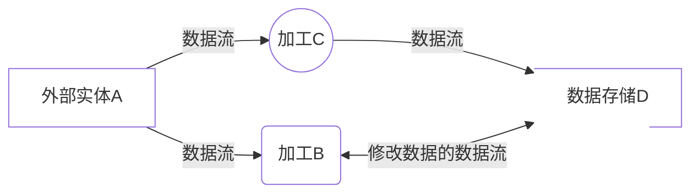

# 下午题知识点分类

[TOC]

## 数据流图

数据流图也称数据流程图(Data Flow Diagram, DFD), 是一种便于用户理解, 分析数据流程的图形工具. 它摆脱了系统的物理内容, 精准地在逻辑上描述系统的功能, 输入, 输出和数据存储等, 是系统逻辑模型的重要组成部分.
 
**数据流图的基本概念**

- 数据流图的组成
    > 数据流(Data Flow)
    > 加工(Process)
    > 数据存储(Data Store)
    > 外部实体(External Agent)

- 数据流图的分层
  - 层次结构
    > 顶层只有一张图,其中只有一个加工,描述软件系统与外界之间的数据流,称为顶层图
  - 图和加工的编号
    > 顶层图不用加编号
    > 0层图中的加工编号分别为1,2,3...
    > 子图号就是父图中被分解的加工号
    > 对于子图中加工的编号, 若父图中的加工号为X的加工号分解成某一子图, 则子图中的加工编号分别为X1, X2, X3...
- 数据流图的审查(一致性和完整性)
  
  > 1. `父图与子图的平衡`: 父图与子图边界上的输入输出流保持一致
  > 2. `数据守恒`: ①输出数据流中数据必须从该加工的输入数据流中获得或产生; ②加工未使用输入数据流中的某些数据项时应当删去多余数据项
  > 3. `加工的输出数据流与输入数据流不能同名`
  > 4. `每个加工至少有一个输入数据流和一个输出数据流`
  > 5. `对于整套DFD来说: 每个数据存储至少有一个加工对其读操作, 另一个加工对其进行写操作; 对于某一张DFD来说: 可以只读不写或只写不读;`
  > 6. `分层DFD中的每个数据流和文件都必须命名(除流入或流出数据存储的数据流), 并保持和数据字典一致`

- 数据字典
  数据字典为DFD中的每个数据流, 文件, 加工, 以及组成数据流或文件的数据项做出说明, 其中对加工的描述称为"小说明(加工逻辑说明)"
  > 数据字典有4类条目: 数据流, 数据项, 数据存储, 基本加工
  > 加工逻辑的描述: `判定表
  |条件定义|条件取值的组合|
  |动作定义|在各种取值下应执行的动作|
- 黑洞 奇迹 灰洞
    > 黑洞: 有输入无输出
    > 奇迹: 有输出无输入
    > 灰洞: 输入不足以产生输出

**补充数据流图中缺失的外部实体**

- 存在于软件系统外的人员, 组织, 外部系统

**补充数据存储**

- 某某文件
- 某某表

**补充遗漏的数据流**

- 分层数据流图的数据平衡原则: 下层图的输入与输出应与上层图保持一致
- 每张数据流图的数据平衡原则: 保证加工的输出数据流都有与其对应的输入数据流与输出数据流.(也就是要消除黑洞, 奇迹, 灰洞)

**数据流图的改错**

- 错误的数据流名称
- 错误的数据流起点和终点
- 多余的数据流

## 数据库设计题

## UML建模

## 算法设计题

## Java
