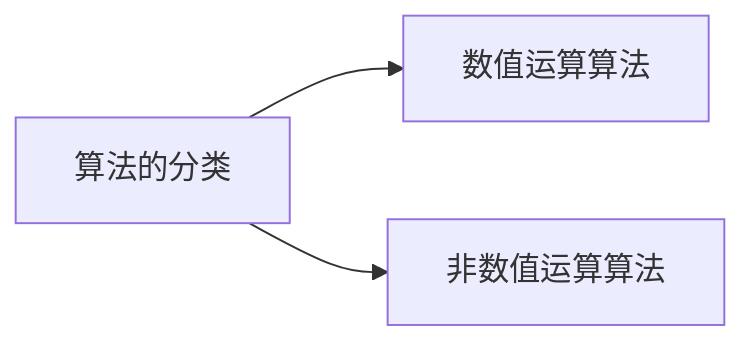

# 算法概述

[TOC]

## 什么是算法

- 算法的定义
  > 一系列用来解决单个或多个问题,或有执行计算功能命令的集合.

- 算法的特征
  > 输入: 一个算法必须要零个或以上的输入, 零个输入指算法本身提供了初始条件
  > 输出: 一个算法应有一个以上的输出, 输出是算法计算的结果
  > 明确性: 算法的描述必须无歧义, 保证算法的实际执行结果符合要求或期望
  > 有穷性: 一个算法应包含有限的操作步骤, 而不能是限的
  > 有效性: 又称可行性, 能够实现, 算法中描述的都是可以通过已经实现的基本运算运行有限次来实现

- 算法的分类

 - <b>程序 : 算法 + 数据结构</b>

    > 程序指一组计算机能识别和执行, 并有一定功能的指令.
    > 算法是一种以数学为本质的计算方法.

## 数据结构

数据元素之间的关系称为"结构", 数据结构是相互存在一种或多种特定关系的数据元素的集合.

1. 顺序表
   > 顺序表是指用顺序存储结构表示的线性表, 它利用内存起始位置确定的地址里的连续的内存空间来存放数据元素.

2. 链表
   > 链表是一种按链式存储结构表示的顺序表(逻辑上的连续, 物理上的不连续), 在每一个节点除了保存数据外, 还要保证下一个节点的指针.

3. 队列
   > 队列是一种先进先出(FIFO)的线性表, 队列只允许在一端(rear)进行插入, 一端(front)进行删除, 通常用顺序表或链表来实现.

4. 栈
   > 栈是一种后进先出(FILO)的线性表, 栈是操作受限的线性表, 仅在线性表的同一端进行插入或删除操作, 进行插入和删除操作的一端称为栈顶, 另一端称为栈底.

## 复杂度

一个高级语言编写的程序的<b>运行时间</b>主要取决于3个因素: <b>算法的方法策略(复杂度)、问题输入的规模、计算机执行指令的速度.
</b>

一个算法在计算机存储器上所占用的<b>存储空间</b>包括: <b>算法本身所占用的存储空间, 算法的输入输出数据所占用的存储空间, 算法在运行过程中临时占用的存储空间.</b>

- 时间频度
  > 一个算法中的语句执行次数, 记T(n).

- <b>时间复杂度</b>
  > 若T(n) = O(f(n)), 则O(f(n))称为算法的渐进时间复杂度

- <b>大O表示法</b>
  > 若存在正数C和n0, 使得对一切n >= n0有0 <= f(n
  ) <= g(n)成立, 则称f(n)的渐进上界是g(n), 记作f(n) = O(g(n))

- 大Ω表示法
  > 若存在正数C和n0使得对一切n >= n0有0 <= C * g(n) <= f(n)成立, 则称f(n)的渐进下界为g(n), 记作f(n) = Ω(g(n))

- 大ʘ表示法
  > 若f(n) = O(g(n))且f(n) = Ω(g(n)), 则称f(n)的渐进紧确界为g(n), 记作f(n) = ʘ(g(n))

- <b>空间复杂度</b>
  > 算法在运行过程中临时占用的存储空间是自变量以输入规模n的函数, 记作S(n) = O(f(n))

<!-- 请享受无法回避的痛苦与孤独 -->
