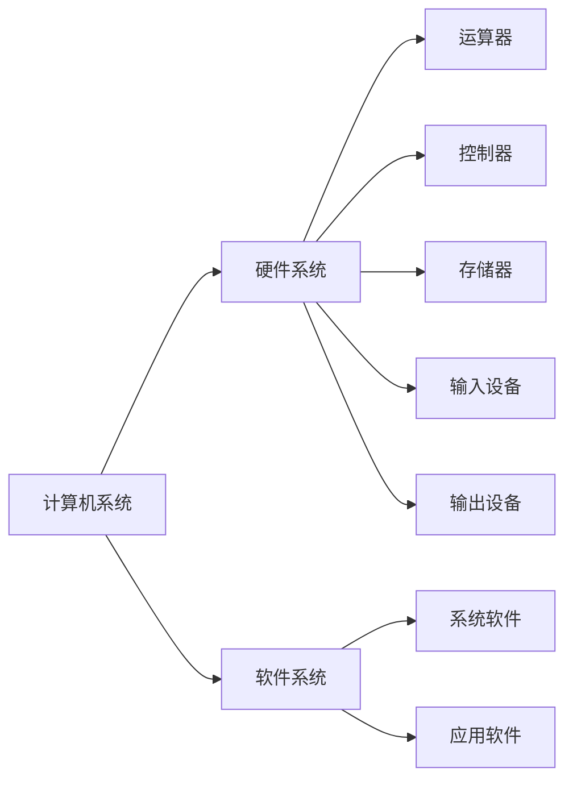

<!-- 被学校摆了一道很难受!
也不知道为什么这两天老有些莫名奇妙的人加我啦! -->

# 计算机基础知识

[TOC]

## 计算机的发展

1946年2月,由美国军方定制的世界上第一台**电子计算机**"电子数字积分计算机"(Electronic Numercial Integrator And Calculator, **ENIAC**)在美国宾夕法尼亚大学诞生.

- 第一代: 电子管数字机(1946年-1958年)
- 第二代: 晶体管数字机(1958年-1964年)
- 第三代: 集成电路数字机(1964年-1970年)
- 第四代: 大规模、超大规模集成电路数字机(1970年至今)

计算机可分为超级计算机、工业控制计算机、网络计算机、个人计算机、嵌入式计算机五类.

## 计算机的特点

1. 运算速度快
2. 计算精度高
3. 逻辑运算能力强
4. 存储容量大
5. 自动化程度高

## 计算机的应用

1. 信息管理
2. 科学计算
3. 过程控制
4. 辅助技术
5. 翻译
6. 多媒体应用
7. 计算机网络

## 计算机中的数字表示

计算机中采用二进制数,并且符合以下几点:

1. 能选用的数码的个数等于基数2,即各数位只允许是0和1;
2. 相邻两位数的比为2;
3. 每个数码代表的数值,等于该数码乘以2的整次幂,幂的大小取决于该数所在位置.
4. 计数规则是"逢二进一".

十进制与二进制的转换:

|2^6|2^5|2^4|2^3|2^2|2^1|2^0|
|:--:|:--:|:--:|:--:|:--:|:--:|:--:|
|64|32|16|8|4|2|1|
|||||1|1|1|

推算:
4+2+1 => 7

## 字符编码

ASCII码是美国国家标准信息交换码, ASCII码是用7位二进制编码的,能表示2^7=**128**个字符,这些字符包括**26**个英文字母(**大小写**),**0~9**十个阿拉伯数字,**32**个专用符号(\!、\#、$、%、\`、\*、\(、\)、<、\>等)和**34**个控制字符.

tips: 52个大小写英文字母,10个阿拉伯数字,32个专用字符,34个控制字符,加起来共128个.

汉字编码分为外码、交换机、机内码和字形码。

## 计算机的系统组成

## 计算机的硬件组成

1. 运算器
   `运算器依照程序的指令,完成对数据的加工和处理`,它提供**算术运算(加减乘除)**和**逻辑运算(与或非)**.
2. 控制器
   `控制器依照指令步骤,统一指挥各部件协调运作`.
3. 存储器
   计算机的存储器分为**内存储器(主存)**和**外存储器(辅存)**.
   计算机工作时,`将用户需要的程序和数据装入内存`;`外存用来放置需要长期保存的数据`.
4. 输入设备
   `向计算机输入数据和信息的设备`.
5. 输出设备
   接收计算机数据的输出显示的设备.`将计算机处理的结果以人们能够认识的方式输出的设备`.

衡量计算机性能优劣的硬件技术指标:

1. 机器字长
   指`CPU一次能处理的二进制数据的位数`,通常与CPU寄存器位数有关,字长越长,数的显示范围也越大,精度也越高.
2. 存储容量
   存储器的容量,即`主存容量和辅存容量`.主存容量是指主存中存放二进制代码的总位数,即`存储容量=存储单元个数X存储字长`.因为一个字节已被定义为8个二进制代码,所以**字节数**也能反映主存/辅存容量.
3. 运算速度
   `指计算机每秒钟所能执行的指令条数`,一般用<u>"百万条指令/秒"(mips,Millin Instruction Per Second)</u>来描述.一般来说,CPU主频越高,运算速度越快.

## 计算机的软件组成

计算机软件系统分为**系统软件**和**应用软件**两大类.`应用软件是为解决各类实际问题而设计的程序系统`;`系统软件由一组控制计算机系统并管理其资源的程序组成`.

- 操作系统
  **操作系统是管理、控制、监督计算机软硬件资源协调运行的程序系统,由一系列具有不同控制和管理功能的程序组成,它是直接运行在计算机硬件上最基本的系统软件,是系统软件是核心**.
  - 操作系统的目的
    `一是方便用户使用计算机,用户键入一条简单指令就能完成复杂的功能`.
    `二是统一管理计算机系统的全部资源,合理组织计算机工作流程,以便充分发挥计算机的效率`.
- 语言处理系统(翻译程序)
  `人和计算机交流信息使用的语言被称为计算机语言或程序设计语言`.计算机语言通常分为**机器语言**、**汇编语言**、**高级语言**.要在计算机上运行高级语言程序就必须配备程序语言翻译程序.`翻译程序本身是一组程序,不同的高级语言都有相应的翻译程序`.
  - 翻译的方法有两种:一种称为"解释",另一种称为"编译",对源程序进行解释和编译任务的程序,分别叫做解释程序和编译程序.
- 数据库管理系统
  `数据库是指按照一定联系存储的数据集合,可为多种应用共享`.`数据库管理系统(Data Base Management System, DBMS)则是能够对数据库进行加工、管理的系统软件`。

Tips: 结合《计算机基础一体化教程》（第二版）课后习题食用最佳！
