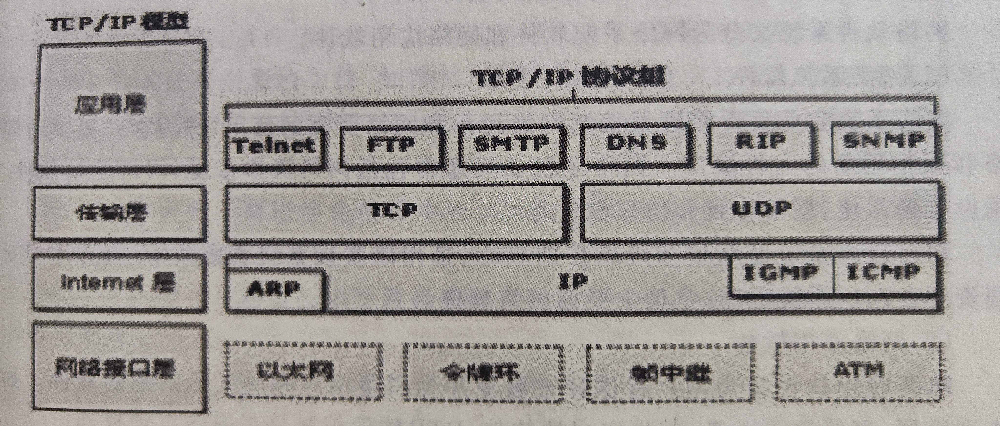

<!-- 切忌重蹈覆辙! -->
# 计算机网络

[TOC]

## 计算机网络概述

### 计算机网络的定义

计算机网络可以看成是计算机与通信技术相结合的产物.
它通过通信链路或传输介质将多个基于计算机系统的节点互连起来， 其中包括特定的网络硬件及协议， 可实现节点之间的相互通信和资源共享.

计算机网络的功能:

1. 数据通信
   数据通信是网络的基本功能,数据通信传输的信息有字符,声音,图片,动画和视频等多媒体信息.
2. 资源共享
   资源共享是网络能将系统内、外的所有软、硬件资源，包括数据提供给系统内、外的用户使用的一种能力，资源共享可以节约大量的投资。
3. 分布式处理
   网络的分布式处理的功能可以使网络内的微型计算机构成高性能的计算机并行处理体系，因此使PC具有了处理大型综合性问题的能力。
   分布式处理模式可以充分地利用网络资源，将一个完整的大问题分解成多个子问题，交由多台PC并行处理。

### 计算机网络的分类

从不同角度出发， 计算机网络的分类也不尽相同， 其中两个维度非常重要： 网络覆盖尺度和传输技术.

根据网络节点的地理距离和系统的复杂性,网络分为:

1. 局域网
   局域网属于私有网络，具有高宽带、低延时、低差错率和网内广播能力。
   局域网的种类有：以太网、快递以太网、千兆位以太网、令牌环网、光纤分布式数据接口FDDI。
2. 城域网
   城域网可以是私有网络也可以是公用网络，它是利用局域网技术在城市范围内建立的一种大型网络。
   城域网通过专用光缆连接城市中的某些重要部门如政府机关、电信机构、医院、学校等单位的主机、外设和局域网，可以实现用户间的数据、语音、图形与视频等多种信息的传输。其覆盖的范围可以达到100公里左右。
3. 广域网
   广域网一般是公用网络。广域网内的节点位置跨越比较大的地理范围，例如跨越省界、国界或洲界。最典型的广域网是因特网，此外还有公用电话交换网PSTN、公用分组交换网（X.25）、数字数据网DDN、帧中继通信FR、交换式多兆位数据服务SMDS和异步传输模式ATM等。

局域网中可以按照拓扑结构对网络进行分类，网络拓扑结构（Network Topology）是组建通信网络结构的策略。

通信子网常见的网络拓扑结构有星型（Star Topology）局域网、总线型（CommonBus Topology）局域网、环型（Ring Topology）局域网三种。

1. 星型
   星型网络拓扑结构的特点是网络中有一台中央设备来连接网络中的所有节点。中央设备可以是集线器或者交换机，用双绞线连接网络中的所有节点并提供独立的数据传输。星型网络拓扑结构为任意两个节点之间提供了最短的传输路径。
2. 总线型
   总线型拓扑结构局域网的介质访问控制方法采用的是“共享介质”方式，网络中所有节点都连接到一条作为公共传输介质的总线上，不需要额外的连接设备。
   总线传输的介质通常采用50Ω的基带同轴电缆，发送或接收数据的方式为“广播”方式。
   总线型拓扑结构的缺点是只能够支持一个通道端口到端口的信号传输，因此网络上的“冲突”会导致传输失败。
3. 环型
   环型拓扑结构的特点是网络中每个节点只与和它相邻两个节点相连接，整个网络形成一个封闭的“环”。
   环型结构中计算机要依靠一个长度为3字节的“令牌”发送信息，因此环型拓扑结构的网络被称为“令牌环网”。
   缺点：网络建成后难以增加新的节点，数据在环中单向传输，任何一个节点发生故障都会导致数据传输中断。
   优点：抗干扰性强，适合于电磁辐射较强的工厂环境。

### 计算机网络体系结构

为了降低网络设计的复杂性，绝大多数网络都组织成一个层次栈，每一层都建立在下一层的基础上，每一层向上一层提供特定的服务。
目前存在两种网络设计体系结构参考模型：OSI参考模型和TCP/IP参考模型。

1. OSI参考模型
   OSI参考模型是国际标准化组织（ISO）提出的开放系统互连参考模型(Open Systems Interconnection Reference Model)，从底层开始分别为物理层、数据链路层、网络层、传输层、会话层、表示层、应用层。

   - 应用层
    直接为用户的应用进程提供服务，包括用户通常需要的各种各样的协议，如超文本传输协议，支持电子邮件的SMTP协议、支持文件传送的FTP协议等。
   - 表示层
    主要任务是管理抽象的数据结构，并允许定义和交换更高层的数据结构。
    由于不同的计算机有不同的内部数据表示法，为了使这些计算机能够通信，它们交换的数据结构必须以一种抽象的方式来定义，表示层就对这些抽象的数据结构进行管理。
   - 会话层
    主要任务是为不同机器上的用户建立对话，对话提供对话控制、同步功能、令牌管理等各种服务。
   - 传输层
    主要任务是接收来自上一层的数据，在必要的时候把这些数据分割成较小的单元，然后把这些数据单元传递给网络层，并保证数据单元正确地到达另一端。
   - 网络层
    主要任务是控制子网的运行、处理拥塞、保证网络所提供的服务质量（延迟、抖动传输时间等），网络层解决网络运行中的流量控制、路由选择、分组传送等问题，从而允许异构网络相互连接成为互联网。
   - 数据链路层
    主要任务是将一个原始的传输设施转变成一条没有漏检传输错误的路线。
    在两个相邻节点之间传送数据时，数据链路层将网络层传下来的IP数据报组装成帧，在两个相邻节点间的链路上透明地传送帧中的数据。每一帧包括数据和必要的控制信息（如同步信息、地址信息、差错控制等）。
   - 物理层
    主要任务是在一条通信信道上传输原始比特。主要涉及机械、电子、时序接口，以及物理传输介质等。

2. TCP/IP参考模型
   为在网络中的数据交换而建立的规则、约定和标准就称为网络协议。
   TCP/IP就是一组用于实现网络互连的通信协议。TCP/IP协议从下往上有四层：网络接口层、Internet层、传输层和应用层。
   

### 计算机网络的基本组成

计算机网络系统由通信子网和资源子网组成，而网络硬件系统和网络软件系统是计算机网络赖以存在的基础。

- 网络硬件系统
  网络硬件是计算机网络系统的物质基础。要构建一个网络，首先要将计算机及其附属硬件设备与网络中的其它计算机系统连接起来，不同的网络系统在硬件方面有所差别，但是大部分都包括终端设备、传输介质、控制设备等。
  1. 网络终端设备
    网络终端设备包括：计算机、服务器（文件服务器、数据库服务器、打印服务器等）、网络设备、共享设备等。
  2. 网络传输介质
    传输介质是数据传输系统中发送装置和接收装置之间的物理媒体。传输介质可分为两大类：有线传输介质和无线传输介质。
    常用有线传输介质：双绞线、同轴电缆、光纤。
    常用无线传输技术：微波通信、红外线通信、无线电波通信。
  3. 网络控制设备
    网络因为完成不同的功能而需要各式各样的设备构成，网络控制设备保障网络各项功能的实现，从而实现网络的互联。
    网络控制（连接）设备包括用于网内连接的网卡、中继器、调制调解器、集线器、交换机、网间连接的路由器、网桥等。

- 网络软件系统
  安装网络软件系统来协调系统资源，通过软件工具对网络资源进行全面的管理、分配和调动，这样才能保证用户对系统的控制，防止出现系统混乱以及信息数据的破坏和丢失。
  1. 网络系统软件
    负责管理和控制网络运行以及网络资源的使用，并为客户提供访问网络和操作网络的人机接口。
    网络系统软件通常有：**网络操作系统**、网络通信软件、数据库管理系统、网络协议和协议软件等。
    网络操作系统是网络系统软件的核心，用以实现系统资源共享、管理用户对不同资源访问的系统程序，是最主要的网络软件。
  2. 网络应用软件
    指为用户提供特定服务并为网络用户解决实际问题的软件。
    例如：浏览器、网络聊天工具、邮件客户端软件、FTP软件等。

## Internet概述

