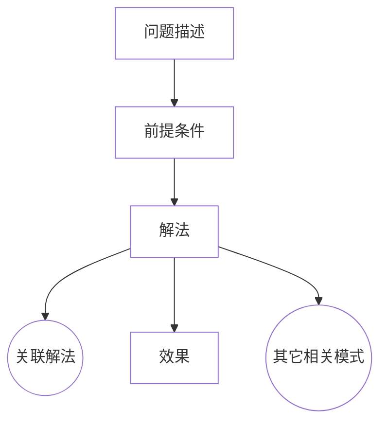

# 设计模式概述

[TOC]

## 设计模式的定义

设计模式是对前人经验的总结,为后人设计与开发基于面向对象的软件和成熟的解决方案

- 模式的定义:
    > 模式是在特定环境下人们解决某类重复出现问题的一套成功或有效的解决方案
- GoF对设计模式的定义:
    > 设计模式是在特定环境下为解决某一通用软件设计问题提供的一套定制的解决方案,该方案描述了对象和类之间的相互作用
- 使用设计模式的目的:
    > 使用设计模式是为了可重用代码, 让代码更容易被他人理解并且提高代码的可靠性

## 软件模式概述

四人组(Gang of Four, Erich Gamma & Richard Helm & Ralph Johnson & John Vlissides)在1994年归纳发表了23种在软件开发中使用频率较高的设计模式,旨在用模式来统一沟通面向对象方法在分析、设计和实现间的鸿沟

- 软件模式的基本结构
    > 问题描述
    > 前提条件(环境或约束条件)
    > 解法和效果

- 模式发现过程中需要遵循"大三律"(Rule of Three)
    > 即只有经过3个以上不同类型(或不同领域)的系统的校验,一个解决方案才能从候选模式升格为模式

## 设计模式的分类

- 根据目的分类
  - 创建型
  - 结构型
  - 行为型

- 根据范围分类
  - 类模式
    > 类模式处理类和子类之间的关系,这些关系通过继承建立,在编译时就被确定下来,是一种静态关系
  - 对象模式
    > 对象模式处理对象间的关系,这些关系在运行时变化,更具动态性

## 设计模式的优点

1. 它提供了一套通用的设计词汇和一种通用的语言方便开发人员之间沟通和交流,使得设计方案更加通俗易懂
2. 设计模式使得重用成功的设计更加容易,并避免那些导致不可重用的设计方案
3. 设计模式使得设计方案更加灵活,且易于修改
4. 设计模式的使用将提高软件系统的开发效率和软件质量
5. 设计模式有助于学者更深入地理解面向对象思想
